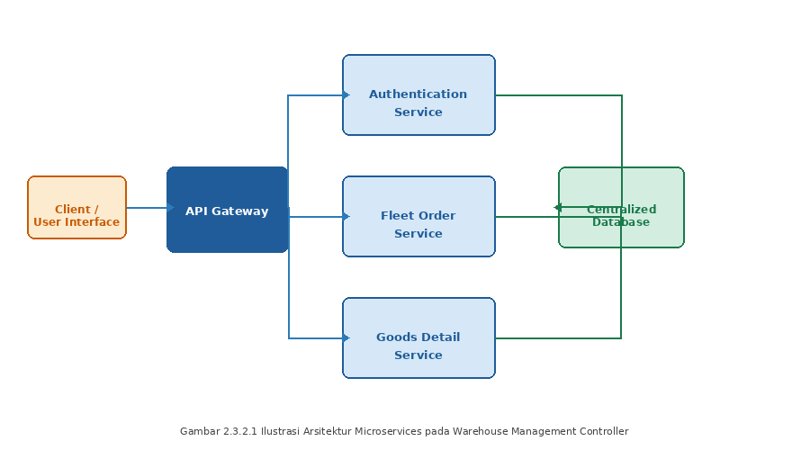
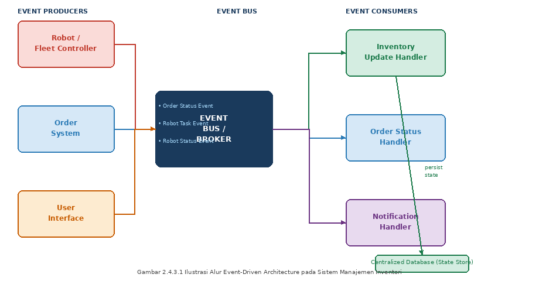

# STUDI LITERATUR

## II.1 Industri FMCG dan Peran Gudang Barang Jadi

Pada industri *Fast Moving Consumer Goods* (FMCG), gudang penyimpanan berperan sebagai pusat kendali aliran barang dalam rantai pasok yang menuntut kecepatan, akurasi, dan integrasi sistem yang tinggi. Operasional gudang yang efektif harus mampu menangani volume barang yang besar, variasi *Stock Keeping Unit* (SKU) yang luas, serta kecepatan distribusi yang tinggi guna memastikan ketersediaan produk di pasar. Dalam konteks ini, gudang bukan lagi sekadar tempat penyimpanan pasif, melainkan komponen strategis yang secara langsung menentukan kelancaran seluruh rantai distribusi. Framinan et al. (2025) menegaskan bahwa sistem pergudangan konvensional pada industri FMCG mengandung inefisiensi signifikan akibat keterbatasan otomasi dan sistem informasi yang belum terintegrasi sepenuhnya, yang pada akhirnya berdampak pada keterlambatan pengiriman dan ketidakakuratan data inventori.

## II.2 Operasional Gudang Konvensional dan Tantangannya

### II.2.1 Sumber Daya dan Proses Bisnis Gudang

Secara operasional, terdapat empat sumber daya utama yang menggerakkan sebuah gudang, yaitu *storage system*, *lift trucks*, *personnel*, dan *Warehouse Management System* (WMS). Setiap komponen tersebut harus memenuhi *Flow Impact Test* (IFIT), di mana kapasitas setiap komponen berpengaruh langsung terhadap kapasitas atau laju keseluruhan operasional gudang (Brazhkin, 2018). Keempat sumber daya ini bersifat saling bergantung dan harus beroperasi secara terkoordinasi untuk menjamin kelancaran alur barang dari tahap penerimaan hingga pengiriman akhir. Kegagalan pada salah satu komponen sumber daya akan menimbulkan efek domino yang mengganggu keseluruhan rantai operasional di dalam gudang.

Proses operasional inventori di dalam gudang secara umum mencakup sembilan tahapan utama, yaitu penerimaan (*receiving*), penempatan (*put-away*), pengisian ulang internal (*internal replenishment*), pengambilan pesanan (*order picking*), pengumpulan dan penyortiran (*accumulating and sorting*), pengepakan (*packing*), lintas-dermaga (*cross docking*), pengiriman barang (*dispatch*), dan pengapalan (*shipping*) (Habazin, 2017). Di antara seluruh tahapan tersebut, proses *order picking* menjadi titik paling kritis karena memiliki tingkat keterlibatan manual tertinggi dan paling rentan terhadap kesalahan serta keterlambatan. Studi empiris pada industri manufaktur di Kroasia menemukan bahwa kekurangan sumber daya manusia merupakan kendala dengan nilai keparahan rata-rata (*mean severity*) kedua tertinggi dalam proses *picking* di gudang dengan nilai 3,79 dari skala 5 (Habazin, 2017), yang mengindikasikan tingginya ketergantungan terhadap faktor manusia dalam aktivitas inti pergudangan konvensional.

Van Geest et al. (2021) menegaskan bahwa kompleksitas rantai pasok modern pada industri FMCG telah mendorong evolusi konsep gudang konvensional menuju *Smart Warehouse*, yang dicirikan oleh empat pilar utama, yaitu *Automation and Robotics*, *IoT-based Visibility*, *AI-driven Optimization*, dan *Cyber-Physical Integration*. Dalam konteks operasional berbasis *pull system*, pilar *Cyber-Physical Integration* menjadi sangat krusial karena memungkinkan sinkronisasi antara permintaan digital dan eksekusi fisik berlangsung secara *real-time*. Dengan demikian, setiap aktivitas pergerakan barang mulai dari penerimaan, penyimpanan, hingga pengiriman dapat tercatat dan direspons secara otomatis oleh sistem tanpa keterlambatan akibat keterbatasan proses manual.

Guna memperoleh gambaran kondisi operasional yang akurat dan kontekstual, kelompok TA252601001 melaksanakan wawancara daring dengan Bapak Falih Muhtadi selaku *Staff Logistics and Business Integration Systems* PT Paragon Technology and Innovation (Paragon Corp) pada tanggal 16 Oktober 2025. Dari wawancara tersebut diketahui bahwa Paragon Corp memiliki tiga jenis gudang, yaitu gudang bahan baku, gudang kemasan (*packaging warehouse*), serta gudang barang jadi (*Finished Goods*) yang terletak pada area terpisah. Fokus pengembangan tugas akhir ini adalah pada gudang barang jadi, yang secara langsung bersinggungan dengan proses distribusi produk ke konsumen akhir.

Berdasarkan hasil wawancara, sistem kerja operasional inventori Paragon Corp menerapkan pendekatan *Pull System*, yaitu suatu mekanisme di mana pergerakan dan pemrosesan barang didasarkan pada permintaan aktual yang masuk ke sistem, bukan pada prakiraan (*forecasting*) internal. Alur kerja utama gudang mencakup empat tahapan, yaitu *Incoming*, *Stocking*, *Picking & Checking*, serta *Dispatching* menuju *Distribution Center*. Dalam skema *pull system*, perintah *stocking* dan *picking* baru dieksekusi ketika terdapat permintaan nyata, sehingga meminimalkan akumulasi stok berlebih (*overstock*) namun di sisi lain menuntut kecepatan respons sistem yang sangat tinggi agar tidak menimbulkan *bottleneck* pada tahap distribusi.

Dari hasil wawancara juga terungkap bahwa teknologi yang saat ini digunakan di gudang Paragon mencakup sistem ERP Odoo dan *Warehouse Management System* (WMS) untuk pencatatan dan pelacakan barang. Namun, kedua sistem tersebut masih bersifat semi-manual sehingga membutuhkan input operator secara berkala dan belum memiliki integrasi *real-time* antar platform. Kondisi ini menyebabkan *mismatch* data yang sering terjadi antara kondisi fisik di lapangan dengan catatan digital pada sistem pusat. Paragon Corp sendiri saat ini tengah dalam proses transformasi menuju sistem SAP untuk meningkatkan kualitas integrasi antar sistem. Kompleksitas operasional semakin bertambah mengingat Paragon Corp mengelola lebih dari 40 *Distribution Centers* (DC) di Indonesia dan Malaysia (UNDIP, 2019), dengan volume produk dan variasi SKU kosmetik yang sangat beragam, sehingga ketersediaan sistem inventori yang akurat dan terintegrasi menjadi kebutuhan operasional yang mendesak.

### II.2.2 Permasalahan Sinkronisasi Data dan Pelacakan Barang

Permasalahan yang umum dijumpai pada gudang FMCG semi-manual adalah ketidaksinkronan data stok antara kondisi fisik di lapangan dengan catatan digital pada sistem pusat. Pada kondisi di mana *Warehouse Management System* (WMS) beroperasi secara independen tanpa koneksi langsung ke sistem pusat, pembaruan data stok masih bergantung pada intervensi manual operator. Akibatnya, terdapat jeda waktu yang tidak dapat diprediksi antara perubahan kondisi fisik barang di lapangan dengan refleksinya pada sistem informasi, sehingga data yang tersedia di sistem pusat tidak selalu mencerminkan kondisi aktual yang terjadi di gudang.

Ketidaksinkronan ini menghasilkan dua manifestasi utama yang secara langsung mengganggu efisiensi operasional. Pertama, terjadi *mismatch* data stok, yaitu selisih antara jumlah barang yang tercatat di sistem dengan jumlah fisik yang tersedia di rak gudang. Kondisi ini memicu *human error* pada proses *picking*, terutama dalam konteks ketidaktepatan jumlah barang yang diambil, karena operator berpatokan pada data yang tidak akurat. Kedua, terjadi *mistracking* barang, di mana posisi fisik barang tidak terdokumentasikan secara akurat karena terdapat area penempatan sementara yang tidak tercatat di dalam sistem manajemen gudang yang ada. Kedua masalah ini secara kumulatif menyebabkan *bottleneck* pada tahap *stocking* dan *picking*, yang berujung pada kondisi *overcapacity* serta *waiting time* yang panjang di area gudang barang jadi.

Temuan ini sejalan dengan penelitian Framinan et al. (2025) yang mengkaji ulang proses pemenuhan pesanan pada perusahaan FMCG menggunakan metode *Business Process Redesign* (BPR). Penelitian tersebut menemukan bahwa 62% keterlambatan pengiriman bersumber dari aktivitas *order picking* dan *staging* yang tidak terkoordinasi secara digital, di mana sistem pencatatan yang tidak *real-time* menjadi akar utama inefisiensi.

Van Geest et al. (2021) mengidentifikasi interoperabilitas sistem sebagai salah satu tantangan teknologi paling kritis dalam implementasi *Smart Warehouse*. Tantangan ini mencakup ketidakmampuan platform yang berbeda untuk saling bertukar data secara langsung, latensi sistem berbasis *cloud*, dan potensi kehilangan data akibat ketidaksesuaian protokol komunikasi antar sistem.

## II.3 Smart Warehouse dan Integrasi Siber-Fisik

Meningkatnya kompleksitas rantai pasok modern mendorong evolusi gudang dari fasilitas penyimpanan pasif menjadi sistem cerdas yang terhubung secara digital. Geest, Tekinerdogan, dan Catal (2021) mendefinisikan *Smart Warehouse* sebagai gudang yang ditopang empat pilar teknologi penggerak (*technology enabler*), yaitu *Automation and Robotics* untuk otomasi proses fisik pemindahan barang, *IoT-based Visibility* untuk pendeteksian dan pelacakan barang secara *real-time*, *AI-driven Optimization* untuk penjadwalan dan pengambilan keputusan otomatis, serta *Cyber-Physical Integration* sebagai perekat yang menyatukan operasi fisik di lantai gudang dengan representasi digitalnya. Keempat pilar ini menempatkan data sebagai aset operasional utama, sehingga kualitas keputusan dan kecepatan respons gudang bergantung langsung pada seberapa akurat kondisi fisik tercermin pada sistem informasi.

Dari perspektif rekayasa sistem, Romero dkk. (2020) menegaskan bahwa sebuah *smart system* dicirikan oleh lima unsur: adanya elemen-elemen sistem, relasi antar-entitas, objektif yang terukur, batasan lingkungan operasi, serta antarmuka yang menghubungkan sistem dengan dunia luar. *Smart Warehouse* memenuhi seluruh karakteristik tersebut dengan objektif tunggal yang jelas, yaitu meningkatkan produktivitas dan akurasi operasional gudang secara berkelanjutan. Karakterisasi ini penting karena menegaskan bahwa transformasi menuju *Smart Warehouse* bukan sekadar penambahan perangkat otomatis, melainkan pengintegrasian elemen fisik dan digital ke dalam satu sistem yang objektif dan batas kerjanya terdefinisi.

Di antara keempat pilar tersebut, *Cyber-Physical Integration* menjadi landasan konseptual yang paling relevan bagi tugas akhir ini. Integrasi siber-fisik mengacu pada sinergi antara lapisan fisik — pergerakan robot dan barang di dalam gudang — dengan lapisan digital berupa pencatatan data inventori secara *real-time* pada basis data terpusat. Melalui pendekatan ini, setiap aktivitas fisik mulai dari penerimaan, penyimpanan, hingga pengambilan barang dapat tercermin secara otomatis dalam sistem informasi tanpa memerlukan intervensi manual. Dalam operasional berbasis *pull system* yang menuntut respons cepat terhadap permintaan aktual, kemampuan menyinkronkan permintaan digital dengan eksekusi fisik secara seketika inilah yang membedakan *Smart Warehouse* dari gudang konvensional, sekaligus menjadi pijakan bagi perancangan sistem pada bab-bab selanjutnya.

## II.4 Sistem Informasi dan Manajemen Inventori Real-Time

Operasional gudang berpusat pada pengelolaan inventori, dan di antara seluruh aktivitasnya, proses pengambilan barang (*order picking*) merupakan aktivitas yang paling padat karya sekaligus paling mahal. De Koster, Le-Duc, dan Roodbergen (2007) memperkirakan biaya *order picking* dapat mencapai 55% dari total biaya operasional gudang, sehingga setiap penurunan kinerja pada proses ini langsung menurunkan tingkat layanan dan menaikkan biaya bagi keseluruhan rantai pasok. Karena itu, proses inventori menuntut dukungan informasi yang akurat dan mutakhir: keputusan pengambilan, penempatan, dan pemantauan stok hanya akan tepat apabila data yang menjadi acuannya mencerminkan kondisi fisik terkini. Kebutuhan inilah yang menempatkan sistem informasi sebagai tulang punggung manajemen inventori *real-time*.

### II.4.1 Konsep dan Komponen Sistem Informasi

Alter (2008) mendefinisikan sistem informasi sebagai suatu *work system* — sistem kerja — yang aktivitas-aktivitasnya dikhususkan untuk menangkap, mengirim, menyimpan, mengambil, mengolah, dan menampilkan informasi. Definisi ini menegaskan bahwa sistem informasi tidak identik dengan teknologi informasi semata, melainkan mencakup keterpaduan antara manusia, proses, dan teknologi yang bekerja bersama untuk suatu tujuan. Dalam kerangka tersebut, sistem informasi tersusun atas sejumlah elemen yang saling terkait: peserta (pengguna yang menjalankan proses), informasi (data yang diproses dan dihasilkan), dan teknologi (perangkat keras dan lunak yang mendukung), yang seluruhnya beroperasi melalui rangkaian proses dan aktivitas untuk menghasilkan produk atau layanan bagi penggunanya. Elemen-elemen inti ini berjalan di dalam konteks lingkungan, infrastruktur, dan strategi organisasi. Sudut pandang ini relevan bagi tugas akhir karena sistem yang dikembangkan bukan sekadar basis data atau antarmuka, melainkan sistem kerja yang menautkan aktivitas fisik gudang, data inventori, dan staf yang memantaunya dalam satu kesatuan.

### II.4.2 Manajemen Inventori Berbasis Event vs Polling

Terdapat dua paradigma untuk menjaga agar data inventori pada sistem informasi selalu mencerminkan perubahan kondisi fisik. Paradigma pertama adalah *polling*, yaitu sistem memeriksa kondisi sumber data secara periodik pada interval tetap untuk mendeteksi perubahan. Pendekatan ini sederhana, tetapi menimbulkan dilema: interval yang panjang memperbesar jeda antara perubahan fisik dan pembaruan data, sedangkan interval yang pendek memboroskan sumber daya karena sebagian besar pemeriksaan tidak menemukan perubahan apa pun. Paradigma kedua adalah pendekatan berbasis *event*, di mana setiap perubahan kondisi — seperti penerimaan barang, reservasi stok, atau penyelesaian tugas — diperlakukan sebagai sebuah *event* diskrit yang dicatat pada saat perubahan itu benar-benar terjadi (Fowler, 2002). Hohpe dan Woolf (2003) meletakkan dasar integrasi berbasis pesan ini, di mana komponen-komponen perangkat lunak berkomunikasi secara asinkron melalui pengiriman *event* melalui kanal terpusat, sehingga tetap *loosely coupled* dan dapat beroperasi secara independen. Keunggulan pendekatan *event-driven* dalam konteks inventori adalah latensi pembaruan yang rendah, konsumsi sumber daya yang efisien, serta kemampuan merekonstruksi dan memverifikasi keadaan stok dari rekaman *event* meskipun terjadi kegagalan pada perangkat di lapangan. Pemilihan di antara kedua paradigma ini untuk sistem yang dikembangkan dibahas secara sistematis pada analisis pemilihan solusi di Bab III.

## II.5 Arsitektur dan Teknologi Perangkat Lunak

### II.5.1 Arsitektur Microservices

Arsitektur *microservices* adalah gaya perancangan perangkat lunak di mana sebuah aplikasi dibangun sebagai kumpulan layanan kecil yang berdiri sendiri (*loosely coupled*), masing-masing menjalankan satu tanggung jawab bisnis yang spesifik dan dapat dikembangkan, di-*deploy*, serta diskalakan secara independen satu sama lain (Newman, 2015). Berbeda dengan arsitektur monolitik di mana seluruh komponen terkompilasi dan berjalan dalam satu unit, pada arsitektur *microservices* setiap layanan berkomunikasi melalui antarmuka yang terdefinisi dengan baik — umumnya berupa *RESTful API* atau *message broker* — sehingga kegagalan pada satu layanan tidak secara langsung melumpuhkan keseluruhan sistem (Newman, 2015). Pola ini memungkinkan tim pengembang untuk memilih teknologi yang paling sesuai untuk setiap layanan secara independen, meningkatkan ketahanan sistem secara keseluruhan, serta mempercepat siklus pengembangan dan pembaruan fitur tanpa harus melakukan *redeployment* pada keseluruhan aplikasi (Richardson, 2018).

*Ilustrasi arsitektur microservices pada Warehouse Management Controller*

### II.5.3 Basis Data Relasional dan Properti ACID

Basis data relasional adalah sistem penyimpanan data yang mengorganisasikan informasi ke dalam tabel-tabel (relasi) yang saling terhubung melalui kunci asing (*foreign key*), berdasarkan model relasional yang diperkenalkan oleh Codd (1970). Sistem ini menjamin integritas data melalui properti ACID — *Atomicity*, *Consistency*, *Isolation*, dan *Durability* — yang memastikan bahwa setiap transaksi *database* dieksekusi secara penuh atau tidak sama sekali, sehingga tidak ada kondisi data yang setengah diperbarui meskipun terjadi kegagalan sistem di tengah proses (Ramakrishnan & Gehrke, 2003). Dalam konteks manajemen inventori *real-time*, properti ACID menjadi sangat kritis karena setiap perubahan jumlah stok, perubahan lokasi barang, maupun pembaruan status *order* harus langsung tercermin secara konsisten di seluruh layanan yang mengakses basis data secara bersamaan, tanpa risiko pembacaan data yang tidak konsisten (*dirty read*) antarproses yang berjalan paralel.

## II.6 Infrastruktur Komunikasi Terdistribusi

Pada sistem yang tersusun atas beberapa layanan independen, komunikasi antarkomponen tidak selalu memadai bila hanya mengandalkan pola *request-reply* sinkron seperti REST. Kebutuhan akan pertukaran pesan yang asinkron, andal, dan *real-time* memunculkan sejumlah infrastruktur komunikasi pelengkap. Sub-bab ini meninjau tiga mekanisme yang lazim digunakan pada sistem terdistribusi bergaya siber-fisik: *message broker*, protokol MQTT, dan WebSocket.

### II.6.1 Message Broker dan RabbitMQ (AMQP)

*Message broker* adalah komponen perangkat lunak yang bertindak sebagai perantara pengiriman pesan antara produsen (*producer*) dan konsumen (*consumer*), sehingga kedua pihak dapat beroperasi secara asinkron dan *loosely coupled* tanpa harus saling mengetahui keberadaan satu sama lain (Hohpe dan Woolf 2003). Pola ini pertama kali diformalkan dalam *Enterprise Integration Patterns* sebagai solusi integrasi sistem heterogen, di mana komponen berkomunikasi melalui pengiriman pesan diskrit melalui kanal terpusat. RabbitMQ merupakan salah satu implementasi *message broker* sumber terbuka yang mengadopsi *Advanced Message Queuing Protocol* (AMQP), standar terbuka untuk *middleware* berorientasi pesan (OASIS 2012). Dalam model AMQP, pesan yang dipublikasikan *producer* dikirim ke *exchange*, diteruskan ke antrean (*queue*) yang sesuai berdasarkan *routing key*, lalu dikonsumsi oleh *consumer* yang berlangganan pada antrean tersebut (RabbitMQ 2023). Mekanisme antrean ini memungkinkan pemisahan beban dan penyanggaan (*buffering*) pesan sehingga sistem tetap tangguh meskipun laju produksi dan konsumsi pesan tidak seimbang.

### II.6.2 Protokol MQTT

*Message Queuing Telemetry Transport* (MQTT) adalah protokol komunikasi bergaya *publish-subscribe* yang dirancang khusus untuk perangkat dengan keterbatasan sumber daya dan jaringan yang tidak selalu andal, seperti perangkat *Internet of Things* dan sensor terdistribusi (OASIS 2014). Protokol ini bekerja melalui tiga peran: *publisher* yang mengirim pesan ke sebuah topik (*topic*), *broker* yang menerima dan mendistribusikan pesan, serta *subscriber* yang berlangganan topik tertentu untuk menerima pesan secara *real-time*. Keunggulan utama MQTT dibandingkan protokol berbasis HTTP adalah *overhead* yang sangat kecil — *header* paketnya minimal hanya berukuran dua *byte* — sehingga sangat efisien untuk pengiriman data telemetri berfrekuensi tinggi, misalnya pembaruan posisi objek yang dikirim berkali-kali per detik. Model *publish-subscribe* yang memisahkan pengirim dan penerima juga membuat penambahan konsumen data baru dapat dilakukan tanpa mengubah sisi pengirim.

### II.6.3 WebSocket

WebSocket adalah protokol komunikasi berbasis TCP yang memungkinkan koneksi persisten dua arah (*full-duplex*) antara server dan klien, berbeda dengan paradigma *request-response* pada HTTP yang menuntut inisiasi koneksi baru pada setiap pertukaran data (Fette dan Melnikov 2011). Setelah koneksi terbentuk melalui mekanisme *HTTP Upgrade handshake*, server dapat mengirimkan data ke klien kapan saja tanpa menunggu permintaan (*server push*), sehingga latensi pengiriman hanya dibatasi oleh latensi jaringan dan bukan oleh interval pemeriksaan. Karakteristik ini menjadikan WebSocket lebih efisien dibandingkan teknik *long-polling* maupun *Server-Sent Events* untuk kasus data yang berubah secara kontinu dengan frekuensi tinggi, seperti pemantauan status dan posisi objek secara *real-time* pada antarmuka pengguna.

## II.7 Lokalisasi Objek Berbasis Visi

Agar sistem dapat mengoordinasikan pemindahan barang, posisi objek di dalam gudang perlu diketahui secara andal. Sub-bab ini meninjau pendekatan-pendekatan lokalisasi dalam ruang, konsep penanda buatan (*fiducial marker*), serta prinsip kalibrasi kamera dan transformasi koordinat, sebagai landasan bagi perbandingan alternatif solusi lokalisasi pada Bab III.

### II.7.1 Pendekatan Lokalisasi dalam Ruang

Lokalisasi dalam ruang (*indoor localization*) menghadapi tantangan tersendiri karena sinyal satelit navigasi global tidak tersedia secara memadai di dalam bangunan. Zafari, Gkelias, dan Leung (2019) memetakan beragam teknik lokalisasi dalam ruang yang umumnya berbasis sinyal radio, seperti *Angle of Arrival* (AoA), *Time of Flight* (ToF), dan *Received Signal Strength* (RSS), yang diwujudkan melalui teknologi WiFi, RFID, *Ultra-Wideband* (UWB), maupun Bluetooth. Mereka menekankan bahwa pemilihan sistem lokalisasi tidak dapat dinilai dari akurasi semata, melainkan harus mempertimbangkan efisiensi energi, ketersediaan, biaya, jangkauan, latensi, skalabilitas, dan akurasi penjejakan secara menyeluruh.

Sebagai alternatif dari pendekatan berbasis sinyal radio, lokalisasi berbasis visi memanfaatkan kamera sebagai sumber data. Morar dkk. (2020) mengklasifikasikan metode lokalisasi berbasis visi ke dalam dua kategori utama: pertama, infrastruktur kamera statis yang menjejaki entitas bergerak (misalnya orang atau robot) melalui penjejakan objek; dan kedua, kamera yang terpasang pada entitas bergerak dan mencocokkan citra yang ditangkap dengan basis citra acuan. Mereka juga menyoroti bahwa jumlah aplikasi yang membutuhkan informasi orientasi — bukan sekadar posisi — terus meningkat. Ragam pendekatan inilah yang membentuk ruang alternatif yang perlu dibandingkan secara sistematis ketika memilih solusi lokalisasi yang sesuai dengan karakteristik lingkungan dan kebutuhan sistem.

### II.7.2 Fiducial Marker sebagai Kelas Penanda

*Fiducial marker* adalah penanda buatan (*artificial landmark*) yang dirancang agar mudah dikenali dan dibedakan satu sama lain oleh sistem visi (Olson, 2011). Berbeda dengan kode dua dimensi seperti QR yang umumnya diselaraskan secara manual oleh manusia dan membawa muatan informasi besar, sebuah *fiducial marker* membawa muatan informasi kecil namun memungkinkan estimasi *pose* enam derajat kebebasan (6-DOF) — mencakup posisi dan orientasi — dari satu citra kamera. Keunggulan penanda semacam ini terletak pada ketahanannya terhadap oklusi, distorsi lensa, dan variasi pencahayaan, serta kemampuannya menyediakan fitur yang mudah dikenali dengan deteksi kesalahan bawaan.

Kalaitzakis dkk. (2021) menempatkan *fiducial marker* sebagai pelengkap atau pengganti metode lokalisasi lain — seperti GNSS, *Visual-Inertial Odometry*, dan SLAM — ketika metode tersebut tidak tersedia atau tidak cukup akurat, misalnya pada lingkungan dengan fitur visual yang miskin. Mereka juga memaparkan bahwa terdapat beberapa keluarga penanda yang menjadi acuan dan paling banyak digunakan, yaitu ARTag, AprilTag, ArUco, dan STag, yang dapat dibandingkan berdasarkan akurasi, tingkat deteksi, dan biaya komputasi pada berbagai skenario gangguan seperti bayangan dan *motion blur*. Keberadaan beberapa keluarga penanda dengan karakteristik berbeda ini menjadi dasar bagi analisis pemilihan penanda yang paling sesuai pada Bab III.

### II.7.3 Kalibrasi Kamera dan Transformasi Koordinat

Agar posisi objek pada citra dapat diterjemahkan menjadi posisi fisik di lantai gudang, kamera perlu dikalibrasi terlebih dahulu. Zhang (2000) memperkenalkan teknik kalibrasi kamera yang fleksibel dengan mengamati pola kalibrasi planar dari beberapa orientasi berbeda untuk mengestimasi parameter internal dan eksternal kamera. Ketika digunakan kamera bersudut pandang sangat lebar seperti lensa *fisheye* — yang menguntungkan karena satu kamera dapat mengamati area luas dari satu titik pemasangan — muncul distorsi radial yang parah sehingga garis lurus tampak melengkung dan pemetaan piksel ke posisi fisik menjadi tidak valid. Kannala dan Brandt (2006) mengatasi persoalan ini melalui model kamera generik beserta metode kalibrasinya yang mampu memodelkan dan mengoreksi distorsi lensa *fisheye* maupun lensa konvensional secara akurat.

Setelah distorsi dikoreksi, koordinat titik pada citra masih perlu dipetakan ke koordinat pada bidang lantai. Untuk kasus permukaan datar yang diamati kamera, pemetaan ini dilakukan melalui transformasi projektif antar-bidang yang dikenal sebagai *homography*, yaitu transformasi yang memetakan titik pada satu bidang datar ke bidang datar lainnya secara satu-ke-satu (Hartley dan Zisserman, 2004). Operasi kalibrasi dan transformasi geometris semacam ini didukung oleh pustaka penglihatan komputer seperti OpenCV (Bradski, 2000). Pada bab ini pembahasan dibatasi pada tataran konsep; formulasi matematis dan penerapannya secara rinci pada perancangan subsistem dipaparkan pada Bab IV.

## II.8 Metode Pengambilan Keputusan: Analytical Hierarchy Process (AHP)

*Analytical Hierarchy Process* (AHP) adalah metode pengambilan keputusan multi-kriteria yang dikembangkan oleh Thomas L. Saaty pada tahun 1970-an. Metode ini bekerja dengan menyusun permasalahan keputusan ke dalam struktur hierarki yang terdiri dari tiga tingkat utama, yaitu tujuan (*goal*), kriteria, dan alternatif solusi. Pada setiap tingkatan, AHP menggunakan teknik perbandingan berpasangan (*pairwise comparison*) untuk mengukur tingkat kepentingan relatif antara satu elemen dengan elemen lainnya menggunakan skala numerik 1 hingga 9 yang dikembangkan oleh Saaty. Hasil perbandingan tersebut diolah melalui perhitungan bobot prioritas (*eigenvector*) dan divalidasi melalui uji konsistensi dengan indikator *Consistency Ratio* (CR), di mana nilai CR di bawah 0,1 mengindikasikan bahwa penilaian yang dilakukan bersifat konsisten dan dapat diterima (Saaty, 1977).

## II.9 Metode Pengembangan Sistem: Design Thinking

*Design Thinking* adalah pendekatan inovasi yang berpusat pada manusia (*human-centered*), yang menerapkan kepekaan dan metode perancang untuk menyelaraskan kebutuhan pengguna dengan kelayakan teknologi dan syarat keberhasilan solusi. Brown (2008) menggambarkan pendekatan ini sebagai proses yang berlangsung melalui tiga ruang kegiatan yang saling bertautan dan bukan berurutan secara kaku, yaitu *inspiration* (memahami masalah dan peluang), *ideation* (membangkitkan dan menguji gagasan), serta *implementation* (mewujudkan gagasan ke dalam bentuk nyata). Ia juga menekankan bahwa keberhasilan pendekatan ini bertumpu pada sikap seperti empati terhadap pengguna, pemikiran integratif, optimisme, kesediaan bereksperimen, dan kolaborasi lintas disiplin. Karakteristik inilah yang membuat *Design Thinking* cocok untuk pengembangan sistem yang solusinya harus relevan dengan cara kerja dan kebutuhan penggunanya.

Dari sisi konseptual, Dorst (2011) mengidentifikasi inti *Design Thinking* pada pola penalaran dan praktik *framing*, yaitu kemampuan mengusulkan sudut pandang baru dalam memaknai suatu persoalan sebelum menentukan solusinya. Menurut Dorst, kekuatan pendekatan ini justru terletak pada perumusan ulang masalah, sehingga *Design Thinking* dapat diadopsi untuk pemecahan masalah dan inovasi di berbagai bidang di luar desain, termasuk pengembangan sistem informasi. Perspektif ini memperkuat posisi *Design Thinking* bukan sekadar rangkaian tahapan, melainkan cara berpikir yang menautkan pemahaman masalah dengan perancangan solusi.

Dalam praktik pengembangan perangkat lunak, *Design Thinking* umumnya dioperasionalkan menjadi lima tahapan iteratif — *empathize*, *define*, *ideate*, *prototype*, dan *test* — yang sejalan dengan ketiga ruang kegiatan yang dikemukakan Brown (2008). Tahap *empathize* dan *define* menggali serta merumuskan kebutuhan pengguna, tahap *ideate* mengeksplorasi alternatif solusi, sementara tahap *prototype* dan *test* mewujudkan dan menguji solusi untuk memperoleh umpan balik yang menyempurnakan pemahaman maupun rancangan. Sifat iteratif inilah yang menjadikan pendekatan tersebut relevan sebagai kerangka metodologi pengerjaan tugas akhir ini, sebagaimana diuraikan pada Bab I.

## II.11 Pengujian dan Evaluasi Sistem

Sistem yang telah dibangun perlu diuji untuk memastikan bahwa ia berfungsi sesuai rancangan dan memenuhi kebutuhan penggunanya. Sub-bab ini meninjau kriteria dan metode evaluasi yang menjadi landasan pengujian pada Bab VI, mencakup verifikasi dan validasi, pengujian fungsional, *usability*, *traceability*, produktivitas dan akurasi, serta penentuan ukuran sampel uji.

### II.11.1 Verifikasi dan Validasi

Verifikasi dan validasi (*Verification and Validation*, V&V) merupakan dua kegiatan komplementer untuk menilai kualitas perangkat lunak (IEEE, 2016). Verifikasi berfokus pada pertanyaan apakah produk dibangun dengan benar, yaitu apakah keluaran setiap tahap pengembangan telah konsisten dengan spesifikasi yang ditetapkan sebelumnya. Validasi berfokus pada pertanyaan apakah produk yang dibangun adalah produk yang benar, yaitu apakah sistem yang dihasilkan sungguh-sungguh memenuhi kebutuhan penggunanya. Kedua kegiatan ini menjadi kerangka payung yang menaungi metode-metode pengujian yang lebih spesifik pada bagian-bagian berikut.

### II.11.2 Pengujian Fungsional (Black-Box)

Pengujian *black-box* adalah teknik pengujian yang menilai perilaku sistem berdasarkan spesifikasi fungsionalnya tanpa memeriksa struktur internal kode (Nidhra dan Dondeti, 2012). Penguji memberikan masukan tertentu dan membandingkan keluaran yang dihasilkan sistem dengan keluaran yang diharapkan, sehingga kesesuaian fungsi dapat dinilai dari perspektif pengguna. Teknik ini kerap dilaksanakan melalui skenario pengujian yang diturunkan dari kebutuhan fungsional atau *use case*, dan memanfaatkan strategi seperti *equivalence partitioning* dan *boundary value analysis* untuk memilih kasus uji yang representatif, termasuk kondisi masukan yang valid maupun tidak valid.

### II.11.3 Usability dan System Usability Scale (SUS)

*Usability* mengukur tingkat kemudahan pengguna dalam mengoperasikan suatu sistem. Salah satu instrumen baku yang paling banyak digunakan untuk menilai *usability* persepsian adalah *System Usability Scale* (SUS), sebuah kuesioner sepuluh butir dengan skala Likert 1–5 yang jawabannya dikonversi menjadi skor tunggal pada rentang 0–100. Lewis (2018) menelaah perjalanan SUS sejak kemunculannya dan menegaskan bahwa instrumen yang semula disebut sebagai "*quick and dirty*" ini terbukti cepat sekaligus andal, sehingga menjadi standar *de facto* dalam pengukuran *usability*. Untuk membantu penafsiran, Bangor, Kortum, dan Miller (2009) melengkapi skor SUS dengan skala adjektif dan ambang penerimaan, sehingga suatu skor dapat dikategorikan mulai dari *poor* hingga *excellent* dan diinterpretasikan maknanya secara praktis.

### II.11.4 Traceability dan Latensi Data

*Traceability* atau keterlacakan adalah kemampuan sistem untuk mendokumentasikan dan merekonstruksi secara akurat seluruh rangkaian aktivitas operasional yang berkaitan dengan pergerakan barang dan status perangkat. Standar ISO 9001:2015 menempatkan keterlacakan sebagai bagian dari pengendalian informasi terdokumentasi (International Organization for Standardization, 2015). Pada sistem *real-time*, keterlacakan tidak hanya menyangkut kelengkapan pencatatan, tetapi juga kecepatan propagasi data antar-lapis sistem, yang diukur melalui parameter latensi. Dengan demikian, evaluasi keterlacakan menilai dua hal sekaligus: tidak adanya data yang hilang dalam pencatatan, dan terpenuhinya batas waktu propagasi data yang ditetapkan.

### II.11.5 Produktivitas (Throughput) dan Akurasi Pemenuhan Tugas

Produktivitas gudang lazim diukur melalui *throughput*, yaitu jumlah tugas yang dapat diselesaikan dalam satuan waktu tertentu. De Koster, Le-Duc, dan Roodbergen (2007) menegaskan bahwa proses pengambilan barang merupakan aktivitas paling padat karya sekaligus penentu utama kinerja gudang, sehingga peningkatan *throughput*-nya menjadi prioritas perbaikan produktivitas. Selain kecepatan, akurasi pemenuhan tugas juga menjadi kriteria kritis, karena kesalahan penempatan atau ketidaksesuaian data inventori berdampak langsung pada tingkat layanan dan biaya operasional (Habazin, Glasnovic, dan Bajor, 2017). Kedua metrik ini — kecepatan dan ketepatan — bersama-sama menggambarkan efektivitas sistem dalam mendukung operasional gudang.

### II.11.6 Penentuan Ukuran Sampel Uji

Jumlah partisipan pada pengujian yang melibatkan pengguna memengaruhi keterwakilan temuan. Alroobaea dan Mayhew (2014) mengkaji secara empiris berapa banyak partisipan yang benar-benar memadai untuk studi *usability*, dan menunjukkan bahwa jumlah sampel yang terlalu kecil berisiko melewatkan sebagian masalah, sementara penambahan partisipan meningkatkan proporsi masalah yang berhasil ditemukan. Temuan ini menjadi dasar bagi penetapan ukuran sampel pada pengujian yang dilakukan, termasuk pertimbangan pelaksanaan *pilot study* untuk pengujian berskala terbatas.

## II.12 Penelitian Terdahulu (Studi Terkait)

### Re-desain Proses Pemenuhan Pesanan (Framinan et al., 2025)

Framinan et al. (2025) dalam penelitian berjudul "Redesigning the Customer Order Fulfilment Process in a Company in the FMCG Sector" yang dipublikasikan di *IFAC-PapersOnLine* mengkaji proses pemenuhan pesanan pada sebuah perusahaan FMCG yang mengalami *bottleneck* akibat sistem pergudangan yang masih bergantung pada proses manual. Menggunakan metode *Business Process Redesign* (BPR), penelitian ini menemukan bahwa 62% keterlambatan pengiriman bersumber dari aktivitas *order picking* dan *staging* yang tidak terkoordinasi secara digital, dan menegaskan bahwa sistem *warehouse* konvensional tidak mampu memenuhi tuntutan permintaan tinggi dan variasi SKU yang luas tanpa dukungan teknologi otomasi dan integrasi sistem informasi yang menyeluruh.

### Integrasi Cloud dan IoT untuk Visibilitas Gudang (van Geest et al., 2021)

Van Geest et al. (2021) dalam artikel ilmiah berjudul "Smart Warehouses: Rationale, Challenges, and Solution Directions" yang diterbitkan di jurnal *Computers in Industry* menyajikan *systematic review* mengenai evolusi *Smart Warehouse* sebagai respons terhadap meningkatnya kompleksitas rantai pasok modern. Penelitian ini mengidentifikasi empat pilar *technology enabler* utama *Smart Warehouse*, yaitu *Automation and Robotics* (penggunaan AGV/AMR untuk transportasi internal), *IoT-based Visibility* (sensor dan RFID untuk deteksi posisi barang secara *real-time*), *AI-driven Optimization* (penjadwalan dan penentuan rute otomatis), serta *Cyber-Physical Integration* sebagai sinergi antara operasi fisik dan sistem digital berbasis *cloud*. Selain mengidentifikasi pilar-pilar tersebut, penulis juga mengklasifikasikan tantangan implementasi ke dalam tiga kategori, yaitu tantangan operasional (integrasi multi-robot dan koordinasi sistem), tantangan teknologi (interoperabilitas antar platform, latensi *cloud*, dan keamanan siber), serta tantangan organisasi (resistensi sumber daya manusia dan biaya transformasi).

### Implementasi Event-Driven Architecture pada Sistem Manajemen Inventori Real-Time

Hohpe & Woolf (2003) dalam *Enterprise Integration Patterns* meletakkan fondasi teoritis arsitektur berbasis *event* sebagai paradigma integrasi sistem di mana komponen-komponen perangkat lunak berkomunikasi melalui pengiriman dan penerimaan pesan (*event*) secara asinkron melalui sebuah *event bus* atau *broker* terpusat, sehingga setiap komponen tetap *loosely coupled* dan dapat beroperasi secara independen tanpa harus mengetahui keberadaan komponen lain secara langsung. Dalam konteks manajemen inventori *real-time*, pendekatan ini diwujudkan melalui tiga kategori komponen utama: *event producers* yang menghasilkan *event*, *event bus* sebagai kanal distribusi pesan, serta *event consumers* yang memproses *event* sesuai tanggung jawabnya masing-masing, sebagaimana diilustrasikan pada gambar berikut.

*Ilustrasi alur Event-Driven Architecture pada sistem manajemen inventori*

<!-- CATATAN: outline meminta tambahan 1-2 studi terdahulu tentang lokalisasi/vision-based agar seimbang dengan studi manajemen gudang di atas. Tidak ada studi semacam itu pada draf Bab II sebelumnya, sehingga tidak ditambahkan di sini agar tidak mengarang sitasi. Tambahkan sitasi nyata (mis. studi AprilTag/fiducial marker atau homography untuk lokalisasi robot indoor) di sini secara manual. -->
