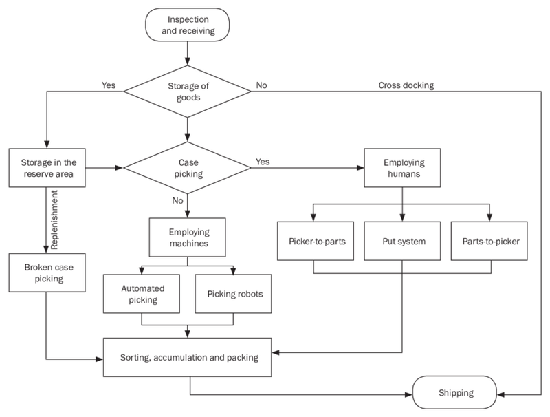

# BAB III

# ANALISIS MASALAH

## III.1 Analisis Kondisi Saat Ini

Sebelum mendefinisikan kebutuhan dan solusi pengembangan _Warehouse Management Controller_ (WMC), perlu dipahami terlebih dahulu kondisi operasional pergudangan PT Paragon Technology and Innovation saat ini beserta permasalahan yang melekat di dalamnya. Analisis kondisi saat ini dilakukan dengan menggali informasi langsung melalui wawancara dengan pihak Paragon Corp, menelaah proses bisnis _warehouse_ eksisting, serta mengidentifikasi kesenjangan (_gap_) antara kondisi tersebut dengan target _Smart Warehouse_.

### III.1.1 Profil Operasional Gudang Berdasarkan Hasil Wawancara

Guna memperoleh gambaran kondisi operasional yang akurat, kelompok TA252601001 melaksanakan wawancara daring dengan Bapak Falih Muhtadi, _Staff Logistics and Business Integration Systems_ PT Paragon Technology and Innovation (Paragon Corp), pada 16 Oktober 2025. Paragon Corp diketahui memiliki tiga jenis gudang yang terpisah, yaitu gudang bahan baku, gudang kemasan (_packaging warehouse_), dan gudang barang jadi (_Finished Goods_). Tugas akhir ini berfokus pada gudang barang jadi karena posisinya yang bersinggungan langsung dengan proses distribusi produk ke konsumen akhir. Sistem kerja inventori Paragon Corp sendiri menerapkan pendekatan _pull system_, di mana pergerakan dan pemrosesan barang baru berjalan ketika ada permintaan aktual yang masuk, bukan berdasarkan prakiraan internal. Alur kerja gudang mengikuti empat tahapan utama mulai dari _incoming_, _stocking_, _picking_ dan _checking_, hingga _dispatching_ menuju _Distribution Center_. Pendekatan ini memang menekan risiko _overstock_, namun juga menuntut kecepatan respons sistem yang tinggi agar tidak menimbulkan _bottleneck_ pada tahap distribusi. Dari sisi teknologi, gudang Paragon saat ini mengandalkan ERP Odoo dan _Warehouse Management System_ (WMS) untuk pencatatan dan pelacakan barang, tetapi kedua sistem tersebut masih bersifat semi-manual dan membutuhkan input operator secara berkala, sehingga integrasi _real-time_ antar platform belum terwujud dan _mismatch_ antara kondisi fisik di lapangan dengan catatan digital kerap terjadi.

Paragon Corp saat ini tengah bertransisi menuju sistem SAP untuk memperbaiki integrasi antar platform tersebut, sebuah kebutuhan yang semakin mendesak mengingat perusahaan mengelola lebih dari 40 _Distribution Center_ di Indonesia dan Malaysia dengan volume produk dan variasi SKU kosmetik yang sangat beragam. Wawancara ini juga mengonfirmasi sejumlah persoalan mendasar pada gudang barang jadi. Data stok belum bersifat _real-time_ karena WMS belum terhubung langsung dengan sistem pusat, proses _inbound_ berjalan lambat dengan perhitungan yang kurang presisi akibat masih mengandalkan cara manual, dan proses _picking_ pun masih bergantung pada operator sehingga rawan _human error_ terutama dalam menghitung jumlah barang. Bapak Falih turut menyoroti masalah _mistracking_ yang muncul akibat area penempatan sementara yang tidak tercatat dalam sistem, sekaligus melihat adanya peluang besar untuk mengotomasi proses _inbound_, khususnya pada tahap pemindahan barang dari truk ke _pallet changer_.

### III.1.2 Proses Bisnis Pergudangan Eksisting

Pada industri _Fast Moving Consumer Goods_ (FMCG) seperti PT Paragon Technology and Innovation, operasional rantai pasok menjadi penggerak utama bisnis, dan kelancarannya sangat bergantung pada empat sumber daya utama, yaitu _storage system_, _lift trucks_, _personnel_, dan _Warehouse Management System_ (WMS). Keempat komponen ini saling terkait erat, sehingga keterbatasan pada salah satunya akan langsung memengaruhi kecepatan keseluruhan operasional gudang.

Hasil analisis sebelumnya terhadap proses operasional Paragon Corp menunjukkan tiga kelemahan mendasar pada kondisi eksisting gudang barang jadi. Sistem inventori masih disimpan secara independen dan belum terintegrasi, sehingga rawan menimbulkan _mismatch_ antara data stok dan kondisi fisik di lapangan. Proses pencatatan dan pengambilan barang (_case picking_) pun masih sangat bergantung pada operator manusia, sebuah kondisi yang rentan terhambat oleh keterbatasan kompetensi dan jumlah sumber daya manusia. Di sisi lain, meskipun Paragon Corp telah memanfaatkan robot _Automated Guided Vehicle_ (AGV) untuk membantu mobilisasi barang jadi, pengelolaan armada AGV tersebut belum ditopang kerangka informasi yang jelas dan terintegrasi. Ketiga kelemahan ini bersama-sama menjadi tantangan tersendiri di tengah volume stok yang terus bertambah dan tuntutan _lead time_ yang semakin ketat.

Berdasarkan hasil analisis proses bisnis _Smart Warehouse_ tersebut, disusun sejumlah aktivitas primer yang menjadi fokus optimasi sistem, sebagaimana dirangkum pada Tabel 3.1.

Tabel 3.1 Aktivitas Primer pada Smart Warehouse

| Kode | Activity                                       |
| :--- | :--------------------------------------------- |
| PA01 | Otomatisasi Penerimaan Stok                    |
| PA02 | Smart Storage & Inventory                      |
| PA03 | Order Picking and Warehouse Management Process |
| PA04 | Quality Control                                |
| PA05 | Smart Vendor Management                        |
| PA06 | E-Procurement & Smart Vendor Management        |

Fokus pengembangan _Warehouse Management Controller_ (WMC) pada tugas akhir ini diarahkan pada aktivitas PA01, PA02, dan PA03, sebagai aktivitas primer yang paling berkaitan dengan permasalahan otomasi penerimaan, penyimpanan, dan pengelolaan _order_ pada gudang Paragon Corp.

### III.1.3 Kondisi Sistem Saat Ini (As-Is)

Pada kondisi saat ini, proses operasional gudang pada industri _Fast Moving Consumer Goods_ (FMCG) seperti Paragon Corp masih berjalan secara konvensional dengan mengandalkan tenaga kerja manusia dan pencatatan manual di hampir seluruh tahapan. Alur proses keseluruhan pada kondisi eksisting digambarkan pada Gambar 3.1.

Gambar 3.1 Diagram BPMN proses bisnis _warehouse_ kondisi saat ini (_As-Is_)

Proses diawali dengan inspeksi dan penerimaan barang (_inspection and receiving_), di mana staf memverifikasi jumlah, kondisi kemasan, dan kesesuaian dokumen secara manual tanpa mekanisme validasi otomatis, sehingga keakuratannya sepenuhnya bergantung pada ketelitian operator. Barang yang telah diverifikasi kemudian diarahkan ke penyimpanan cadangan (_storage of goods_) atau langsung diteruskan melalui jalur _cross docking_. Untuk barang yang disimpan, pengisian kembali ke area aktif (_replenishment_) masih dilakukan berdasarkan estimasi visual operator karena belum tersedia pemantauan stok _real-time_, sehingga rawan memicu _stockout_ atau _overstock_ yang tidak terdeteksi cepat. Pada tahap pengambilan barang (_case picking_), metode berbasis manusia seperti _picker-to-parts_, _put system_, dan _parts-to-picker_ sama-sama masih bergantung penuh pada kecepatan dan ketersediaan staf, sementara metode berbasis mesin seperti _automated picking_ dan _picking robots_ pun beroperasi terpisah tanpa integrasi dengan sistem manajemen gudang, sehingga tetap memerlukan koordinasi manual dan menimbulkan _bottleneck_ pada periode permintaan tinggi. Barang yang telah dipilih kemudian disortir, dikumpulkan, dan dikemas (_sorting, accumulation, and packing_) secara manual tanpa validasi otomatis atas kesesuaian barang dengan detail pesanan, sebelum akhirnya dikirim (_shipping_) ke pelanggan atau distributor tujuan.

Secara keseluruhan, kondisi eksisting ini memperlihatkan empat kelemahan struktural yang saling berkaitan. Seluruh tahap operasional, dari penerimaan hingga pengiriman, masih mengandalkan pencatatan dan koordinasi manual yang rentan terhadap kesalahan dan inkonsistensi data. Ketiadaan pemantauan stok _real-time_ menyebabkan ketidaksinkronan berulang antara kondisi fisik di lapangan dan catatan digital. Ketergantungan pada tenaga manusia dalam proses _picking_ menciptakan _bottleneck_ yang membatasi kapasitas dan kecepatan pemenuhan pesanan, sementara minimnya integrasi antar subsistem membatasi visibilitas operasional bagi manajemen dan memperbesar potensi _human error_ di setiap tahap.

### III.1.4 Analisis Gap

Dengan memahami kondisi eksisting _warehouse_ dan kondisi _Smart Warehouse_ yang ditargetkan, dilakukan analisis _gap_ untuk mengidentifikasi kesenjangan antara _current condition_ dan _future condition_ secara terstruktur. Analisis ini menjadi landasan utama dalam merumuskan kebutuhan sistem WMC, sebagaimana dirangkum pada Tabel 3.2.

Tabel 3.2 Gap Analysis Kondisi Eksisting vs Smart Warehouse

| Kode | Current Condition (Masalah Aktual Paragon)                                                  | Gap                                                                                     | Future Condition                                                                           |
| :--- | :------------------------------------------------------------------------------------------ | :-------------------------------------------------------------------------------------- | :----------------------------------------------------------------------------------------- |
| MA01 | Data stok belum _real-time_ karena WMS tidak terhubung dengan sistem pusat.                 | Belum ada integrasi _real-time_ antar sistem, _update_ masih manual dan rawan _error_.  | Sistem terintegrasi dan sinkron antara _warehouse_ barang jadi dan pusat.                  |
| MA02 | Pendataan dan penaruhan _inbound_ barang berjalan lambat dengan perhitungan kurang presisi. | Ketergantungan tinggi pada proses manual membuat _error rate_ tinggi dan proses lambat. | Sistem deteksi dan pelacakan barang akurat yang berjalan otomatis.                         |
| MA03 | _Picking_ manual berjalan lambat dan masih bergantung pada operator manusia.                | Belum ada sistem otomasi yang menjamin keakuratan permintaan dan waktu pemenuhan.       | Perpindahan barang di semua tahapan berjalan otomatis dengan keakuratan dan waktu terjaga. |

Ketiga masalah aktual tersebut (MA01--MA03) menjadi dasar langsung perancangan WMC. Persoalan sinkronisasi data pada MA01 mendorong kebutuhan modul _Goods Detail Service_ yang menjamin stok tercatat secara _real-time_. Lambatnya pendataan pada MA02 melatarbelakangi kebutuhan otomasi pencatatan dan pemantauan barang agar proses _inbound_ lebih cepat dan akurat. Adapun ketergantungan pada operator manusia dalam proses _picking_ pada MA03 menjadi latar belakang pengembangan _Fleet Order Service_ yang mengoordinasikan armada robot secara terprogram dalam proses _stocking_ dan _picking_.

## III.2 Analisis Kebutuhan

Analisis kebutuhan bertujuan untuk mengidentifikasi secara sistematis dan menjabarkan seluruh persyaratan yang harus dipenuhi oleh _Warehouse Management Controller_ (WMC) guna menyelesaikan permasalahan operasional yang ada. Tahapan ini mencakup penjabaran karakteristik produk, penetapan kebutuhan fungsional dan nonfungsional, serta penjabaran batasan sistem sebagai landasan perancangan solusi yang tepat sasaran.

### III.2.1 Tujuan Proyek

Berdasarkan kebutuhan yang telah dirumuskan, tujuan atau _objectives_ dari proyek ini adalah untuk mengembangkan sebuah sistem _Warehouse_ yang mampu melakukan hal yang dapat menjawab Rumusan Masalah:

- **[OB01]** Menjamin konsistensi data stok antara kondisi fisik dan catatan digital secara otomatis dan _integrated_, sehingga seluruh informasi inventori dapat diandalkan sebagai dasar pengambilan keputusan dan tidak terjadi selisih antara sistem dan kenyataan di lapangan.
- **[OB02]** Melakukan pelacakan dan pencatatan operasi gudang secara menyeluruh, mencakup proses penerimaan, penyimpanan, hingga distribusi barang, agar setiap pergerakan dapat ditelusuri dengan jelas dan terdokumentasi dengan baik.
- **[OB03]** Melaksanakan perpindahan barang yang dibutuhkan secara otomatis, mencakup pada proses _stocking_ (_inbound_) dan _picking_ (_outbound_). Sistem harus dapat melakukan perpindahan secara presisi dan dalam batas waktu pemenuhan _order_.

Ketiga tujuan proyek tersebut dirancang untuk menjawab setiap poin rumusan masalah yang telah disusun sebelumnya. Hubungan antara rumusan masalah dan tujuan proyek dapat dilihat melalui pemetaan berikut.

Tabel 3.3 Pemetaan Rumusan Masalah dengan Tujuan Proyek

| Kode Rumusan Masalah | Kode Tujuan Proyek | Tujuan Proyek                                                                                                                                                                                                                                                          |
| :------------------- | :----------------- | :--------------------------------------------------------------------------------------------------------------------------------------------------------------------------------------------------------------------------------------------------------------------- |
| PM01                 | OB01               | Menjamin konsistensi data stok antara kondisi fisik dan catatan digital secara otomatis dan _integrated_, sehingga seluruh informasi inventori dapat diandalkan sebagai dasar pengambilan keputusan dan tidak terjadi selisih antara sistem dan kenyataan di lapangan. |
| PM02                 | OB02               | Melakukan pelacakan dan pencatatan operasi gudang secara menyeluruh, mencakup proses penerimaan, penyimpanan, hingga distribusi barang, agar setiap pergerakan dapat ditelusuri dengan jelas dan terdokumentasi dengan baik.                                           |
| PM03                 | OB03               | Melaksanakan perpindahan barang yang dibutuhkan secara otomatis, mencakup pada proses _stocking_ (_inbound_) dan _picking_ (_outbound_). Sistem harus dapat melakukan perpindahan secara presisi dan dalam batas waktu pemenuhan _order_.                              |

### III.2.2 Karakteristik Produk

Berdasarkan tujuan proyek _Smart Warehouse_ yang telah dirumuskan pada dokumen B100 subbab 2.2.1, sistem _Warehouse Management Controller_ (WMC) dirancang untuk mengotomatisasi proses _stocking_ dan _picking_ pada pergudangan, mulai dari pencatatan, pelacakan, hingga perpindahan barang. Sistem ini memastikan integrasi data antara kondisi fisik dan digital secara _real-time_, memungkinkan deteksi dan pemantauan pergerakan barang yang akurat, serta mendukung proses perpindahan barang secara presisi dan tepat waktu. Karakteristik produk tersebut dirangkum dan diberi kodefikasi pada Tabel 3.4.

Tabel 3.4 Karakteristik Produk Sistem Smart Warehouse

| Kode | Deskripsi                                                                                                                                    |
| :--- | :------------------------------------------------------------------------------------------------------------------------------------------- |
| CH01 | Sistem dapat menyinkronkan data stok secara otomatis antara kondisi fisik dan catatan digital untuk menjaga konsistensi informasi inventori. |
| CH02 | Sistem mampu mendeteksi, mencatat, dan memantau pergerakan barang secara menyeluruh dari proses _stocking_ hingga _picking_.                 |
| CH03 | Sistem dapat mengatur perpindahan barang secara otomatis dengan presisi sesuai waktu dan kebutuhan _order_.                                  |
| CH04 | Sistem menyajikan laporan _real-time_ kepada pengguna untuk mendukung pengambilan keputusan operasional.                                     |
| CH05 | Sistem dapat menyesuaikan kapasitas dan alur kerja secara otomatis sesuai perubahan volume dan variasi produk.                               |
| CH06 | Sistem mampu beradaptasi dengan kebutuhan gudang yang berbeda melalui penyesuaian otomasi tambahan.                                          |
| CH07 | Sistem mampu melakukan pembentukan _order stocking_ secara otomatis.                                                                         |

Karakteristik CH01--CH05 merupakan fungsi dasar yang menjadi inti kapabilitas sistem, sedangkan CH06--CH07 merupakan fungsi dan fitur tambahan. Ketujuh karakteristik produk ini menjadi acuan dalam penurunan kebutuhan fungsional dan nonfungsional WMC pada Subbab III.2.3 dan III.2.4 berikutnya.

Untuk menunjukkan keterkaitan antara karakteristik produk dengan tujuan proyek yang telah dirumuskan pada Subbab III.2.1, disusun pemetaan antara kode tujuan proyek (OB01--OB03) dengan kode karakteristik produk (CH01--CH07) yang mendukungnya, sebagaimana disajikan pada Tabel 3.5.

Tabel 3.5 Pemetaan Karakteristik Produk dengan Tujuan Proyek

| Kode Tujuan Proyek | Kode Karakteristik |
| :----------------- | :----------------- |
| OB01               | CH01, CH04         |
| OB02               | CH02, CH05, CH06   |
| OB03               | CH03, CH07         |

### III.2.3 Kebutuhan Fungsional

Kebutuhan fungsional mendefinisikan kapabilitas layanan yang harus disediakan oleh _Warehouse Management Controller_ (WMC) beserta Subsistem Lokalisasi sebagai satu sistem terintegrasi. Kebutuhan diturunkan dari karakteristik produk (CH01--CH07) dan dirumuskan dalam bentuk _Input_, _Operasi_, dan _Output_ untuk setiap fungsi utama sistem, sebagaimana dirinci pada Tabel 3.6--3.10.

**Tabel 3.6 KF-01 — Autentikasi dan Otorisasi Akses**

| Aspek   | Deskripsi                                                                                                                                                                                                                |
| :------ | :----------------------------------------------------------------------------------------------------------------------------------------------------------------------------------------------------------------------- |
| Input   | Kredensial pengguna berupa _username_ dan _password_.   _Bearer Token_ yang disertakan pada setiap permintaan akses layanan.                                                                                          |
| Operasi | Memvalidasi kredensial terhadap data pengguna terdaftar.   Menerbitkan _Bearer Token_ sebagai kredensial sesi aktif.   Memverifikasi token pada setiap akses _endpoint_ layanan dan mengakhiri sesi saat _logout_. |
| Output  | _Bearer Token_ untuk sesi terautentikasi.   Status keberhasilan atau penolakan akses terhadap fungsi sistem.                                                                                                          |

**Tabel 3.7 KF-02 — Pengelolaan Informasi Barang**

| Aspek   | Deskripsi                                                                                                                                                                                                                                                                                    |
| :------ | :------------------------------------------------------------------------------------------------------------------------------------------------------------------------------------------------------------------------------------------------------------------------------------------- |
| Input   | Permintaan data barang (daftar maupun detail) dari pengguna atau layanan lain.   Identitas barang (SKU/ID) serta data slot dan lokasi penyimpanan pada _grid_ gudang.                                                                                                                     |
| Operasi | Mengambil dan menyajikan daftar barang beserta atribut ringkas (nama, SKU, kategori, jumlah stok).   Menyediakan informasi detail barang (dimensi, berat, kondisi stok terkini).   Memetakan lokasi fisik barang ke koordinat _grid_ dan memperbarui data stok saat terjadi perubahan. |
| Output  | Data daftar dan detail barang yang konsisten.   Informasi lokasi fisik barang pada _grid_ gudang.                                                                                                                                                                                         |

**Tabel 3.8 KF-03 — Manajemen Order Stocking dan Picking**

| Aspek   | Deskripsi                                                                                                                                                                                                                                  |
| :------ | :----------------------------------------------------------------------------------------------------------------------------------------------------------------------------------------------------------------------------------------- |
| Input   | Permintaan pembuatan _order_ (jenis _stocking_/_picking_, barang, lokasi sumber dan tujuan).   _Event_ hasil eksekusi tugas dari _Fleet Controller_.                                                                                    |
| Operasi | Memvalidasi dan mencatat _order_ beserta reservasi stok terkait.   Meneruskan instruksi pemindahan barang ke _Fleet Controller_.   Memperbarui status _order_ berdasarkan _event_ (_Pending_, _In Progress_, _Completed_, _Failed_). |
| Output  | Konfirmasi _order_ yang berhasil dibuat.   Daftar dan status _order_ terkini secara _real-time_ beserta riwayat untuk audit.                                                                                                            |

**Tabel 3.9 KF-04 — Lokalisasi Objek**

| Aspek   | Deskripsi                                                                                                                                                                                                                                                        |
| :------ | :--------------------------------------------------------------------------------------------------------------------------------------------------------------------------------------------------------------------------------------------------------------- |
| Input   | Aliran citra dari kamera _overhead_ melalui protokol RTSP.   Parameter kalibrasi kamera dan _homography_ serta definisi _layout grid_ gudang.                                                                                                                 |
| Operasi | Mendeteksi dan mengidentifikasi objek (robot, rak, _docking station_) melalui _marker fiducial_.   Memetakan posisi objek ke sel _grid_ diskrit dan menentukan orientasi (_heading_).   Mempublikasikan status posisi secara berkala melalui _topic_ MQTT. |
| Output  | Koordinat _grid_ dan orientasi setiap objek terdeteksi.   Status posisi terkini yang dikonsumsi oleh _Fleet Controller_ dan _Fleet Order Service_.                                                                                                            |

**Tabel 3.10 KF-05 — Pemantauan Armada Robot**

| Aspek   | Deskripsi                                                                                                                                                                                                                                                                     |
| :------ | :---------------------------------------------------------------------------------------------------------------------------------------------------------------------------------------------------------------------------------------------------------------------------- |
| Input   | _Telemetry_ posisi dan status robot (posisi, baterai, status tugas).   Data antrean dan progres _task_ dari pusat kendali.                                                                                                                                                 |
| Operasi | Menerima dan memproses status robot secara _real-time_ melalui protokol komunikasi IoT.   Mengklasifikasikan status robot (_active_, _idle_, _error_) dan mengaitkan progres _task_ dengan _order_ terkait.   Menghasilkan notifikasi apabila terjadi kondisi abnormal. |
| Output  | Data posisi dan status operasional armada robot secara _real-time_.   Status dan progres _task_ beserta notifikasi anomali.                                                                                                                                                |

### III.2.4 Kebutuhan Nonfungsional

Kebutuhan nonfungsional mendefinisikan batasan kualitas dan performa yang harus dipenuhi oleh sistem sebagai atribut kualitas di luar fungsi utamanya. Kebutuhan ini diturunkan dari spesifikasi produk pada dokumen B200 serta mencakup WMC dan Subsistem Lokalisasi secara terpadu, sebagaimana disajikan pada Tabel 3.11.

Tabel 3.11 Kebutuhan Nonfungsional Sistem

| Kode   | Kategori               | Deskripsi Kebutuhan                                                                                                                                                                                                                          | Parameter                                                       | Acuan                         |
| :----- | :--------------------- | :------------------------------------------------------------------------------------------------------------------------------------------------------------------------------------------------------------------------------------------- | :-------------------------------------------------------------- | :---------------------------- |
| KNF-01 | Traceability & Latensi | Seluruh aktivitas pergerakan barang dan status robot tercatat lengkap dan berurutan tanpa kehilangan data, dengan sinkronisasi waktu robot--server dan server--WMS terjamin serta pembaruan posisi dan status robot dikirim secara periodik. | Sinkronisasi ≤ 200 ms; posisi & status robot ≤ 1 detik          | B200 -- Traceability          |
| KNF-02 | Reliability            | Sistem tidak mengalami degradasi akurasi posisi meskipun robot beroperasi berulang kali pada rute yang sama.                                                                                                                                 | _Task Repeatability_ 100%                                       | B200 -- Reliability           |
| KNF-03 | Availability           | Seluruh layanan WMC beroperasi kontinu selama jam operasional gudang, serta mampu mendeteksi kegagalan pelacakan (_mismatch_ koordinat server vs posisi fisik) dan mengirimkan notifikasi yang memuat koordinat terakhir robot.              | _Availability_ ≥ 95%; notifikasi memuat _last-known coordinate_ | B200 -- Availability & Safety |
| KNF-04 | Keamanan               | Seluruh _endpoint_ layanan hanya dapat diakses oleh pengguna terautentikasi melalui _Bearer Token_ yang diterbitkan _Authentication Service_, sehingga tidak ada akses tidak sah terhadap fungsi kritis sistem.                              | 0 akses tanpa token valid                                       | P-05, B200 -- Safety          |
| KNF-05 | Skalabilitas           | Arsitektur _microservices_ memungkinkan setiap layanan dikembangkan, diuji, dan di-_deploy_ secara independen tanpa _redeployment_ keseluruhan sistem, guna mendukung adaptasi terhadap kebutuhan gudang yang berbeda.                       | _Independent deploy_ per _service_                              | CH05, CH06                    |

## III.3 Analisis Pemilihan Solusi

Berdasarkan identifikasi masalah dan kebutuhan yang telah dirumuskan pada sub-bab sebelumnya, tahap berikutnya adalah menganalisis dan menentukan solusi arsitektur yang paling sesuai untuk diimplementasikan sebagai _Warehouse Management Controller_ (WMC) beserta Subsistem Lokalisasi. Mengikuti struktur analisis pada dokumen B100, subbab ini disusun dalam tiga tahap: identifikasi alternatif solusi (III.3.1), analisis dan evaluasi alternatif menggunakan metode _Analytical Hierarchy Process_ (AHP) (III.3.2), serta penetapan solusi terpilih (III.3.3). Kedua keputusan yang dibahas — pemilihan solusi manajemen data inventori WMC dan pemilihan solusi teknis Subsistem Lokalisasi — dievaluasi dengan kedalaman dan tahapan AHP yang setara.

### III.3.1 Usulan Solusi

#### III.3.1.1 Alternatif Solusi Manajemen Data Inventori (WMC)

Dalam pengembangan WMC sebagai sistem perangkat lunak inti _Smart Warehouse_, permasalahan utama yang perlu diselesaikan pada lapisan manajemen data adalah bagaimana sistem mencatat, memperbarui, dan menjaga konsistensi informasi inventori secara _real-time_ sejalan dengan aktivitas fisik robot di lapangan. Berdasarkan kajian pada dokumen B100 subbab 2.2.2.4, terdapat dua pendekatan arsitektur yang dapat dipertimbangkan sebagai solusi manajemen data inventori WMC, yaitu _Event-Driven Inventory Management_ dan _State-Driven Inventory Management_. Karakteristik masing-masing alternatif diuraikan sebagai berikut.

##### III.3.1.1.1 Alternatif 1: Event-Driven Inventory Management

Pada pendekatan _Event-Driven Inventory Management_, WMC mengelola _order_, stok, dan proses pemindahan barang secara terintegrasi melalui mekanisme pencatatan _event_. Ketika _order stocking_ atau _picking_ dibuat melalui _Fleet Order Service_, sistem langsung mencatat _order_ dan melakukan reservasi stok secara internal untuk memastikan ketersediaan barang tanpa langsung mengurangi stok secara final. Setelah reservasi dilakukan, sistem mengirimkan instruksi pemindahan barang ke _Fleet Controller_. Selama proses berlangsung, seluruh aktivitas dan hasil pemindahan dicatat sebagai _event_ operasional diskrit yang merepresentasikan kondisi fisik di lapangan. Berdasarkan hasil _event_ tersebut, sistem menentukan apakah pemindahan berhasil atau gagal, lalu memperbarui stok secara final atau mengembalikan stok ke kondisi semula sesuai hasil aktual.

Keunggulan utama alternatif ini terletak pada keseimbangan antara latensi rendah dan keandalan tinggi karena pembaruan stok hanya dilakukan setelah konfirmasi _event_ dari lapangan. Selain itu, riwayat seluruh pergerakan barang tetap tersimpan sebagai catatan _event_ yang dapat ditelusuri untuk kebutuhan audit dan analisis operasional, sehingga memenuhi persyaratan _traceability_ sesuai standar ISO 9001:2015. Adapun kekurangan dari pendekatan ini adalah kompleksitas implementasi yang lebih tinggi karena membutuhkan mekanisme pengelolaan _event_ yang terstruktur.

##### III.3.1.1.2 Alternatif 2: State-Driven Inventory Management

Pada pendekatan _State-Driven Inventory Management_, WMC beroperasi dengan menjadikan satu sistem terpusat sebagai satu-satunya pengelola _state_ stok dan pergerakan barang. Ketika _order picking_ atau _stocking_ dibuat, sistem langsung mencatat _order_ dan sekaligus memperbarui stok secara langsung di basis data tanpa mekanisme reservasi bertingkat. Setelah _order_ tercatat, sistem mengirimkan instruksi ke _Fleet Controller_ untuk melakukan pemindahan barang. Apabila pemindahan gagal, sistem akan menyesuaikan kembali kondisi stok berdasarkan hasil aktual di lapangan. Setelah proses pemindahan selesai, data inventori terbaru disinkronisasi ke seluruh lapisan sistem sebagai referensi kondisi terkini.

Keunggulan utama alternatif ini adalah alur sistem yang lebih sederhana dengan kompleksitas implementasi yang lebih rendah dibandingkan pendekatan _event-driven_, serta latensi yang rendah karena pembaruan stok dilakukan secara langsung. Proses pemantauan dan penelusuran masalah juga menjadi lebih mudah karena seluruh data _state_ terpusat di satu lokasi. Namun, kekurangan pendekatan ini adalah tingkat keandalan yang lebih rendah terhadap kegagalan parsial, karena jika terjadi kegagalan komunikasi antara WMC dan _Fleet Controller_ di tengah proses, konsistensi antara _state_ stok digital dan kondisi fisik barang tidak dapat dijamin secara otomatis. Selain itu, tidak adanya pencatatan _event_ membuat keterlacakan historis operasional menjadi terbatas.

#### III.3.1.2 Alternatif Solusi Lokalisasi

Sama seperti pada subbab sebelumnya, pemilihan solusi teknis untuk Subsistem Lokalisasi diawali dengan mengidentifikasi alternatif pendekatan lokalisasi yang dapat diterapkan. Berdasarkan kajian pada dokumen B100/B300 dan implementasi yang dilakukan pada tugas akhir ini, terdapat dua pendekatan yang dapat dipertimbangkan, yaitu _QR Code + Line Following_ dan _AprilTag + Overhead Fisheye Camera_. Karakteristik masing-masing alternatif diuraikan sebagai berikut.

##### III.3.1.2.1 Alternatif 1: QR Code + Line Following

Pendekatan ini menempatkan seluruh perangkat lokalisasi pada masing-masing robot (_on-board_, desentralisasi) sebagaimana dirancang pada dokumen B100/B300. Robot mengikuti garis lintasan di lantai secara kontinu menggunakan _Line Detector Sensor_ BFD-1000 (6 kanal IR) untuk memperoleh posisi relatif terhadap jalur, kemudian memindai _QR code_ menggunakan GM65 _reader_ pada titik-titik tertentu untuk memverifikasi posisi absolut dalam matriks _grid_ 12×6. Data ini digabung dengan pembacaan IMU dan diolah oleh ESP32-S3 di tiap robot untuk menghasilkan status posisi yang dikirim ke _Fleet Controller_.

Keunggulan utama alternatif ini adalah setiap robot mandiri melakukan _self-localization_ sehingga tidak bergantung pada satu titik kegagalan sentral, dan infrastruktur jalur serta _QR code_ relatif murah untuk dipasang di lantai gudang. Adapun kekurangannya, akurasi posisi antar-_checkpoint_ bergantung pada kestabilan pembacaan sensor garis yang sensitif terhadap kondisi lantai (debu, aus, pencahayaan), setiap robot memerlukan satu set sensor lengkap sehingga biaya bertambah linear seiring penambahan robot, dan verifikasi posisi absolut hanya terjadi secara diskrit di titik _QR_, bukan kontinu di seluruh area.

##### III.3.1.2.2 Alternatif 2: AprilTag + Overhead Fisheye Camera

Pendekatan ini memindahkan seluruh proses lokalisasi ke satu titik sentral, yaitu kamera IP _fisheye_ 1080p yang dipasang setinggi 60 cm di atas area lantai gudang (2,4×1,2 m), melakukan _streaming_ video melalui protokol RTSP, kemudian diproses oleh Subsistem Lokalisasi di server melalui _pipeline_ koreksi distorsi Kannala–Brandt → transformasi _homography_ → deteksi _marker_ AprilTag Tag36h11 → _snapping_ ke sel _grid_, yang berjalan pada frekuensi 4 Hz dan dipublikasikan ke _topic_ MQTT `location` setiap 500 ms. Pendekatan inilah yang diimplementasikan pada tugas akhir ini.

Keunggulan utama alternatif ini adalah satu perangkat mampu mencakup seluruh area tanpa oklusi, akurasi terverifikasi 100% pada pengujian posisi maupun orientasi (Tabel 6.4 dan 6.5 pada Bab VI), kalibrasi _homography_ hanya dilakukan sekali di awal pemasangan (_one-time_), dan penambahan robot baru cukup dilakukan dengan menempelkan _marker_ AprilTag baru tanpa tambahan sensor per unit. Adapun kekurangannya, pendekatan ini bersifat _single point of failure_ karena jika kamera atau koneksi RTSP mengalami gangguan maka seluruh sistem lokalisasi ikut lumpuh, area cakupan dibatasi oleh _field-of-view_ satu kamera sehingga perluasan ke gudang yang lebih besar memerlukan penambahan kamera dan proses _stitching_, serta memerlukan tahap kalibrasi optik yang lebih matematis dibandingkan sensor garis.

### III.3.2 Analisis Usulan Solusi

Analisis usulan solusi dilakukan untuk mengevaluasi setiap alternatif yang telah diidentifikasi pada Subbab III.3.1 secara sistematis menggunakan metode _Analytical Hierarchy Process_ (AHP), sehingga keputusan pemilihan solusi bersifat objektif dan dapat dipertanggungjawabkan secara teknis. Mengikuti pendekatan pada dokumen B100, satu set kriteria, bobot, dan rubrik penilaian yang sama digunakan untuk mengevaluasi kedua keputusan yang dibahas — pemilihan solusi manajemen data inventori WMC maupun pemilihan solusi teknis Subsistem Lokalisasi — sehingga kedua keputusan dinilai secara setara dan dapat diperbandingkan pada kerangka acuan yang identik. Kriteria dan bobot ini disusun dan dijelaskan terlebih dahulu, dilanjutkan dengan rekapitulasi skor akhir tiap alternatif untuk masing-masing keputusan, dan diakhiri dengan penjelasan justifikasi nilai pada setiap kriteria.

#### III.3.2.1 Kriteria dan Bobot Evaluasi

Kriteria penilaian dalam matriks AHP mengacu pada kriteria umum yang telah ditetapkan pada dokumen B100, yaitu _Reliability_, _Scalability_, _Cost of Production_, _Complexity of Production_, _Task Completion Speed_, dan Kemudahan Penggunaan, sebagaimana disajikan pada Tabel 3.12. Keenam kriteria ini digunakan sebagai acuan evaluasi baik untuk pemilihan solusi manajemen data inventori WMC maupun pemilihan solusi teknis Subsistem Lokalisasi.

Tabel 3.12 Kriteria dan Penjelasannya (Manajemen Data Inventori)

| Kriteria                 | Penjelasan                                                                  |
| :----------------------- | :-------------------------------------------------------------------------- |
| Reliability              | Ketahanan sistem bekerja secara konsisten dan akurat tanpa gangguan.        |
| Scalability              | Kemampuan sistem untuk dikembangkan sesuai peningkatan kebutuhan.           |
| Cost of Production       | Total biaya yang diperlukan untuk membuat dan mengoperasikan sistem.        |
| Complexity of Production | Tingkat kesulitan dalam perancangan, pembuatan, dan integrasi sistem.       |
| Task Completion Speed    | Kecepatan sistem dalam menyelesaikan tugas permintaan dan penaruhan barang. |
| Kemudahan Penggunaan     | Seberapa mudah sistem dioperasikan tanpa pelatihan khusus.                  |

Pembobotan kriteria ditetapkan melalui perbandingan berpasangan (_pairwise comparison_) sebagaimana dilakukan pada dokumen B100 subbab 2.2.3. Hasil perbandingan berpasangan menggunakan skala Saaty disajikan pada Tabel 3.13.

Tabel 3.13 Nilai Kepentingan Kriteria (Manajemen Data Inventori) (B100 Tabel 8)

| Kriteria                 | Reliability | Scalability | Cost of Production | Complexity of Production | Task Completion Speed | Kemudahan Penggunaan |
| :----------------------- | :---------: | :---------: | :----------------: | :----------------------: | :-------------------: | :------------------: |
| Reliability              |      1      |      2      |         3          |            4             |           4           |          4           |
| Scalability              |     0,5     |      1      |         2          |            3             |           4           |          4           |
| Cost of Production       |    0,33     |     0,5     |         1          |            2             |           3           |          4           |
| Complexity of Production |    0,25     |    0,33     |        0,5         |            1             |           2           |          3           |
| Task Completion Speed    |    0,25     |    0,25     |        0,33        |           0,5            |           1           |          2           |
| Kemudahan Penggunaan     |    0,25     |    0,25     |        0,25        |           0,33           |          0,5          |          1           |

Bobot masing-masing kriteria dihitung dengan menormalisasi setiap kolom matriks terhadap jumlah kolomnya, kemudian merata-ratakan nilai pada setiap baris (metode _eigenvector_ approksimasi), sebagaimana dilakukan pada dokumen B100. Nilai bobot mencerminkan tingkat kepentingan relatif setiap kriteria terhadap tujuan pemilihan solusi manajemen data inventori WMC, sebagaimana disajikan pada Tabel 3.14.

Tabel 3.14 Nilai Bobot Kriteria (Manajemen Data Inventori) (B100 Tabel 9)

| Kriteria                 | Bobot    |
| :----------------------- | :------- |
| Reliability              | 0,36     |
| Scalability              | 0,25     |
| Cost of Production       | 0,17     |
| Complexity of Production | 0,11     |
| Task Completion Speed    | 0,07     |
| Kemudahan Penggunaan     | 0,05     |
| **Total**                | **1,00** |

Setelah kriteria dan bobotnya ditetapkan, rubrik penilaian disusun untuk memberikan acuan yang konsisten dalam menilai setiap alternatif solusi pada skala 1 (sangat buruk) hingga 5 (sangat baik), sebagaimana disajikan pada Tabel 3.15.

Tabel 3.15 Rubrik Penilaian Solusi (Manajemen Data Inventori) (B100 Tabel 10)

| No  | Kriteria                 | Bobot 1 (Sangat Buruk)                                                               | Bobot 2 (Buruk)                                               | Bobot 3 (Cukup)                                                      | Bobot 4 (Baik)                                                       | Bobot 5 (Sangat Baik)                                                                                      |
| :-: | :----------------------- | :----------------------------------------------------------------------------------- | :------------------------------------------------------------ | :------------------------------------------------------------------- | :------------------------------------------------------------------- | :--------------------------------------------------------------------------------------------------------- |
|  1  | Reliability              | Sistem sering gagal berfungsi (>10% _downtime_ per minggu).                          | Sistem mengalami gangguan berulang (5–10% _downtime_).        | Sistem cukup andal dengan _downtime_ sedang (2–5% _downtime_).       | Sistem stabil dengan _downtime_ sangat jarang (<2% _downtime_).      | Sistem sangat andal, _uptime_ >99,9%, mampu beroperasi terus-menerus tanpa gangguan.                       |
|  2  | Scalability              | Sistem tidak mampu menangani peningkatan beban; performa turun >50% saat beban naik. | Sistem dapat diskalakan terbatas (penurunan performa 30–50%). | Sistem masih responsif dengan penurunan performa moderat (10–30%).   | Sistem tetap stabil dengan performa menurun <10% saat beban naik.    | Sistem sangat fleksibel; mampu menangani peningkatan beban 100% tanpa penurunan performa signifikan (<5%). |
|  3  | Cost of Production       | Biaya produksi sangat tinggi.                                                        | Biaya melebihi anggaran dan sulit ditekan.                    | Biaya masih dalam batas wajar namun belum optimal.                   | Biaya minimal dan sesuai dengan target anggaran.                     | Biaya sangat minimal dan memberikan rasio biaya–manfaat terbaik.                                           |
|  4  | Complexity of Production | Desain sistem sangat rumit dan membutuhkan komponen kustom langka.                   | Sistem cukup kompleks dan sulit diintegrasikan.               | Sistem memiliki kompleksitas menengah dengan beberapa komponen umum. | Sistem mudah dirakit dan dikonfigurasi menggunakan komponen standar. | Sistem sederhana, modular, dan mudah diintegrasikan dengan sistem lain.                                    |
|  5  | Task Completion Speed    | Waktu penyelesaian tugas jauh melebihi standar.                                      | Waktu penyelesaian masih lambat dan sering tertunda.          | Kecepatan cukup baik.                                                | Sistem mampu menyelesaikan tugas dengan cepat dan konsisten.         | Sistem sangat cepat dan responsif di bawah beban tinggi.                                                   |
|  6  | Kemudahan Penggunaan     | Sistem sulit digunakan, hanya bisa dioperasikan teknisi berpengalaman.               | Sistem cukup rumit dan membutuhkan pelatihan intensif.        | Sistem mudah digunakan setelah pelatihan singkat.                    | Sistem mudah dipahami dan dapat digunakan oleh operator umum.        | Sistem sangat intuitif, langsung bisa digunakan tanpa pelatihan.                                           |

#### III.3.2.2 Penilaian Solusi Manajemen Data Inventori

Berdasarkan rubrik penilaian pada Tabel 3.15, setiap alternatif solusi manajemen data inventori dievaluasi dengan memberikan nilai pada masing-masing kriteria sesuai karakteristik arsitekturnya. Nilai tersebut dikalikan dengan bobot kriteria hasil perhitungan AHP pada Tabel 3.14 untuk memperoleh skor total tiap alternatif, sebagaimana dirangkum pada Tabel 3.16.

Tabel 3.16 Rekapitulasi Penilaian AHP Solusi Manajemen Data Inventori (B100 Tabel 2.2.3.8)

| Kriteria              | Bobot | Alt. 1: Event-Driven (Nilai) | Alt. 1 (Bobot×Nilai) | Alt. 2: State-Driven (Nilai) | Alt. 2 (Bobot×Nilai) |
| :-------------------- | :---: | :--------------------------: | :------------------: | :--------------------------: | :------------------: |
| Reliability           | 0,36  |              4               |         1,44         |              3               |         1,08         |
| Scalability           | 0,25  |              4               |         1,00         |              3               |         0,75         |
| Cost of Production    | 0,17  |              3               |         0,51         |              3               |         0,51         |
| Complexity of Prod.   | 0,11  |              3               |         0,33         |              4               |         0,44         |
| Task Completion Speed | 0,07  |              3               |         0,21         |              4               |         0,28         |
| Kemudahan Penggunaan  | 0,05  |              5               |         0,25         |              5               |         0,25         |
| **Total**             | **1** |             ---              |       **3,74**       |             ---              |       **3,31**       |

Dari hasil rekapitulasi, Alternatif 1: _Event-Driven Inventory Management_ memperoleh skor total 3,74, lebih tinggi dibandingkan Alternatif 2: _State-Driven Inventory Management_ dengan skor 3,31. Penjelasan penilaian pada setiap kriteria diuraikan pada Tabel 3.17 untuk Alternatif 1 dan Tabel 3.18 untuk Alternatif 2.

Tabel 3.17 Penjelasan Penilaian Alternatif 1: Event-Driven Inventory Management

| Kriteria                 | Nilai | Penjelasan                                                                                                                                               |
| :----------------------- | :---: | :------------------------------------------------------------------------------------------------------------------------------------------------------- |
| Reliability              |   4   | Sistem memperbarui stok berdasarkan urutan kejadian (_event_) sehingga data inventori tetap konsisten meskipun terjadi kegagalan pada robot di lapangan. |
| Scalability              |   4   | Arsitektur berbasis _event_ memungkinkan sistem menangani peningkatan volume _order_ tanpa perubahan besar pada komponen inti layanan.                   |
| Cost of Production       |   3   | Biaya pengembangan relatif moderat dan berskala linear sesuai kebutuhan tiap gudang.                                                                     |
| Complexity of Production |   3   | Kompleksitas muncul pada perancangan mekanisme transisi status stok dan pengelolaan _event handler_ yang terstruktur.                                    |
| Task Completion Speed    |   3   | Proses penyelesaian tugas memerlukan waktu tambahan karena setiap perubahan stok harus melalui validasi kejadian (_event confirmation_) terlebih dahulu. |
| Kemudahan Penggunaan     |   5   | Pengguna lebih mudah mengoperasikan sistem karena seluruh data dan kontrol terpusat pada satu antarmuka terintegrasi.                                    |

Tabel 3.18 Penjelasan Penilaian Alternatif 2: State-Driven Inventory Management

| Kriteria                 | Nilai | Penjelasan                                                                                                                                                                                               |
| :----------------------- | :---: | :------------------------------------------------------------------------------------------------------------------------------------------------------------------------------------------------------- |
| Reliability              |   3   | Keandalan sistem bergantung pada satu pusat pengelolaan _state_ sehingga operasi tetap stabil selama sistem utama berjalan, namun berisiko inkonsistensi stok jika terjadi kegagalan di tengah eksekusi. |
| Scalability              |   3   | Peningkatan kapasitas sistem memerlukan penambahan sumber daya pada sistem pusat, sehingga _scaling_ lebih terbatas dibandingkan pendekatan berbasis _event_.                                            |
| Cost of Production       |   3   | Biaya produksi berada pada tingkat menengah karena sistem terpusat membutuhkan infrastruktur yang cukup andal.                                                                                           |
| Complexity of Production |   4   | Kompleksitas pengembangan lebih rendah karena seluruh logika inventori dan pemindahan barang berada dalam satu sistem yang terpusat.                                                                     |
| Task Completion Speed    |   4   | Penyelesaian tugas berlangsung cepat karena keputusan dan pembaruan stok dilakukan langsung tanpa proses sinkronisasi _event_ bertingkat.                                                                |
| Kemudahan Penggunaan     |   5   | Pengguna lebih mudah mengoperasikan sistem karena seluruh data dan kontrol terpusat pada satu antarmuka.                                                                                                 |

Keunggulan utama _Event-Driven_ terletak pada aspek _Reliability_ (bobot tertinggi 0,36) dan _Scalability_ (0,25) yang secara agregat memberikan kontribusi skor lebih besar, mencerminkan kemampuan arsitektur berbasis _event_ dalam menjaga konsistensi data stok meskipun terjadi kegagalan pada komponen fisik robot, serta fleksibilitasnya dalam menangani peningkatan volume transaksi tanpa membebani satu titik pusat sistem.

#### III.3.2.3 Penilaian Solusi Lokalisasi

Berdasarkan rubrik penilaian pada Tabel 3.15, setiap alternatif solusi lokalisasi dievaluasi dengan memberikan nilai pada skala 1–5 untuk masing-masing kriteria sesuai karakteristik teknisnya, menggunakan kriteria dan bobot yang sama dengan pemilihan solusi manajemen data inventori pada Tabel 3.12--3.14. Nilai tersebut dikalikan dengan bobot kriteria hasil perhitungan AHP pada Tabel 3.14 untuk memperoleh skor total tiap alternatif, sebagaimana dirangkum pada Tabel 3.19.

Tabel 3.19 Rekapitulasi Penilaian AHP Solusi Lokalisasi

| Kriteria              | Bobot | Alt. 1: QR Code + Line (Nilai) | Alt. 1 (Bobot×Nilai) | Alt. 2: AprilTag + Overhead (Nilai) | Alt. 2 (Bobot×Nilai) |
| :--------------------- | :---: | :-----------------------------: | :-------------------: | :------------------------------------: | :-------------------: |
| Reliability             | 0,36  |                3                 |          1,08          |                    4                    |          1,44          |
| Scalability             | 0,25  |                4                 |          1,00          |                    3                    |          0,75          |
| Cost of Production       | 0,17  |                3                 |          0,51          |                    4                    |          0,68          |
| Complexity of Prod.      | 0,11  |                4                 |          0,44          |                    3                    |          0,33          |
| Task Completion Speed    | 0,07  |                3                 |          0,21          |                    5                    |          0,35          |
| Kemudahan Penggunaan     | 0,05  |                3                 |          0,15          |                    4                    |          0,20          |
| **Total**                | **1** |               ---                |        **3,39**        |                   ---                   |        **3,75**        |

Dari hasil rekapitulasi, Alternatif 2: AprilTag + Overhead Fisheye Camera memperoleh skor total 3,75, lebih tinggi dibandingkan Alternatif 1: QR Code + Line Following dengan skor 3,39. Penjelasan penilaian pada setiap kriteria diuraikan pada Tabel 3.20 untuk Alternatif 1 dan Tabel 3.21 untuk Alternatif 2.

Tabel 3.20 Penjelasan Penilaian Alternatif 1: QR Code + Line Following

| Kriteria                  | Nilai | Penjelasan                                                                                                                                                              |
| :------------------------- | :---: | :------------------------------------------------------------------------------------------------------------------------------------------------------------------- |
| Reliability                 |   3   | Posisi relatif terjaga kontinu oleh sensor garis, namun akurasi absolut hanya terverifikasi diskrit di titik QR sehingga berpotensi _drift_ antar-_checkpoint_, dan rentan terhadap ausnya _marker_/garis lantai serta perubahan pencahayaan lokal. |
| Scalability                 |   4   | Bersifat desentralisasi — penambahan robot tidak membebani satu titik pemrosesan, cocok untuk perluasan area tanpa infrastruktur kamera tambahan.                     |
| Cost of Production           |   3   | Biaya bertambah linear karena setiap robot membutuhkan satu set sensor lengkap (BFD-1000, GM65, IMU, ESP32-S3).                                                        |
| Complexity of Production      |   4   | Instalasi relatif sederhana — garis dan QR ditempel di lantai tanpa perhitungan optik yang kompleks.                                                                   |
| Task Completion Speed         |   3   | Memenuhi target latensi publikasi ≤ 1 detik (KNF-01), namun bergantung pada rantai komunikasi robot→server yang lebih panjang dibanding sistem tersentralisasi.       |
| Kemudahan Penggunaan          |   3   | Operator perlu memantau kondisi sensor pada tiap robot secara individual, sehingga pemeliharaan sistem relatif lebih menuntut dibandingkan sistem terpusat.           |

Tabel 3.21 Penjelasan Penilaian Alternatif 2: AprilTag + Overhead Fisheye Camera

| Kriteria                  | Nilai | Penjelasan                                                                                                                                                       |
| :------------------------- | :---: | :---------------------------------------------------------------------------------------------------------------------------------------------------------- |
| Reliability                 |   4   | Terverifikasi akurasi 100% pada 6 kasus posisi dan 4 kasus orientasi dengan deteksi kontinu 4 Hz di seluruh area, serta tidak mengalami degradasi fisik seperti aus lantai, meski tetap berisiko oklusi. |
| Scalability                 |   3   | Penambahan robot cukup dengan _marker_ cetak, namun cakupan dibatasi _field-of-view_ satu kamera sehingga perluasan area memerlukan kamera tambahan.           |
| Cost of Production           |   4   | Biaya marjinal per robot sangat rendah (hanya _marker_ cetak); biaya utama berupa satu kamera per zona cakupan.                                                 |
| Complexity of Production      |   3   | Memerlukan kalibrasi _homography_ dan koreksi distorsi _fisheye_ di awal pemasangan, meski hanya dilakukan sekali (_one-time_).                                |
| Task Completion Speed         |   5   | Latensi publikasi terukur konsisten 500 ms, jauh di bawah target 1 detik (KNF-01).                                                                              |
| Kemudahan Penggunaan          |   4   | Seluruh status posisi terpantau dari satu titik terpusat, memudahkan operator melakukan pemantauan dan diagnosis tanpa perlu memeriksa tiap robot satu per satu. |

Keunggulan utama AprilTag + Overhead Fisheye Camera terletak pada aspek _Reliability_ (bobot tertinggi 0,36), didukung akurasi posisi terverifikasi 100% dan ketahanan terhadap degradasi fisik, yang menyumbang kontribusi skor terbesar terhadap total. Alternatif QR Code + Line Following unggul pada kriteria _Scalability_ dan _Complexity of Production_ karena sifatnya yang desentralisasi dan instalasi sederhana, namun keunggulan tersebut tidak cukup mengimbangi defisit pada kriteria berbobot tertinggi (_Reliability_), sehingga AprilTag + Overhead Fisheye Camera tetap unggul secara keseluruhan dengan skor total 3,75 berbanding 3,39.

### III.3.3 Solusi yang Dipilih

Berdasarkan hasil analisis AHP pada Subbab III.3.2, diperoleh solusi terpilih untuk kedua keputusan yang dibahas pada Bab ini.

Untuk manajemen data inventori WMC, _Event-Driven Inventory Management_ dipilih sebagai arsitektur solusi yang diimplementasikan pada _Warehouse Management Controller_ (WMC) dalam tugas akhir ini. Keputusan ini selaras dengan kesimpulan pada dokumen B100 subbab 2.2.4, di mana _Event-Driven Inventory Management_ ditetapkan sebagai solusi manajemen inventori terpilih karena kemampuannya menjaga konsistensi data stok melalui pencatatan setiap perubahan sebagai _event_, serta memudahkan proses audit dan keterlacakan operasional gudang.

Untuk Subsistem Lokalisasi, AprilTag + Kamera _Fisheye Overhead_ dipilih sebagai solusi teknis yang diimplementasikan pada tugas akhir ini, menggantikan pendekatan QR Code + _Line Following_ yang dirancang pada dokumen B100/B300. Keputusan ini konsisten dengan implementasi Subsistem Lokalisasi pada Bab IV Subbab 1.4 dan Bab V Subbab 3, serta hasil pengujian pada Bab VI Subbab 2.6 yang membuktikan pemenuhan seluruh kebutuhan nonfungsional lokalisasi.

**Justifikasi Solusi Terpilih**

Kaitan hasil AHP dengan pemenuhan kebutuhan nonfungsional sistem (Subbab III.2.4) diuraikan sebagai berikut. Untuk manajemen data inventori, skor tertinggi _Event-Driven_ pada kriteria _Reliability_ selaras dengan pemenuhan KNF-01 (_traceability_ dan sinkronisasi data) karena setiap perubahan stok tercatat sebagai _event_ yang dapat ditelusuri, serta KNF-05 (skalabilitas) melalui arsitektur _loosely coupled_ yang mendukung penambahan layanan tanpa perubahan besar.

Untuk Subsistem Lokalisasi, KNF-01 (latensi status posisi ≤ 1 detik) terpenuhi dengan latensi publikasi terukur 500 ms melalui _topic_ MQTT `location`, jauh di bawah ambang batas yang disyaratkan, sejalan dengan skor tertinggi AprilTag + Overhead Fisheye Camera pada kriteria _Task Completion Speed_ (nilai 5). KNF-02 (tidak ada degradasi akurasi posisi/_Task Repeatability_ 100%) terpenuhi dengan hasil verifikasi 100% pada 6 kasus posisi dan 4 kasus orientasi, sejalan dengan skor tertinggi pada kriteria _Reliability_ (nilai 4). KNF-03 (deteksi kegagalan pelacakan dan notifikasi koordinat terakhir) didukung oleh arsitektur tersentralisasi yang memudahkan pemantauan status koneksi kamera dan validitas _payload_ MQTT secara terpusat, sebagaimana dijelaskan pada mekanisme ketahanan operasional pada Tabel 3.20 dan 3.21.

Dengan terpenuhinya seluruh kebutuhan nonfungsional tersebut serta unggulnya skor AHP pada kriteria berbobot tertinggi untuk masing-masing keputusan, pemilihan _Event-Driven Inventory Management_ dan AprilTag + Overhead Fisheye Camera dapat dijustifikasi secara objektif dan dapat dipertanggungjawabkan secara teknis, sekaligus menunjukkan bahwa pengembangan pada tugas akhir ini memberikan penyempurnaan terhadap rancangan awal pada dokumen B100/B300.
