# BAB IV

# DESAIN SISTEM

## IV.1 Konsep Sistem

Sebelum mengembangkan sistem Smart Warehouse, dilakukan analisis kesenjangan (gap analysis) untuk mengidentifikasi permasalahan pada operasional gudang konvensional saat ini (kondisi As-Is) dan merumuskan target perbaikannya pada rancangan sistem usulan (kondisi To-Be).

Pada kondisi As-Is, operasional pergudangan untuk industri Fast Moving Consumer Goods (FMCG) seperti Paragon Corp masih bersifat semi-manual dan sangat bergantung pada operator manusia dalam proses stocking, picking, serta checking. Berdasarkan analisis proses bisnis, kondisi saat ini memunculkan celah operasional berupa data stok yang tidak real-time karena belum tersinkronisasinya WMS dengan sistem pusat, proses inbound yang lambat dan rawan error, serta kelambatan dalam picking barang yang berdampak pada meningkatnya lead time distribusi logistik.

Untuk menyelesaikan berbagai celah operasional tersebut, diusulkan kondisi To-Be berupa sistem Smart Warehouse yang sepenuhnya terotomasi. Transformasi pada kondisi To-Be dirancang dengan cakupan sebagai berikut:

- **Integrasi Sistem Real-Time**: Sistem inventori terintegrasi secara langsung antara warehouse barang jadi dengan sistem pusat sehingga pencatatan data stok selalu tersinkronisasi dan aktual.
- **Deteksi dan Pelacakan Otomatis**: Proses pendataan, pelacakan lokasi, dan pemantauan pergerakan barang dilakukan secara otomatis dengan tingkat presisi yang tinggi untuk meminimalisasi human error.
- **Otomasi Perpindahan Barang**: Menggantikan proses manual dengan sistem perpindahan barang otomatis (menggunakan robot) untuk seluruh tahapan operasional—baik storing maupun picking—guna menjamin kecepatan dan keakuratan pemenuhan pesanan.

## IV.2 Gambaran Umum Sistem

Sistem Smart Warehouse yang dikembangkan pada penelitian ini dirancang sebagai sebuah Proof of Concept (PoC) untuk memvalidasi fungsionalitas, kinerja, dan integrasi dari seluruh subsistem otomasi pergudangan sebelum diimplementasikan pada lingkungan industri yang sesungguhnya. Implementasi fisik dari sistem ini dilaksanakan pada layout yang diskalakan ±2.4×1.2 m, robot dengan ukuran ±15×15 cm, dan rak barang dengan ukuran ±20×20 cm sebagai representasi proses gudang yang sama seperti skala besar.

Selain itu, perangkat lunak yang digunakan memiliki kesamaan fungsi dengan rancangan skala industri, sehingga yang diuji pada PoC mencerminkan perilaku sistem penuh. Melalui pendekatan pengujian berskala ini, seluruh proses operasional mulai dari manajemen pesanan, sinkronisasi inventori, pemetaan lokasi, hingga pengendalian pergerakan armada robot dapat dievaluasi secara komprehensif dan akurat selayaknya operasional gudang pada tahap Industry Scale.

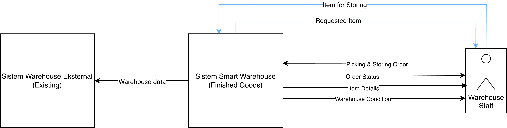

Gambar 4.1 Konsep Sistem Smart Warehouse

## IV.3 Diagram Arsitektur

Subbab ini menjabarkan arsitektur sistem Smart Warehouse secara bertingkat, dari gambaran sistem keseluruhan pada Level 0 hingga dekomposisi komponen perangkat lunak yang menyusun Warehouse Management Controller (WMC) pada Level 3. Fokus pembahasan diarahkan pada WMC sebagai subsistem perangkat lunak yang dikembangkan, beserta komponen-komponen yang secara langsung berinteraksi dengannya, termasuk arsitektur Fleet Controller sebagai konteks integrasi dan komponen Localisation System yang menjadi kontribusi individu penulis di dalamnya.

### IV.3.1 Arsitektur Level 0

Arsitektur Level 0 menggambarkan sistem Smart Warehouse secara menyeluruh sebagai satu kesatuan modul tunggal. Pada level ini, sistem dipandang sebagai kotak hitam (black box) yang menerima berbagai masukan dari lingkungan eksternal dan menghasilkan keluaran berupa eksekusi fisik pemindahan barang serta laporan status operasional. Sistem ini berinteraksi langsung dengan staf gudang (Warehouse Staff) dan sistem logistik eksternal. Gambar 4.2 berikut mengilustrasikan arsitektur sistem pada Level 0.

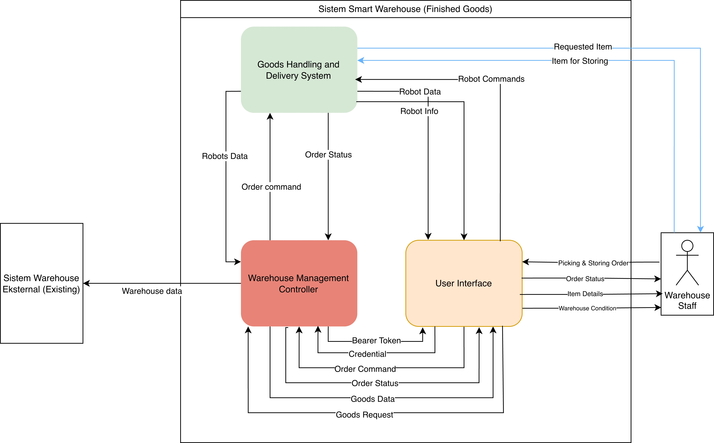

Gambar 4.2 Arsitektur Sistem Smart Warehouse Level 0
Tabel 4.1 Fungsi, Masukan, dan Keluaran Sistem Smart Warehouse (Level 0)

| Elemen  | Deskripsi                                                                                                                                                                                                                                                                                                                                         |
| ------- | ------------------------------------------------------------------------------------------------------------------------------------------------------------------------------------------------------------------------------------------------------------------------------------------------------------------------------------------------- |
| Modul   | Sistem Smart Warehouse (Finished Goods)                                                                                                                                                                                                                                                                                                           |
| Fungsi  | Melakukan interaksi perintah picking dan storing serta data yang dikirimkan dari Warehouse Staff, serta melakukan integrasi data gudang dengan sistem yang sudah ada.                                                                                                                                                                             |
| Masukan | 1. Warehouse data — informasi stok, lokasi penyimpanan, dan status barang dari sistem eksternal. 2. Requested item — permintaan pengambilan barang dari Warehouse Staff. 3. Item for storing — barang fisik yang akan disimpan beserta data ID barang. 4. Warehouse condition report — kapasitas ruang, posisi rak, dan kondisi area penyimpanan. |
| Luaran  | 1. Order status — informasi keberhasilan proses ke operator dan sistem. 2. Robots data — status operasi robot, progres navigasi, dan hasil tugas. 3. Goods delivery — barang fisik yang dikirim ke sistem logistik. 4. Logistic documentation — laporan pelepasan barang dan dokumen tracking.                                                    |

### IV.3.2 Subsistem Warehouse Management Controller (WMC)

#### IV.3.2.1 Arsitektur Level 2 — WMC

Pada Level 2, sistem Smart Warehouse didekomposisi menjadi dua subsistem utama, yaitu Goods Handling and Delivery System (GHDS) yang menangani aktivitas fisik robot, dan Warehouse Management Controller (WMC) yang menjadi fokus pengembangan pada tugas akhir ini. WMC berfungsi sebagai pusat kendali digital yang mengelola permintaan barang, mengoordinasikan pengendalian robot, serta memperbarui status pesanan secara terintegrasi. WMC berinteraksi langsung dengan antarmuka pengguna, basis data, dan Fleet Controller pada GHDS. Gambar 4.3 berikut mengilustrasikan arsitektur WMC pada Level 2.

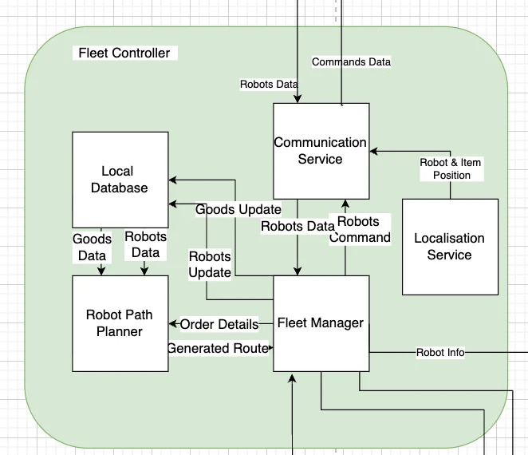

Gambar 4.3 Arsitektur Warehouse Management Controller (Level 2)
Tabel 4.2 Fungsi, Masukan, dan Keluaran Warehouse Management Controller (Level 2)

| Elemen  | Deskripsi                                                                                                                                                                                                                                                                                                                                                                                    |
| ------- | -------------------------------------------------------------------------------------------------------------------------------------------------------------------------------------------------------------------------------------------------------------------------------------------------------------------------------------------------------------------------------------------- |
| Fungsi  | Mengelola dan mengkoordinasikan proses permintaan barang, pengendalian robot, serta pembaruan status pesanan di gudang secara terintegrasi.                                                                                                                                                                                                                                                  |
| Masukan | 1. Data robot — informasi kondisi, posisi, dan status operasional robot. 2. Status pesanan — informasi perkembangan pesanan yang sedang diproses. 3. Permintaan barang — permintaan pengambilan atau penyediaan barang dari gudang. 4. Perintah pesanan — instruksi untuk memproses atau mengeksekusi pesanan tertentu. 5. Kredensial — data autentikasi untuk memverifikasi akses pengguna. |
| Luaran  | 1. Barang yang diminta — informasi atau perintah terkait barang yang harus diambil atau disiapkan. 2. Informasi & data robot — kondisi dan data operasional robot yang telah diperbarui. 3. Status pesanan — status terbaru pesanan setelah diproses oleh sistem. 4. Bearer Token — token autentikasi untuk mengamankan komunikasi antar layanan.                                            |

#### IV.3.2.2 Arsitektur Level 3 — Komponen WMC

Pada Level 3, WMC didekomposisi menjadi empat komponen perangkat lunak yang masing-masing memiliki tanggung jawab yang terdefinisi. Keempat komponen tersebut adalah Database, Goods Detail Service, Fleet Order Service, dan Authentication Service. Setiap komponen saling terhubung dan beroperasi dalam arsitektur microservices yang memungkinkan setiap layanan dikembangkan dan di-deploy secara independen.

##### IV.3.2.2.1 Database

Komponen Database merupakan lapisan penyimpanan data terpusat pada WMC. Komponen ini menyimpan seluruh data operasional gudang, mencakup detail barang, layout penyimpanan, data pengguna, sesi autentikasi, dan status pengiriman robot. Seluruh layanan WMC lainnya berinteraksi dengan komponen ini melalui mekanisme query yang terstruktur. Gambar 4.4 mengilustrasikan arsitektur komponen Database.

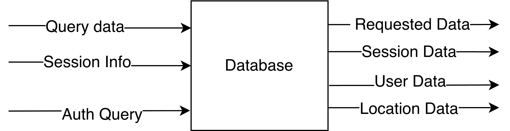

Gambar 4.4 Arsitektur Komponen Database WMC (Level 3)
Tabel 4.3 Fungsi, Masukan, dan Keluaran Database WMC

| Elemen  | Deskripsi                                                                                                                                                                                                                                                                                                                                   |
| ------- | ------------------------------------------------------------------------------------------------------------------------------------------------------------------------------------------------------------------------------------------------------------------------------------------------------------------------------------------- |
| Fungsi  | Menyimpan dan menyediakan data keseluruhan operasional gudang, mencakup detail barang, layout penyimpanan, status pengiriman robot, data pengguna, dan sesi autentikasi.                                                                                                                                                                    |
| Masukan | 1. Query Data Goods — permintaan baca/ubah/hapus data barang dari Goods Detail Service. 2. Auth Query / Session Data — diterima dari Authentication Service untuk validasi pengguna dan penyimpanan sesi. 3. Location Query & Order Data — diterima dari Fleet Order Service untuk mendapatkan lokasi barang dan memperbarui detail barang. |
| Luaran  | 1. Goods Data — dikirim ke Goods Detail Service sebagai hasil query data barang. 2. User Data / Session Info — dikirim ke Authentication Service. 3. Location Data / Updated Goods Detail — dikirim ke Fleet Order Service.                                                                                                                 |

Sebagai kelanjutan dari perancangan komponen Database, subbab ini turut menjabarkan skema basis data sistem yang dimodelkan menggunakan Entity Relationship Diagram (ERD) berikut.
Entity Relationship Diagram (ERD) adalah diagram yang menggambarkan struktur data dalam suatu sistem informasi yang berguna untuk mengetahui hubungan antar entitas, atribut dari masing-masing entitas, dan apa saja entitas yang berperan di dalam penyimpanan data (Silberschatz dkk. 2020). ERD merupakan bagian penting dalam proses perancangan sistem, khususnya dalam merancang skema basis data relasional yang terstruktur dan konsisten.
Pada tugas akhir ini, ERD digunakan untuk memodelkan entitas-entitas utama yang terlibat dalam sistem Warehouse Management Controller, yaitu User, Session, Order, OrderItem, Item, ItemLocation, Task, Robot, dan RobotLog, beserta seluruh relasi yang menghubungkan entitas-entitas tersebut. Entitas-entitas ini saling terhubung secara relasional sesuai dengan pendekatan basis data SQL yang diterapkan pada sistem.
Berikut ini merupakan Entity Relationship Diagram yang digunakan dalam pengembangan sistem Warehouse Management Controller.

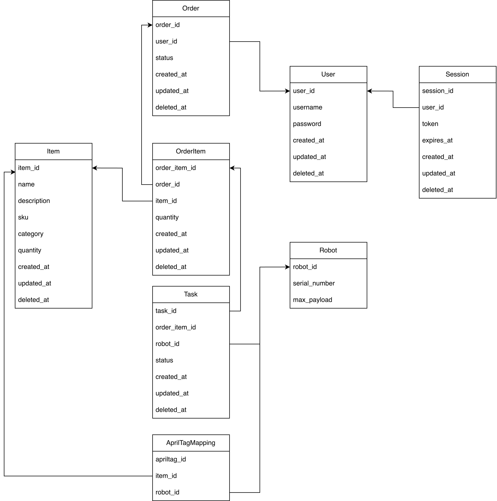

Gambar 4.5 ERD Sistem Warehouse Management Controller
Berdasarkan ERD pada Gambar 4.5, terdapat sembilan entitas yang dirancang dalam basis data sistem. Entitas User menyimpan data pengguna sistem beserta kredensial autentikasi, sedangkan entitas Session mencatat informasi sesi aktif pengguna termasuk token dan masa berlakunya. Entitas Order merepresentasikan setiap permintaan picking maupun storing yang dibuat oleh pengguna, dan terhubung dengan entitas OrderItem yang memuat rincian barang dalam setiap order beserta kuantitasnya. Entitas Item menjadi master data barang yang tersimpan di gudang, dilengkapi dengan entitas ItemLocation untuk menyimpan informasi posisi fisik barang berupa koordinat rak dalam area gudang. Entitas Task menghubungkan OrderItem dengan Robot, merepresentasikan instruksi operasional yang diberikan kepada robot untuk dieksekusi. Entitas Robot menyimpan data identitas dan kapasitas robot, sementara entitas RobotLog mencatat seluruh aktivitas dan kejadian pada setiap robot sebagai mekanisme logging dan pelacakan kesalahan sistem.
Tabel 4.4 Penjelasan Entitas Basis Data Warehouse Management Controller

| Entitas      | Deskripsi                                                                                                                                                                                                                                                                                                                                                                                                                                                                                                                                                                                                                                                                                                                                                            |
| ------------ | -------------------------------------------------------------------------------------------------------------------------------------------------------------------------------------------------------------------------------------------------------------------------------------------------------------------------------------------------------------------------------------------------------------------------------------------------------------------------------------------------------------------------------------------------------------------------------------------------------------------------------------------------------------------------------------------------------------------------------------------------------------------- |
| User         | Menyimpan data pengguna sistem yang merupakan staf gudang yang bertugas mengelola dan memantau seluruh operasional Warehouse Management Controller. Struktur data dari entitas User mencakup informasi identitas pengguna seperti nama, username, dan password yang digunakan untuk keperluan autentikasi, serta timestamp pembuatan, pembaruan, dan penghapusan data. Entitas User terhubung dengan dua entitas lain dalam sistem. Relasi dengan entitas Order memungkinkan sistem melacak seluruh permintaan picking dan storing yang dibuat oleh masing-masing pengguna, sedangkan relasi dengan entitas Session digunakan untuk mengelola sesi login aktif pengguna berdasarkan token autentikasi yang diterbitkan setelah proses login berhasil dilakukan.      |
| Order        | Menyimpan data permintaan operasional gudang yang diajukan oleh pengguna, baik berupa proses picking (pengambilan barang) maupun storing (penyimpanan barang). Struktur data dari entitas Order mencakup referensi pengguna yang mengajukan permintaan, status terkini dari permintaan tersebut, serta timestamp pembuatan, pembaruan, dan penghapusan data. Entitas Order terhubung dengan dua entitas lain dalam sistem. Relasi dengan entitas User mengikat setiap permintaan kepada pengguna yang membuatnya sehingga sistem dapat melakukan pelacakan dan audit aktivitas secara terstruktur, sedangkan relasi dengan entitas OrderItem memungkinkan satu permintaan mencakup beberapa barang sekaligus dengan rincian kuantitas masing-masing.                 |
| OrderItem    | Menyimpan data rincian barang yang terdapat dalam suatu permintaan operasional gudang. Struktur data dari entitas OrderItem mencakup referensi ke permintaan induk, referensi ke barang yang diminta, jumlah kuantitas yang diperlukan, serta timestamp pembuatan, pembaruan, dan penghapusan data. Entitas OrderItem merupakan entitas penghubung yang memiliki relasi dengan tiga entitas sekaligus dalam sistem. Relasi dengan entitas Order mengaitkan setiap detail barang ke permintaan asalnya, relasi dengan entitas Item menentukan barang spesifik yang menjadi objek permintaan, sedangkan relasi dengan entitas Task menjadi dasar pembentukan instruksi operasional yang akan diberikan kepada robot untuk dieksekusi.                                  |
| Item         | Menyimpan master data seluruh barang yang dikelola di dalam gudang. Struktur data dari entitas Item mencakup informasi identitas barang seperti nama, deskripsi, stock-keeping unit (SKU), kategori, dan jumlah stok yang tersedia, serta timestamp pembuatan, pembaruan, dan penghapusan data. Entitas Item terhubung dengan dua entitas lain dalam sistem. Relasi dengan entitas OrderItem memungkinkan sistem merujuk data barang secara akurat ketika memproses permintaan operasional, sedangkan relasi dengan entitas ItemLocation digunakan untuk menyimpan informasi posisi fisik barang di dalam gudang berupa koordinat rak sehingga robot dapat menavigasi ke lokasi yang tepat.                                                                          |
| Task         | Menyimpan data instruksi operasional yang diberikan kepada robot sebagai tindak lanjut dari permintaan picking atau storing yang masuk ke sistem. Struktur data dari entitas Task mencakup referensi ke detail permintaan barang yang harus dikerjakan, referensi ke robot yang ditugaskan, status pelaksanaan tugas, serta timestamp pembuatan, pembaruan, dan penghapusan data. Entitas Task terhubung dengan dua entitas lain dalam sistem. Relasi dengan entitas OrderItem mengaitkan setiap instruksi dengan permintaan barang yang harus diselesaikan, sedangkan relasi dengan entitas Robot menentukan robot mana yang bertanggung jawab mengeksekusi tugas tersebut sehingga sistem dapat melakukan pemantauan dan pengelolaan armada robot secara terpusat. |
| Robot        | Menyimpan data identitas dan kapasitas setiap unit robot yang beroperasi di dalam gudang. Struktur data dari entitas Robot mencakup nomor seri robot, kapasitas muatan maksimum, kapasitas baterai, serta waktu pemeliharaan terakhir yang dilakukan. Entitas Robot terhubung dengan dua entitas lain dalam sistem. Relasi dengan entitas Task memungkinkan sistem menugaskan dan memantau seluruh instruksi operasional yang sedang dijalankan oleh masing-masing robot, sedangkan relasi dengan entitas RobotLog digunakan untuk mencatat seluruh aktivitas, kode log, kode kesalahan, dan pesan kejadian yang terjadi pada robot selama beroperasi sebagai mekanisme logging dan penelusuran kesalahan sistem.                                                    |
| Session      | Menyimpan informasi sesi aktif setiap pengguna yang berhasil melakukan autentikasi ke dalam sistem. Struktur data entitas Session mencakup token sesi, waktu kedaluwarsa (expiry), serta status validitas token yang digunakan untuk memverifikasi kredensial pengguna pada setiap permintaan yang dikirimkan ke layanan WMC. Entitas Session terhubung dengan entitas User melalui relasi one-to-many, di mana satu pengguna dapat memiliki beberapa sesi aktif secara bersamaan, namun setiap sesi selalu dimiliki oleh tepat satu pengguna.                                                                                                                                                                                                                       |
| ItemLocation | Menyimpan informasi posisi fisik setiap jenis barang dalam area gudang, direpresentasikan sebagai koordinat sel pada grid lantai gudang. Struktur data entitas ItemLocation mencakup koordinat kolom (c) dan baris (r) pada grid 8×4 yang merepresentasikan posisi penyimpanan barang, serta stempel waktu pembaruan terakhir untuk keperluan traceability lokasi. Entitas ini terhubung dengan entitas Item melalui relasi one-to-one, memastikan bahwa setiap jenis barang selalu memiliki satu catatan lokasi aktif yang dapat diperbarui secara real-time mengikuti perpindahan barang oleh robot.                                                                                                                                                               |
| RobotLog     | Mencatat seluruh kejadian, aktivitas, dan kesalahan yang terjadi pada setiap robot selama beroperasi di dalam gudang sebagai mekanisme logging dan audit trail. Struktur data entitas RobotLog mencakup kode log, kode kesalahan (error code), pesan kejadian, serta stempel waktu kejadian. Entitas RobotLog terhubung dengan dua entitas lain: relasi dengan entitas Robot (many-to-one) untuk mengidentifikasi unit robot yang menghasilkan log, serta relasi dengan entitas Task (many-to-one) untuk mengaitkan setiap entri log dengan task operasional yang sedang dijalankan saat kejadian tersebut terjadi, sehingga memudahkan penelusuran akar masalah (root cause analysis) ketika terjadi kegagalan operasional.                                         |

##### IV.3.2.2.2 Goods Detail Service

Komponen Goods Detail Service bertanggung jawab mengelola data master seluruh barang yang tersimpan di gudang. Komponen ini menjadi antarmuka antara Database dan komponen lain yang memerlukan informasi barang, mencakup penyimpanan, pembaruan, dan pengambilan informasi secara terperinci. Gambar 4.6 mengilustrasikan arsitektur komponen ini.

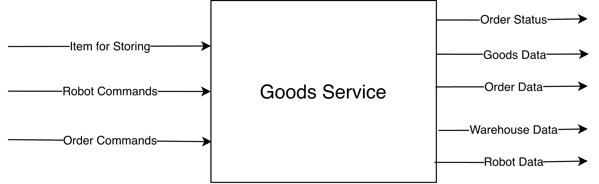

Gambar 4.6 Arsitektur Komponen Goods Detail Service WMC (Level 3)
Tabel 4.5 Fungsi, Masukan, dan Keluaran Goods Detail Service WMC

| Elemen  | Deskripsi                                                                                                                                                                                                |
| ------- | -------------------------------------------------------------------------------------------------------------------------------------------------------------------------------------------------------- |
| Fungsi  | Mengelola data master seluruh barang di gudang, mencakup penyimpanan, pembaruan, dan pengambilan informasi barang secara terperinci.                                                                     |
| Masukan | 1. Goods Data — objek data berisi informasi lengkap atau pembaruan detail satu atau lebih item barang. 2. Query Data — permintaan spesifik untuk mengambil, menghapus, atau memverifikasi detail barang. |
| Luaran  | 1. Goods Data — data barang sebagai respons atas permintaan Query Data. 2. Query Data — respons konfirmasi bahwa permintaan telah dieksekusi.                                                            |

##### IV.3.2.2.3 Fleet Order Service

Komponen Fleet Order Service merupakan gateway utama antara sistem WMC dan komponen Fleet Controller pada robot. Komponen ini mengolah seluruh logika pembuatan dan pembatalan order, pengaturan tugas robot, serta pemantauan dan sinkronisasi status tugas secara real-time. Gambar 4.7 mengilustrasikan arsitektur komponen ini.

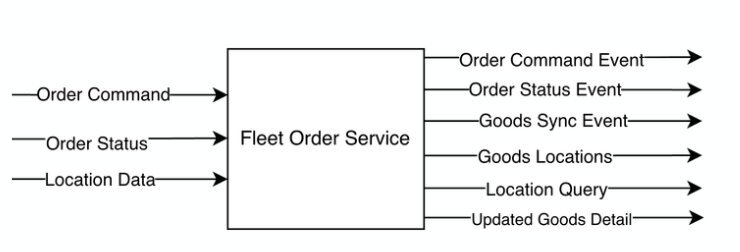

Gambar 4.7 Arsitektur Komponen Fleet Order Service WMC (Level 3)
Tabel 4.6 Fungsi, Masukan, dan Keluaran Fleet Order Service WMC

| Elemen  | Deskripsi                                                                                                                                                                                                                                                                                              |
| ------- | ------------------------------------------------------------------------------------------------------------------------------------------------------------------------------------------------------------------------------------------------------------------------------------------------------ |
| Fungsi  | Mengolah seluruh data dan logika pembuatan order, pengaturan tugas robot, pemantauan status robot, serta sinkronisasi status tugas. Menjadi gateway antara sistem internal WMC dan Fleet Controller.                                                                                                   |
| Masukan | 1. Order Command — instruksi pembuatan atau pembatalan order dari antarmuka pengguna. 2. Robot Status & Task Status — informasi posisi, baterai, error, dan progres tugas dari Fleet Controller. 3. Order Data / Location Data — diterima dari Database untuk memproses dan memperbarui catatan order. |
| Luaran  | 1. Order Status Event — dikirim ke antarmuka pengguna sebagai respons status order terkini. 2. Command ke Fleet Controller — instruksi robot berupa start task, cancel task, atau emergency stop. 3. Updated Goods Detail — dikirim ke Database setelah order diproses.                                |

##### IV.3.2.2.4 Authentication Service

Komponen Authentication Service bertanggung jawab memvalidasi identitas pengguna yang mengakses sistem WMC. Komponen ini menerima kredensial dari antarmuka pengguna, memverifikasinya terhadap data pada Database, kemudian menerbitkan Bearer Token sebagai bukti otorisasi untuk seluruh permintaan berikutnya. Gambar 4.8 mengilustrasikan arsitektur komponen ini.

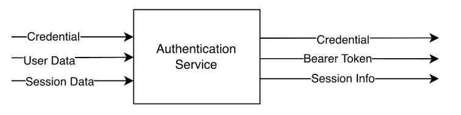

Gambar 4.8 Arsitektur Komponen Authentication Service WMC (Level 3)
Tabel 4.7 Fungsi, Masukan, dan Keluaran Authentication Service WMC

| Elemen  | Deskripsi                                                                                                                                                                                                                                                                                                               |
| ------- | ----------------------------------------------------------------------------------------------------------------------------------------------------------------------------------------------------------------------------------------------------------------------------------------------------------------------- |
| Fungsi  | Memvalidasi identitas pengguna berdasarkan kredensial yang diberikan, menghasilkan token autentikasi (Bearer Token), serta mengelola sesi pengguna.                                                                                                                                                                     |
| Masukan | 1. Credential Pengguna — data username dan password diterima dari antarmuka pengguna via API HTTP/HTTPS. 2. Session Info / User Data — hasil pencarian pengguna dari Database. 3. Token / Session ID (opsional) — diterima dari antarmuka pengguna untuk validasi sesi yang masih aktif.                                |
| Luaran  | 1. Bearer Token — dikirim ke antarmuka pengguna sebagai string token untuk otorisasi permintaan berikutnya. 2. Session Data — dikirim ke Database untuk disimpan atau diperbarui. 3. Informasi Penolakan Akses — pesan kesalahan dikirim ke antarmuka pengguna bila kredensial tidak valid atau sesi telah kedaluwarsa. |

### IV.3.3 Subsistem Fleet Controller

#### IV.3.3.1 Arsitektur Level 2 — Fleet Controller

Selain Warehouse Management Controller, subsistem Fleet Controller turut menjadi bagian penting dari arsitektur Smart Warehouse karena berperan sebagai penghubung langsung antara WMC dan armada robot fisik pada Goods Handling and Delivery System (GHDS). Fleet Controller bertanggung jawab mengelola penugasan robot, manajemen status, dan perencanaan rute pergerakan armada, dengan seluruh data status robot diterima melalui subsistem Communication pada GHDS. Pengembangan Fleet Controller secara keseluruhan berada di luar cakupan tugas akhir individu ini, kecuali komponen Localisation System yang menjadi kontribusi khusus penulis (lihat Subbab I.4). Pemaparan arsitektur Fleet Controller pada subbab ini diperlukan untuk memberikan konteks interaksi antara WMC dan Fleet Controller melalui Fleet Order Service (lihat IV.3.3.3).
Pada Level 2, Fleet Controller dipandang sebagai satu modul tunggal yang menerima instruksi order dan data robot dari WMC, kemudian menghasilkan perintah eksekusi bagi robot serta status terkini yang dikembalikan ke WMC. Gambar 4.9 berikut mengilustrasikan arsitektur Fleet Controller pada Level 2.

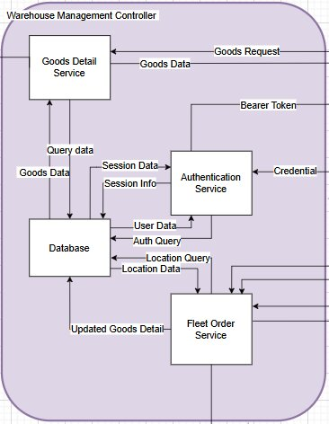

Gambar 4.9 Arsitektur Fleet Controller (Level 2)
Tabel 4.8 Fungsi, Masukan, dan Keluaran Fleet Controller (Level 2)

| Elemen  | Deskripsi                                                                                                                                                                                                                                                                           |
| ------- | ----------------------------------------------------------------------------------------------------------------------------------------------------------------------------------------------------------------------------------------------------------------------------------- |
| Fungsi  | Mengelola penugasan robot, manajemen status, dan rute pergerakan seluruh armada robot berdasarkan instruksi order yang diterima dari WMC.                                                                                                                                           |
| Masukan | 1. Robots Data — informasi status, posisi, dan kondisi seluruh robot yang beroperasi di gudang. 2. Order Commands — instruksi pembuatan, pembaruan, atau pembatalan tugas robot, diterima dari Fleet Order Service WMC.                                                             |
| Luaran  | 1. Order Status — status pelaksanaan tugas dikirim ke Fleet Order Service WMC. 2. Robot Commands — perintah kendali dikirim ke robot melalui subsistem Communication pada GHDS. 3. Robots Data — data status robot terbaru diteruskan ke WMC untuk ditampilkan pada User Interface. |

#### IV.3.3.2 Arsitektur Level 3 — Komponen Fleet Controller

Pada Level 3, Fleet Controller didekomposisi menjadi lima komponen perangkat lunak, yaitu Communication Service, Fleet Manager, Local Database, Robot Path Planner, dan Localisation System. Keempat komponen pertama merupakan hasil rancangan kelompok TA252601001, sedangkan komponen Localisation System merupakan kontribusi individu penulis yang menggantikan pendekatan lokalisasi berbasis QR Code + Line Following pada rancangan awal dengan pendekatan AprilTag + Overhead Fisheye Camera (lihat Subbab III.3.2).

##### IV.3.3.2.1 Localisation System

Localisation System merupakan komponen Fleet Controller yang menjadi fokus kontribusi individu penulis pada tugas akhir ini, berjalan secara paralel dengan subsistem Navigation pada robot. Berbeda dengan Navigation yang menentukan posisi robot dari perspektif internal robot melalui pembacaan kode QR di lantai dan sensor IMU, Localisation System menyediakan perspektif eksternal dari atas (overhead) yang mencakup seluruh area lantai gudang sekaligus, termasuk posisi robot, barang, dan docking station. Gambar 4.10 mengilustrasikan arsitektur komponen ini; rincian perancangan perangkat dan pipeline deteksinya dijabarkan lebih lanjut pada Subbab IV.3.6.

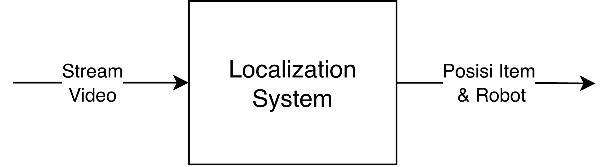

Gambar 4.10 Arsitektur Komponen Localisation System Fleet Controller (Level 3)
Tabel 4.9 Fungsi, Masukan, dan Keluaran Localisation System

| Elemen  | Deskripsi                                                                                                                                                                                                                                                                         |
| ------- | --------------------------------------------------------------------------------------------------------------------------------------------------------------------------------------------------------------------------------------------------------------------------------- |
| Fungsi  | Mendeteksi posisi grid dan orientasi seluruh robot, barang, serta docking station secara terpusat dari sudut pandang overhead menggunakan AprilTag fiducial marker, kemudian mempublikasikan hasil deteksi sebagai data grid state kepada komponen lain Fleet Controller.         |
| Masukan | 1. Video Stream — umpan video RTSP dari kamera IP fisheye overhead. 2. Parameter Kalibrasi — koefisien distorsi lensa (Kannala–Brandt) dan matriks homography hasil kalibrasi satu kali di awal pemasangan.                                                                       |
| Luaran  | 1. Grid State (Location Data) — data posisi grid dan orientasi seluruh entitas terklasifikasi, dipublikasikan setiap 500 ms melalui topic MQTT location, dikonsumsi oleh Fleet Manager dan diteruskan ke Fleet Order Service WMC untuk ditampilkan real-time pada User Interface. |

#### IV.3.3.3 Desain Detail Subsistem Lokalisasi (Localisation System)

Subsistem Lokalisasi merupakan komponen perangkat lunak yang berada di dalam Fleet Controller, berjalan secara paralel dengan Navigation subsystem pada robot. Jika Navigation subsystem menentukan posisi robot dari perspektif internal robot melalui pembacaan kode QR di lantai dan sensor IMU, Subsistem Lokalisasi menyediakan perspektif eksternal dari atas (overhead) yang mencakup seluruh area lantai gudang sekaligus—termasuk posisi robot, barang, dan docking station. Output subsistem ini berupa data grid state yang dipublikasikan melalui MQTT ke topic location pada RabbitMQ broker, dikonsumsi oleh Fleet Manager untuk keperluan digital twin koordinasi robot, serta oleh Fleet Order Service di WMC untuk diteruskan ke User Interface secara real-time.

##### IV.3.3.3.1 Perangkat Lokalisasi

Perangkat lokalisasi adalah rakitan kamera overhead yang dipasang setinggi 60 cm di atas lantai gudang berukuran 2,4 × 1,2 m. Rakitan ini terdiri dari rangka penyangga, sebuah kamera IP fisheye berkemampuan 1080p (3 MP) dengan H.264 encoding yang melakukan streaming melalui protokol RTSP over TCP, serta pencahayaan LED tambahan untuk memastikan iluminasi yang seragam di seluruh area lantai. Optik fisheye dipilih karena kemampuannya mencakup seluruh area lantai gudang dari satu titik pemasangan tunggal tanpa oklusi, meskipun memerlukan proses koreksi distorsi sebelum dapat digunakan untuk pemetaan posisi yang akurat (lihat Subbab 2.5.2).

##### IV.3.3.3.2 Desain Pipeline Deteksi

Subsistem Lokalisasi didesain sebagai pipeline pemrosesan frame yang berjalan secara kontinu. Sebuah background thread mengambil frame terbaru dari stream RTSP secara terus-menerus dan membuang frame yang sudah basi, sementara detection loop utama berjalan pada frekuensi 4 Hz. Setiap frame diproses melalui enam tahap secara berurutan, sebagaimana dirangkum pada Tabel 4.10 berikut.
Tabel 4.10 Pipeline Pemrosesan Subsistem Lokalisasi

| No. | Tahap                   | Deskripsi                                                                                                                                                                        |
| --- | ----------------------- | -------------------------------------------------------------------------------------------------------------------------------------------------------------------------------- |
| 1   | Koreksi Distorsi Lensa  | Menghilangkan distorsi radial fisheye menggunakan koefisien kalibrasi Kannala–Brandt yang dihitung saat setup.                                                                   |
| 2   | Pra-pemrosesan          | Meningkatkan kontras frame yang telah terkoreksi dan mengonversinya ke grayscale untuk detektor.                                                                                 |
| 3   | Deteksi AprilTag        | Menjalankan detektor Tag36h11 (marker fisik 8×8 cm) untuk mengekstrak ID, posisi piksel pusat, dan empat koordinat sudut setiap tag.                                             |
| 4   | Pemetaan Grid           | Mentransformasi koordinat piksel ke sel grid diskrit menggunakan homography H dan aturan nearest-cell-centre (lihat Subbab 2.5.3).                                               |
| 5   | Klasifikasi dan Heading | Mengklasifikasikan setiap tag ID ke salah satu dari tiga kategori: docking station, robot, atau warehouse item. Orientasi (heading 0°–359°) diperoleh dari sudut sisi depan tag. |
| 6   | Publikasi MQTT          | Mengodekan seluruh grid occupancy state sebagai payload JSON dan mempublikasikannya setiap 500 ms ke topic location pada RabbitMQ broker.                                        |

## IV.4 Diagram Use Case

Kebutuhan fungsional sistem mendefinisikan kapabilitas spesifik yang harus tersedia bagi pengguna dalam berinteraksi dengan sistem Warehouse Management Controller. Kebutuhan ini diturunkan langsung dari Tabel III.4 dengan perincian yang lebih granular, sehingga setiap kebutuhan merepresentasikan satu fungsi yang dapat diuji secara mandiri. Berikut ini adalah kebutuhan fungsional yang diidentifikasi untuk mendukung pengembangan sistem Warehouse Management Controller sebagai perangkat lunak pengelola operasional gudang berbasis robot.

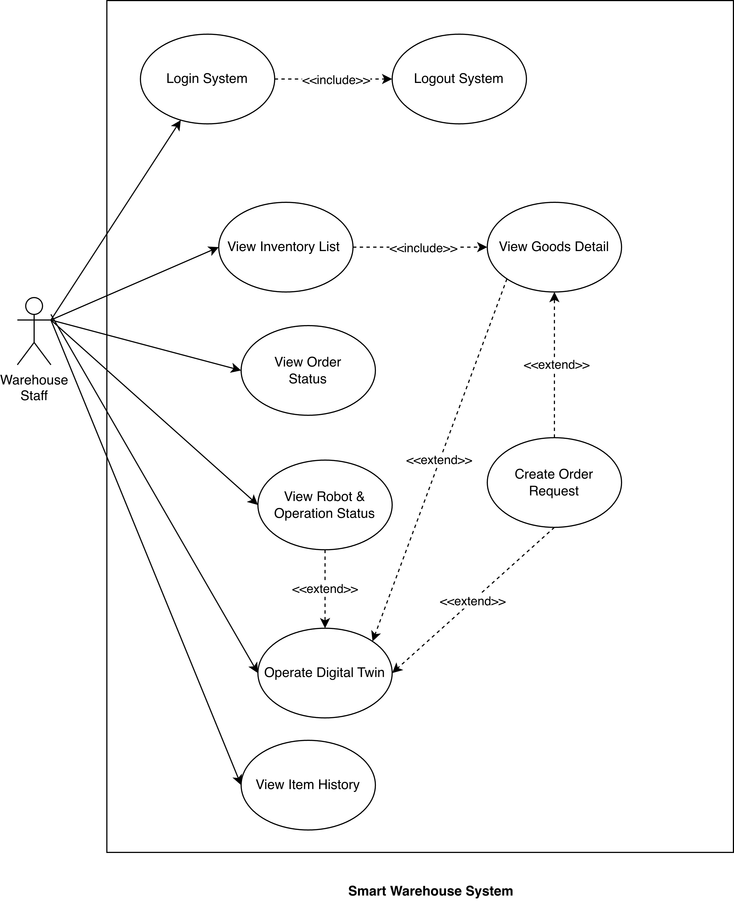
_Gambar 4.11 Use Case Diagram Sistem Warehouse Management Controller_

Skenario use case mendeskripsikan interaksi antara pengguna dan sistem Warehouse Management Controller (WMC) untuk setiap kebutuhan fungsional. Setiap skenario mencakup kondisi awal, kondisi akhir, langkah-langkah interaksi normal, serta skenario alternatif apabila terjadi kondisi di luar alur utama.

#### IV.4.1.1 UC-01: Login System

Tabel 4.11 Deskripsi Use Case UC-01: Login System

| Elemen | Keterangan |
| --- | --- |
| ID Use Case | UC-01 |
| Aktor Utama | Staf Gudang (Warehouse Staff) |
| Referensi SR | FR01–FR05 (Bab III.4) |
| Kondisi Awal | (1) Pengguna telah memiliki akun terdaftar. (2) Pengguna memiliki akses ke aplikasi cross-platform. |
| Kondisi Akhir | Pengguna berhasil masuk ke sistem dan dapat mengakses seluruh fitur sesuai hak akses. |
| Deskripsi | Use case ini menjelaskan proses autentikasi staf gudang yang telah memiliki akun untuk mengakses fitur sistem Smart Warehouse. |

Tabel 4.12 Skenario Use Case UC-01: Login System

| Aktor | Sistem |
| --- | --- |
| **Skenario Utama** | |
| 1. Pengguna mengakses halaman masuk. |  |
|  | Sistem menampilkan formulir username dan kata sandi. |
| 3. Pengguna memasukkan kredensial dan menekan tombol masuk. |  |
|  | Sistem memverifikasi kredensial ke basis data. |
|  | Sistem membuat sesi pengguna aktif dan menghasilkan bearer token. |
|  | Sistem menampilkan dashboard utama. |
| **Skenario Alternatif** | |
| 4a. Kredensial yang dimasukkan tidak valid. | Sistem menampilkan pesan kesalahan dan meminta pengguna mencoba kembali. |

#### IV.4.1.2 UC-02: Logout System

Tabel 4.13 Deskripsi Use Case UC-02: Logout System

| Elemen | Keterangan |
| --- | --- |
| ID Use Case | UC-02 |
| Aktor Utama | Staf Gudang (Warehouse Staff) |
| Referensi SR | FR01–FR05 (Bab III.4) |
| Kondisi Awal | Pengguna sedang dalam keadaan masuk (logged in). |
| Kondisi Akhir | Sesi pengguna berakhir dan akses ke fitur sistem ditutup. |
| Deskripsi | Use case ini menjelaskan proses pengakhiran sesi pengguna yang sedang aktif. |

Tabel 4.14 Skenario Use Case UC-02: Logout System

| Aktor | Sistem |
| --- | --- |
| **Skenario Utama** | |
| 1. Pengguna memilih opsi keluar. |  |
|  | Sistem membatalkan sesi aktif berdasarkan session ID. |
|  | Sistem menampilkan kembali halaman masuk. |
| **Skenario Alternatif** | |
| Tidak terdapat skenario alternatif yang dirumuskan untuk use case ini pada dokumen sumber. | |

#### IV.4.1.3 UC-03: View Inventory List

Tabel 4.15 Deskripsi Use Case UC-03: View Inventory List

| Elemen | Keterangan |
| --- | --- |
| ID Use Case | UC-03 |
| Aktor Utama | Staf Gudang (Warehouse Staff) |
| Referensi SR | FR01–FR05 (Bab III.4) |
| Kondisi Awal | Pengguna telah masuk ke sistem. |
| Kondisi Akhir | Pengguna memperoleh gambaran kondisi stok gudang secara terpusat. |
| Deskripsi | Use case ini memungkinkan staf gudang melihat daftar seluruh barang yang tercatat dalam inventori. |

Tabel 4.16 Skenario Use Case UC-03: View Inventory List

| Aktor | Sistem |
| --- | --- |
| **Skenario Utama** | |
| 1. Pengguna membuka halaman inventori. |  |
|  | Sistem mengambil data barang dari goods detail service. |
|  | Sistem menampilkan daftar barang beserta kuantitas dan kategori. |
| **Skenario Alternatif** | |
| Tidak terdapat skenario alternatif yang dirumuskan untuk use case ini pada dokumen sumber. | |

#### IV.4.1.4 UC-04: View Goods Detail

Tabel 4.17 Deskripsi Use Case UC-04: View Goods Detail

| Elemen | Keterangan |
| --- | --- |
| ID Use Case | UC-04 |
| Aktor Utama | Staf Gudang (Warehouse Staff) |
| Referensi SR | FR01–FR05 (Bab III.4) |
| Kondisi Awal | Pengguna sedang melihat daftar inventori (UC-03). |
| Kondisi Akhir | Pengguna memperoleh informasi lengkap barang yang dipilih. |
| Deskripsi | Use case ini menampilkan informasi rinci suatu barang termasuk SKU, deskripsi, kuantitas, dan lokasi penyimpanan. |

Tabel 4.18 Skenario Use Case UC-04: View Goods Detail

| Aktor | Sistem |
| --- | --- |
| **Skenario Utama** | |
| 1. Pengguna memilih barang tertentu. |  |
|  | Sistem mengirim permintaan detail barang ke goods detail service. |
|  | Sistem menampilkan halaman detail barang. |
| **Skenario Alternatif** | |
| Tidak terdapat skenario alternatif yang dirumuskan untuk use case ini pada dokumen sumber. | |

#### IV.4.1.5 UC-05: View Order

Tabel 4.19 Deskripsi Use Case UC-05: View Order

| Elemen | Keterangan |
| --- | --- |
| ID Use Case | UC-05 |
| Aktor Utama | Staf Gudang (Warehouse Staff) |
| Referensi SR | FR01–FR05 (Bab III.4) |
| Kondisi Awal | Pengguna telah masuk ke sistem. |
| Kondisi Akhir | Pengguna dapat memantau progres setiap permintaan penyimpanan atau pengambilan barang. |
| Deskripsi | Use case ini memungkinkan staf gudang memantau status order inbound maupun outbound. |

Tabel 4.20 Skenario Use Case UC-05: View Order

| Aktor | Sistem |
| --- | --- |
| **Skenario Utama** | |
| 1. Pengguna membuka halaman status order. |  |
|  | Sistem mengambil data order dari fleet order service. |
|  | Sistem menampilkan daftar order beserta status (Pending, InProgress, Completed, Failed). |
| **Skenario Alternatif** | |
| Tidak terdapat skenario alternatif yang dirumuskan untuk use case ini pada dokumen sumber. | |

#### IV.4.1.6 UC-06: View Robot & Operation Status

Tabel 4.21 Deskripsi Use Case UC-06: View Robot & Operation Status

| Elemen | Keterangan |
| --- | --- |
| ID Use Case | UC-06 |
| Aktor Utama | Staf Gudang (Warehouse Staff) |
| Referensi SR | FR01–FR05 (Bab III.4) |
| Kondisi Awal | Pengguna telah masuk ke sistem. |
| Kondisi Akhir | Pengguna memperoleh visibilitas operasional armada robot. |
| Deskripsi | Use case ini menampilkan status armada AGV termasuk posisi, baterai, dan tugas aktif. |

Tabel 4.22 Skenario Use Case UC-06: View Robot & Operation Status

| Aktor | Sistem |
| --- | --- |
| **Skenario Utama** | |
| 1. Pengguna membuka halaman status robot. |  |
|  | Sistem berlangganan telemetry stream melalui WebSocket. |
|  | Sistem menampilkan panel status armada AGV secara real-time. |
| **Skenario Alternatif** | |
| Tidak terdapat skenario alternatif yang dirumuskan untuk use case ini pada dokumen sumber. | |

#### IV.4.1.7 UC-07: Operate Digital Twin

Tabel 4.23 Deskripsi Use Case UC-07: Operate Digital Twin

| Elemen | Keterangan |
| --- | --- |
| ID Use Case | UC-07 |
| Aktor Utama | Staf Gudang (Warehouse Staff) |
| Referensi SR | FR01–FR05 (Bab III.4) |
| Kondisi Awal | Pengguna telah masuk ke sistem; modul Digital Twin tersedia. |
| Kondisi Akhir | Pengguna memperoleh kesadaran spasial (spatial situational awareness) terhadap kondisi operasional gudang. |
| Deskripsi | Use case ini memungkinkan staf gudang berinteraksi dengan representasi virtual 3D kondisi gudang dan robot. |

Tabel 4.24 Skenario Use Case UC-07: Operate Digital Twin

| Aktor | Sistem |
| --- | --- |
| **Skenario Utama** | |
| 1. Pengguna membuka tampilan Digital Twin. |  |
|  | Sistem memuat model 3D gudang dan berlangganan koordinat robot. |
| 3. Pengguna memilih robot atau barang pada tampilan 3D. |  |
|  | Sistem menampilkan detail entitas yang dipilih. |
| **Skenario Alternatif** | |
| Tidak terdapat skenario alternatif yang dirumuskan untuk use case ini pada dokumen sumber. | |

#### IV.4.1.8 UC-08: Create Order Request

Tabel 4.25 Deskripsi Use Case UC-08: Create Order Request

| Elemen | Keterangan |
| --- | --- |
| ID Use Case | UC-08 |
| Aktor Utama | Staf Gudang (Warehouse Staff) |
| Referensi SR | FR01–FR05 (Bab III.4) |
| Kondisi Awal | Pengguna telah masuk; data barang tersedia di inventori. |
| Kondisi Akhir | Order baru terdaftar dan siap dieksekusi oleh armada robot. |
| Deskripsi | Use case ini menjelaskan proses pembuatan permintaan storing atau picking barang. |

Tabel 4.26 Skenario Use Case UC-08: Create Order Request

| Aktor | Sistem |
| --- | --- |
| **Skenario Utama** | |
| 1. Pengguna mengisi formulir order (barang dan kuantitas). |  |
|  | Sistem memvalidasi ketersediaan barang. |
| 3. Pengguna menekan tombol kirim. |  |
|  | Sistem menyimpan order dan order item ke basis data. |
|  | Sistem mengirim perintah ke fleet controller melalui AMQP. |
|  | Sistem menampilkan konfirmasi pembuatan order. |
| **Skenario Alternatif** | |
| Tidak terdapat skenario alternatif yang dirumuskan untuk use case ini pada dokumen sumber. | |

#### IV.4.1.9 UC-09: View Item History

Tabel 4.27 Deskripsi Use Case UC-09: View Item History

| Elemen | Keterangan |
| --- | --- |
| ID Use Case | UC-09 |
| Aktor Utama | Staf Gudang (Warehouse Staff) |
| Referensi SR | FR01–FR05 (Bab III.4) |
| Kondisi Awal | Pengguna telah masuk ke sistem. |
| Kondisi Akhir | Pengguna dapat menelusuri histori pergerakan barang untuk kebutuhan audit operasional. |
| Deskripsi | Use case ini menampilkan riwayat aktivitas suatu barang termasuk perpindahan dan perubahan kuantitas. |

Tabel 4.28 Skenario Use Case UC-09: View Item History

| Aktor | Sistem |
| --- | --- |
| **Skenario Utama** | |
| 1. Pengguna memilih barang untuk dilihat riwayatnya. |  |
|  | Sistem mengambil log aktivitas dari goods detail service. |
|  | Sistem menampilkan kronologi aktivitas inbound/outbound. |
| **Skenario Alternatif** | |
| Tidak terdapat skenario alternatif yang dirumuskan untuk use case ini pada dokumen sumber. | |

## IV.5 Class Diagram

Subbab ini menyajikan Class Diagram yang memodelkan struktur statis dari layanan backend WMC. Diagram ini mengidentifikasi dan menggambarkan kelas-kelas utama penyusun sistem, yaitu Controller, Service, Repository, dan Entity, beserta relasi dan ketergantungan antar kelas tersebut dalam mendukung seluruh logika operasional pengelolaan gudang.

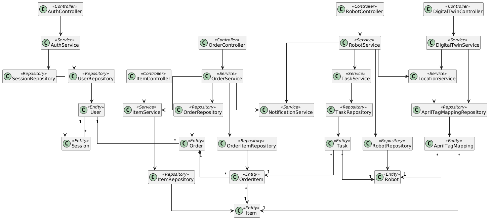
_Gambar 4.12 Class Diagram Sistem Warehouse Management Controller_

Berdasarkan Class Diagram pada Gambar 4.12, rancangan perangkat lunak Warehouse Management Controller mengikuti pola arsitektur microservice berlapis yang memisahkan tanggung jawab ke dalam empat jenis kelas: Controller sebagai titik masuk permintaan dari antarmuka, Service sebagai pengampu logika bisnis, Repository sebagai lapisan akses persistensi data, dan Entity sebagai representasi data domain.

Tabel 4.29 Daftar Kelas pada Arsitektur Warehouse Management Controller

| ID   | Nama Kelas                | Tipe Kelas |
| ---- | ------------------------- | ---------- |
| C-01 | AuthController            | Controller |
| C-02 | ItemController            | Controller |
| C-03 | OrderController           | Controller |
| C-04 | RobotController           | Controller |
| C-05 | DigitalTwinController     | Controller |
| C-06 | AuthService               | Service    |
| C-07 | ItemService               | Service    |
| C-08 | OrderService              | Service    |
| C-09 | RobotService              | Service    |
| C-10 | TaskService               | Service    |
| C-11 | DigitalTwinService        | Service    |
| C-12 | LocationService           | Service    |
| C-13 | NotificationService       | Service    |
| C-14 | UserRepository            | Repository |
| C-15 | SessionRepository         | Repository |
| C-16 | ItemRepository            | Repository |
| C-17 | OrderRepository           | Repository |
| C-18 | OrderItemRepository       | Repository |
| C-19 | RobotRepository           | Repository |
| C-20 | TaskRepository            | Repository |
| C-21 | AprilTagMappingRepository | Repository |
| C-22 | User                      | Entity     |
| C-23 | Session                   | Entity     |
| C-24 | Item                      | Entity     |
| C-25 | Order                     | Entity     |
| C-26 | OrderItem                 | Entity     |
| C-27 | Robot                     | Entity     |
| C-28 | Task                      | Entity     |
| C-29 | AprilTagMapping           | Entity     |

Subbab ini menguraikan spesifikasi internal dari kelas-kelas utama yang telah dimodelkan pada Class Diagram sistem Warehouse Management Controller (WMC). Rincian perancangan ini mendefinisikan atribut beserta tipe datanya, metode (operasi) yang dieksekusi oleh kelas, serta tingkat visibilitas dari masing-masing elemen tersebut (Publik atau Privat). Pendefinisian ini menjadi acuan spesifikasi teknis dalam tahap implementasi kode program.

### IV.5.1 Kelas Controller

Tabel 4.30 Detail Kelas – AuthController

| Nama Operasi              | Visibilitas | Keterangan                                                                                    |
| ------------------------- | ----------- | --------------------------------------------------------------------------------------------- |
| login(username, password) | Publik      | Menerima kredensial pengguna dari antarmuka dan meneruskan proses autentikasi ke AuthService. |
| logout(sessionId)         | Publik      | Menerima permintaan keluar dan meneruskan pembatalan sesi ke AuthService.                     |
| validateSession(token)    | Publik      | Meneruskan validasi bearer token ke AuthService.                                              |
| Nama Atribut              | Visibilitas | Tipe                                                                                          |
| authService               | Privat      | AuthService                                                                                   |

Tabel 4.31 Detail Kelas – ItemController

| Nama Operasi           | Visibilitas | Keterangan                                                             |
| ---------------------- | ----------- | ---------------------------------------------------------------------- |
| listInventory()        | Publik      | Menerima permintaan daftar inventori dan meneruskannya ke ItemService. |
| getGoodsDetail(itemId) | Publik      | Meneruskan permintaan detail barang ke ItemService.                    |
| getItemHistory(itemId) | Publik      | Meneruskan permintaan riwayat aktivitas barang ke ItemService.         |
| Nama Atribut           | Visibilitas | Tipe                                                                   |
| itemService            | Privat      | ItemService                                                            |

Tabel 4.32 Detail Kelas – OrderController

| Nama Operasi                    | Visibilitas | Keterangan                                                                         |
| ------------------------------- | ----------- | ---------------------------------------------------------------------------------- |
| getOrderStatus(userId)          | Publik      | Meneruskan permintaan status order pengguna ke OrderService.                       |
| createOrderRequest(itemId, qty) | Publik      | Menerima data order dari antarmuka dan meneruskan pembuatan order ke OrderService. |
| Nama Atribut                    | Visibilitas | Tipe                                                                               |
| orderService                    | Privat      | OrderService                                                                       |

Tabel 4.33 Detail Kelas – RobotController

| Nama Operasi            | Visibilitas | Keterangan                                          |
| ----------------------- | ----------- | --------------------------------------------------- |
| listRobots()            | Publik      | Meneruskan permintaan daftar robot ke RobotService. |
| getRobotStatus(robotId) | Publik      | Meneruskan permintaan status robot ke RobotService. |
| Nama Atribut            | Visibilitas | Tipe                                                |
| robotService            | Privat      | RobotService                                        |

Tabel 4.34 Detail Kelas – DigitalTwinController

| Nama Operasi         | Visibilitas | Keterangan                                                      |
| -------------------- | ----------- | --------------------------------------------------------------- |
| operateDigitalTwin() | Publik      | Menginisialisasi modul Digital Twin melalui DigitalTwinService. |
| getRobotPositions()  | Publik      | Meneruskan permintaan koordinat robot ke DigitalTwinService.    |
| getItemPositions()   | Publik      | Meneruskan permintaan posisi barang ke DigitalTwinService.      |
| Nama Atribut         | Visibilitas | Tipe                                                            |
| digitalTwinService   | Privat      | DigitalTwinService                                              |

### IV.5.2 Kelas Service

Tabel 4.35 Detail Kelas – AuthService

| Nama Operasi                     | Visibilitas | Keterangan                                                        |
| -------------------------------- | ----------- | ----------------------------------------------------------------- |
| authenticate(username, password) | Publik      | Memverifikasi kredensial ke UserRepository dan membuat sesi baru. |
| revokeSession(sessionId)         | Publik      | Membatalkan sesi aktif melalui SessionRepository.                 |
| validateToken(token)             | Publik      | Memvalidasi bearer token terhadap sesi tersimpan.                 |
| generateToken(user)              | Privat      | Menghasilkan bearer token untuk sesi yang baru dibuat.            |
| Nama Atribut                     | Visibilitas | Tipe                                                              |
| userRepository                   | Privat      | UserRepository                                                    |
| sessionRepository                | Privat      | SessionRepository                                                 |

Tabel 4.36 Detail Kelas – ItemService

| Nama Operasi                | Visibilitas | Keterangan                                                               |
| --------------------------- | ----------- | ------------------------------------------------------------------------ |
| getInventoryList()          | Publik      | Menyusun daftar barang dari ItemRepository untuk kebutuhan tampilan.     |
| getItemDetail(itemId)       | Publik      | Mengambil detail barang termasuk SKU, kuantitas, dan lokasi penyimpanan. |
| getItemHistory(itemId)      | Publik      | Menyusun log aktivitas inbound/outbound suatu barang.                    |
| resolveItemLocation(itemId) | Privat      | Menyelaraskan data barang dengan lokasi dari LocationService.            |
| Nama Atribut                | Visibilitas | Tipe                                                                     |
| itemRepository              | Privat      | ItemRepository                                                           |
| locationService             | Privat      | LocationService                                                          |

Tabel 4.37 Detail Kelas – OrderService

| Nama Operasi                          | Visibilitas | Keterangan                                                                  |
| ------------------------------------- | ----------- | --------------------------------------------------------------------------- |
| listOrders(userId)                    | Publik      | Menyusun daftar order beserta statusnya untuk pengguna.                     |
| createOrder(itemId, qty)              | Publik      | Memvalidasi ketersediaan barang dan menyimpan order beserta order item.     |
| validateItemAvailability(itemId, qty) | Privat      | Memastikan stok mencukupi melalui ItemService.                              |
| dispatchOrderCommand(order)           | Privat      | Mengirim perintah order ke fleet controller dan memicu NotificationService. |
| Nama Atribut                          | Visibilitas | Tipe                                                                        |
| orderRepository                       | Privat      | OrderRepository                                                             |
| orderItemRepository                   | Privat      | OrderItemRepository                                                         |
| itemService                           | Privat      | ItemService                                                                 |
| notificationService                   | Privat      | NotificationService                                                         |

Tabel 4.38 Detail Kelas – RobotService

| Nama Operasi                        | Visibilitas | Keterangan                                                        |
| ----------------------------------- | ----------- | ----------------------------------------------------------------- |
| getRobotList()                      | Publik      | Menyusun daftar robot dari RobotRepository.                       |
| getRobotStatus(robotId)             | Publik      | Mengambil status robot termasuk posisi, baterai, dan tugas aktif. |
| assignTask(robotId, orderItemId)    | Publik      | Menugaskan pekerjaan ke robot melalui TaskService.                |
| updateRobotTelemetry(robotId, data) | Privat      | Memperbarui telemetry robot dan sinkronisasi lokasi.              |
| Nama Atribut                        | Visibilitas | Tipe                                                              |
| robotRepository                     | Privat      | RobotRepository                                                   |
| taskService                         | Privat      | TaskService                                                       |
| locationService                     | Privat      | LocationService                                                   |
| notificationService                 | Privat      | NotificationService                                               |

Tabel 4.39 Detail Kelas – TaskService

| Nama Operasi                     | Visibilitas | Keterangan                                          |
| -------------------------------- | ----------- | --------------------------------------------------- |
| createTask(orderItemId, robotId) | Publik      | Membuat tugas baru untuk eksekusi suatu order item. |
| updateTaskStatus(taskId, status) | Publik      | Memperbarui status tugas robot.                     |
| getActiveTasks(robotId)          | Publik      | Mengambil daftar tugas aktif suatu robot.           |
| Nama Atribut                     | Visibilitas | Tipe                                                |
| taskRepository                   | Privat      | TaskRepository                                      |

Tabel 4.40 Detail Kelas – DigitalTwinService

| Nama Operasi              | Visibilitas | Keterangan                                                       |
| ------------------------- | ----------- | ---------------------------------------------------------------- |
| initializeTwin()          | Publik      | Memuat model 3D gudang dan menyiapkan langganan koordinat robot. |
| getRobotPositions()       | Publik      | Menyusun koordinat robot terkini dari LocationService.           |
| getItemPositions()        | Publik      | Menyusun posisi barang berdasarkan data AprilTagMapping.         |
| Nama Atribut              | Visibilitas | Tipe                                                             |
| aprilTagMappingRepository | Privat      | AprilTagMappingRepository                                        |
| locationService           | Privat      | LocationService                                                  |

Tabel 4.41 Detail Kelas – LocationService

| Nama Operasi                | Visibilitas | Keterangan                                                  |
| --------------------------- | ----------- | ----------------------------------------------------------- |
| resolvePosition(aprilTagId) | Publik      | Menentukan koordinat entitas berdasarkan pemetaan AprilTag. |
| mapRobotPosition(robotId)   | Publik      | Menyelaraskan posisi robot dengan data AprilTagMapping.     |
| mapItemPosition(itemId)     | Publik      | Menentukan lokasi penyimpanan suatu barang.                 |
| Nama Atribut                | Visibilitas | Tipe                                                        |
| aprilTagMappingRepository   | Privat      | AprilTagMappingRepository                                   |

Tabel 4.42 Detail Kelas – NotificationService

| Nama Operasi                | Visibilitas | Keterangan                                               |
| --------------------------- | ----------- | -------------------------------------------------------- |
| notifyOrderStatus(order)    | Publik      | Mengirim pembaruan status order ke antarmuka pengguna.   |
| notifyRobotStatus(robot)    | Publik      | Mengirim pembaruan status robot ke antarmuka pengguna.   |
| broadcastTelemetry(payload) | Privat      | Menyiarkan telemetry secara real-time melalui WebSocket. |
| Nama Atribut                | Visibilitas | Tipe                                                     |
| messageBroker               | Privat      | MessageBroker                                            |

### IV.5.3 Kelas Repository

Tabel 4.43 Detail Kelas – UserRepository

| Nama Operasi             | Visibilitas | Keterangan                                                 |
| ------------------------ | ----------- | ---------------------------------------------------------- |
| save(user)               | Publik      | Menyimpan atau memperbarui data pengguna pada basis data.  |
| findById(userId)         | Publik      | Mengambil pengguna berdasarkan ID.                         |
| findByUsername(username) | Publik      | Mengambil pengguna berdasarkan username untuk autentikasi. |
| Nama Atribut             | Visibilitas | Tipe                                                       |
| sumberDataPengguna       | Privat      | DataSource                                                 |

Tabel 4.44 Detail Kelas – SessionRepository

| Nama Operasi          | Visibilitas | Keterangan                             |
| --------------------- | ----------- | -------------------------------------- |
| save(session)         | Publik      | Menyimpan sesi pengguna baru.          |
| findById(sessionId)   | Publik      | Mengambil sesi berdasarkan ID.         |
| deleteById(sessionId) | Publik      | Menghapus sesi ketika pengguna keluar. |
| Nama Atribut          | Visibilitas | Tipe                                   |
| sumberDataSesi        | Privat      | DataSource                             |

Tabel 4.45 Detail Kelas – ItemRepository

| Nama Operasi        | Visibilitas | Keterangan                              |
| ------------------- | ----------- | --------------------------------------- |
| save(item)          | Publik      | Menyimpan atau memperbarui data barang. |
| findById(itemId)    | Publik      | Mengambil barang berdasarkan ID.        |
| findAll()           | Publik      | Mengambil seluruh daftar inventori.     |
| findHistory(itemId) | Publik      | Mengambil log aktivitas suatu barang.   |
| Nama Atribut        | Visibilitas | Tipe                                    |
| sumberDataBarang    | Privat      | DataSource                              |

Tabel 4.46 Detail Kelas – OrderRepository

| Nama Operasi                  | Visibilitas | Keterangan                                |
| ----------------------------- | ----------- | ----------------------------------------- |
| save(order)                   | Publik      | Menyimpan order baru.                     |
| findById(orderId)             | Publik      | Mengambil order berdasarkan ID.           |
| findByUser(userId)            | Publik      | Mengambil daftar order milik pengguna.    |
| updateStatus(orderId, status) | Publik      | Memperbarui status order pada basis data. |
| Nama Atribut                  | Visibilitas | Tipe                                      |
| sumberDataOrder               | Privat      | DataSource                                |

Tabel 4.47 Detail Kelas – OrderItemRepository

| Nama Operasi         | Visibilitas | Keterangan                                |
| -------------------- | ----------- | ----------------------------------------- |
| save(orderItem)      | Publik      | Menyimpan item order pada basis data.     |
| findByOrder(orderId) | Publik      | Mengambil seluruh item berdasarkan order. |
| Nama Atribut         | Visibilitas | Tipe                                      |
| sumberDataOrderItem  | Privat      | DataSource                                |

Tabel 4.48 Detail Kelas – RobotRepository

| Nama Operasi      | Visibilitas | Keterangan                             |
| ----------------- | ----------- | -------------------------------------- |
| save(robot)       | Publik      | Menyimpan atau memperbarui data robot. |
| findById(robotId) | Publik      | Mengambil robot berdasarkan ID.        |
| findAll()         | Publik      | Mengambil seluruh daftar robot.        |
| Nama Atribut      | Visibilitas | Tipe                                   |
| sumberDataRobot   | Privat      | DataSource                             |

Tabel 4.49 Detail Kelas – TaskRepository

| Nama Operasi         | Visibilitas | Keterangan                                |
| -------------------- | ----------- | ----------------------------------------- |
| save(task)           | Publik      | Menyimpan tugas robot pada basis data.    |
| findById(taskId)     | Publik      | Mengambil tugas berdasarkan ID.           |
| findByRobot(robotId) | Publik      | Mengambil daftar tugas aktif suatu robot. |
| Nama Atribut         | Visibilitas | Tipe                                      |
| sumberDataTugas      | Privat      | DataSource                                |

Tabel 4.50 Detail Kelas – AprilTagMappingRepository

| Nama Operasi         | Visibilitas | Keterangan                              |
| -------------------- | ----------- | --------------------------------------- |
| save(mapping)        | Publik      | Menyimpan pemetaan AprilTag.            |
| findById(aprilTagId) | Publik      | Mengambil pemetaan berdasarkan ID tag.  |
| findByRobot(robotId) | Publik      | Mengambil pemetaan posisi suatu robot.  |
| findByItem(itemId)   | Publik      | Mengambil pemetaan posisi suatu barang. |
| Nama Atribut         | Visibilitas | Tipe                                    |
| sumberDataAprilTag   | Privat      | DataSource                              |

### IV.5.4 Kelas Entity

Tabel 4.51 Detail Kelas – User

| Nama Operasi     | Visibilitas | Keterangan                         |
| ---------------- | ----------- | ---------------------------------- |
| authenticate(pw) | Publik      | Memverifikasi kata sandi pengguna. |
| Nama Atribut     | Visibilitas | Tipe                               |
| user_id          | Privat      | int                                |
| username         | Privat      | string                             |
| password         | Privat      | string                             |
| created_at       | Privat      | datetime                           |
| updated_at       | Privat      | datetime                           |
| deleted_at       | Privat      | datetime                           |

Tabel 4.52 Detail Kelas – Session

| Nama Operasi | Visibilitas | Keterangan                                             |
| ------------ | ----------- | ------------------------------------------------------ |
| isValid()    | Publik      | Mengecek validitas sesi berdasarkan waktu kedaluwarsa. |
| Nama Atribut | Visibilitas | Tipe                                                   |
| session_id   | Privat      | int                                                    |
| user_id      | Privat      | int                                                    |
| token        | Privat      | string                                                 |
| expires_at   | Privat      | datetime                                               |

Tabel 4.53 Detail Kelas – Item

| Nama Operasi        | Visibilitas | Keterangan                              |
| ------------------- | ----------- | --------------------------------------- |
| updateQuantity(qty) | Publik      | Memperbarui kuantitas stok barang.      |
| getHistory()        | Publik      | Mengembalikan riwayat aktivitas barang. |
| Nama Atribut        | Visibilitas | Tipe                                    |
| item_id             | Privat      | int                                     |
| name                | Privat      | string                                  |
| sku                 | Privat      | string                                  |
| category            | Privat      | string                                  |
| quantity            | Privat      | int                                     |

Tabel 4.54 Detail Kelas – Order

| Nama Operasi         | Visibilitas | Keterangan                                                                 |
| -------------------- | ----------- | -------------------------------------------------------------------------- |
| updateStatus(status) | Publik      | Mengubah status order menjadi Pending, InProgress, Completed, atau Failed. |
| Nama Atribut         | Visibilitas | Tipe                                                                       |
| order_id             | Privat      | int                                                                        |
| user_id              | Privat      | int                                                                        |
| status               | Privat      | string                                                                     |

Tabel 4.55 Detail Kelas – OrderItem

| Nama Operasi        | Visibilitas | Keterangan                               |
| ------------------- | ----------- | ---------------------------------------- |
| updateQuantity(qty) | Publik      | Menyesuaikan kuantitas item dalam order. |
| Nama Atribut        | Visibilitas | Tipe                                     |
| order_item_id       | Privat      | int                                      |
| order_id            | Privat      | int                                      |
| item_id             | Privat      | int                                      |
| quantity            | Privat      | int                                      |

Tabel 4.56 Detail Kelas – Robot

| Nama Operasi  | Visibilitas | Keterangan                          |
| ------------- | ----------- | ----------------------------------- |
| getStatus()   | Publik      | Mengembalikan status robot terkini. |
| Nama Atribut  | Visibilitas | Tipe                                |
| robot_id      | Privat      | int                                 |
| serial_number | Privat      | string                              |
| max_payload   | Privat      | float                               |

Tabel 4.57 Detail Kelas – Task

| Nama Operasi         | Visibilitas | Keterangan                      |
| -------------------- | ----------- | ------------------------------- |
| updateStatus(status) | Publik      | Memperbarui status tugas robot. |
| Nama Atribut         | Visibilitas | Tipe                            |
| task_id              | Privat      | int                             |
| order_item_id        | Privat      | int                             |
| robot_id             | Privat      | int                             |
| status               | Privat      | string                          |

Tabel 4.58 Detail Kelas – AprilTagMapping

| Nama Operasi      | Visibilitas | Keterangan                                                 |
| ----------------- | ----------- | ---------------------------------------------------------- |
| resolvePosition() | Publik      | Mengembalikan koordinat entitas berdasarkan tag terpasang. |
| Nama Atribut      | Visibilitas | Tipe                                                       |
| apriltag_id       | Privat      | int                                                        |
| item_id           | Privat      | int                                                        |
| robot_id          | Privat      | int                                                        |
## IV.6 Sequence Diagram

Sequence diagram merupakan pemodelan perilaku dinamis (dynamic behavior) yang menggambarkan bagaimana objek-objek di dalam sistem Warehouse Management Controller (WMC) saling berinteraksi dari waktu ke waktu. Diagram ini memetakan urutan pertukaran pesan (message passing) antara aktor (User Interface) dengan kelas-kelas pada lapisan Controller, Service, dan Entity (Database) dalam mengeksekusi logika bisnis sistem.
Pada perancangan ini, sequence diagram disusun untuk merealisasikan kesembilan skenario use case yang telah didefinisikan pada Subbab IV.4.

1. Sequence Diagram UC-01: Login System

Sequence diagram ini menggambarkan alur sistem saat pengguna melakukan autentikasi. Proses dimulai ketika antarmuka pengguna mengirimkan kredensial (username dan password) ke AuthController. Controller meneruskan permintaan tersebut ke AuthService untuk divalidasi terhadap data kredensial yang tersimpan pada basis data User. Jika validasi berhasil, sistem membuat sesi baru dan mengembalikan bearer token kepada pengguna.

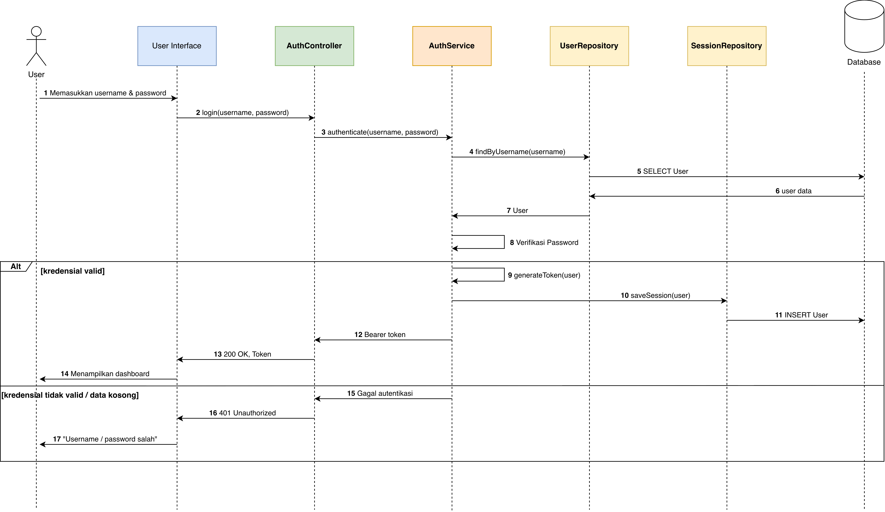

_Gambar 4.13 Sequence Diagram UC-01: Login System_

2. Sequence Diagram UC-02: Logout System

Sequence diagram ini memodelkan proses pengakhiran sesi. Antarmuka pengguna mengirimkan permintaan keluar beserta session ID yang sedang aktif ke AuthController. AuthService memverifikasi dan membatalkan sesi tersebut pada basis data Session, sehingga token yang bersangkutan tidak lagi dapat digunakan untuk otorisasi permintaan berikutnya.

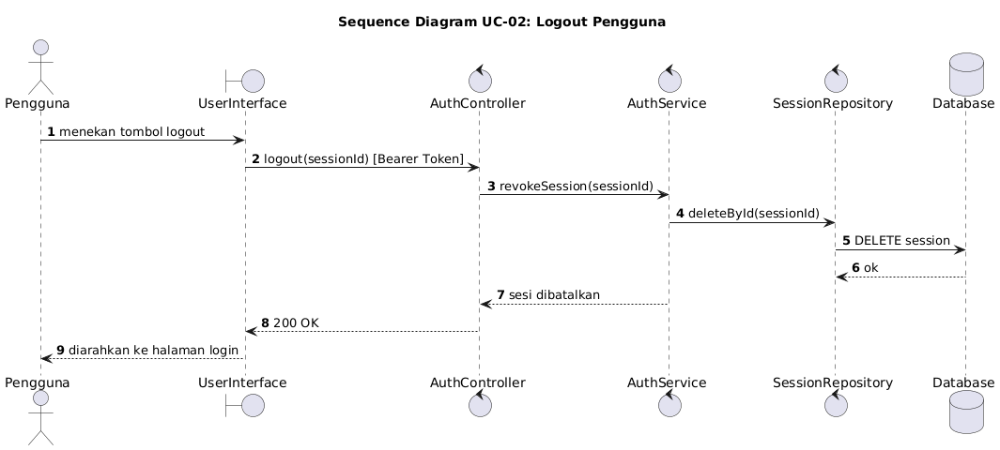

_Gambar 4.14 Sequence Diagram UC-02: Logout System_

3. Sequence Diagram UC-03: View Inventory List

Sequence diagram ini menggambarkan alur penampilan daftar inventori. Antarmuka pengguna mengirimkan permintaan ke ItemController, yang meneruskannya ke goods detail service untuk mengambil seluruh data barang. Hasilnya dikembalikan dan ditampilkan sebagai daftar barang beserta kuantitas dan kategori.

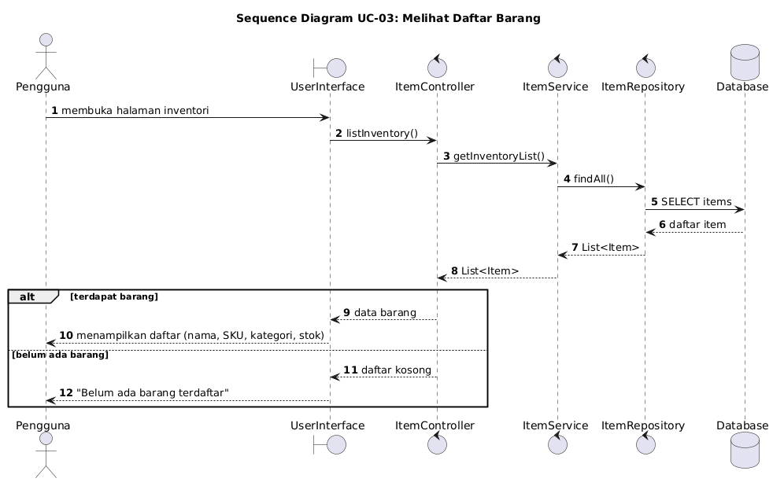

_Gambar 4.15 Sequence Diagram UC-03: View Inventory List_

4. Sequence Diagram UC-04: View Goods Detail

Sequence diagram ini menggambarkan alur penampilan detail suatu barang. Ketika pengguna memilih salah satu barang dari daftar inventori, antarmuka mengirimkan permintaan ke ItemController yang meneruskannya ke goods detail service untuk mengambil informasi lengkap barang, kemudian menampilkannya pada halaman detail.

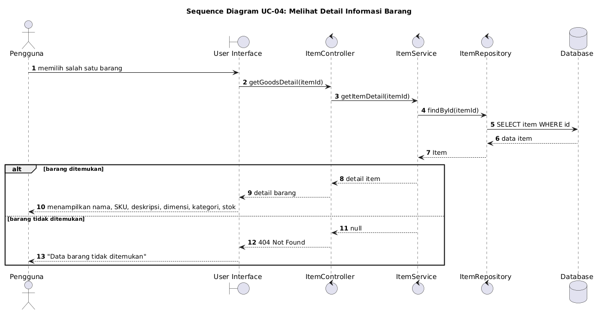

_Gambar 4.16 Sequence Diagram UC-04: View Goods Detail_

5. Sequence Diagram UC-05: View Order

Sequence diagram ini menggambarkan alur pemantauan status order. Antarmuka pengguna mengirimkan permintaan ke OrderController, yang meneruskannya ke fleet order service untuk mengambil data order. Sistem menampilkan daftar order beserta status terkininya (Pending, InProgress, Completed, atau Failed).

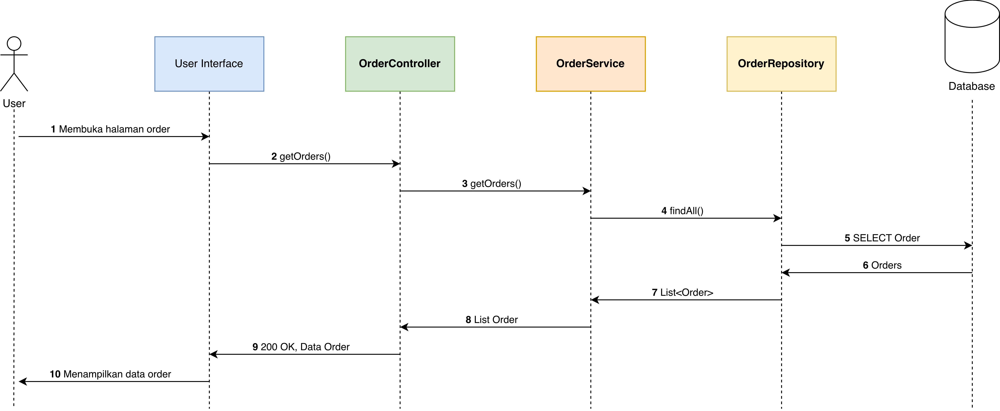

_Gambar 4.17 Sequence Diagram UC-05: View Order_

6. Sequence Diagram UC-06: View Robot & Operation Status

Sequence diagram ini menggambarkan alur pemantauan status robot secara real-time. Antarmuka pengguna berlangganan (subscribe) telemetry stream melalui WebSocket yang dikelola RobotController, sehingga panel status armada AGV—mencakup posisi, baterai, dan tugas aktif—dapat diperbarui secara langsung tanpa polling berulang.

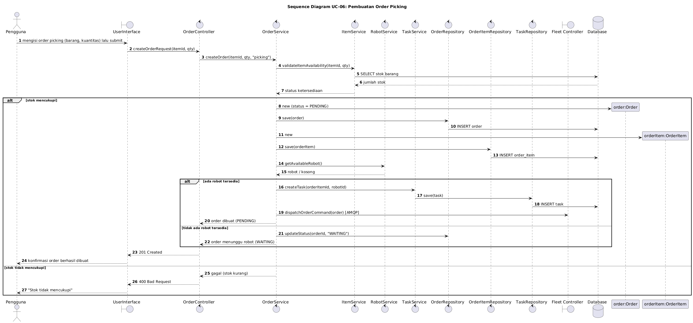

_Gambar 4.18 Sequence Diagram UC-06: View Robot & Operation Status_

7. Sequence Diagram UC-07: Operate Digital Twin

Sequence diagram ini menggambarkan alur interaksi dengan modul Digital Twin. Antarmuka pengguna memuat tampilan Digital Twin melalui DigitalTwinController, yang menginisialisasi model 3D gudang dan berlangganan koordinat robot secara real-time. Saat pengguna memilih robot atau barang pada tampilan 3D, sistem menampilkan detail entitas yang dipilih.

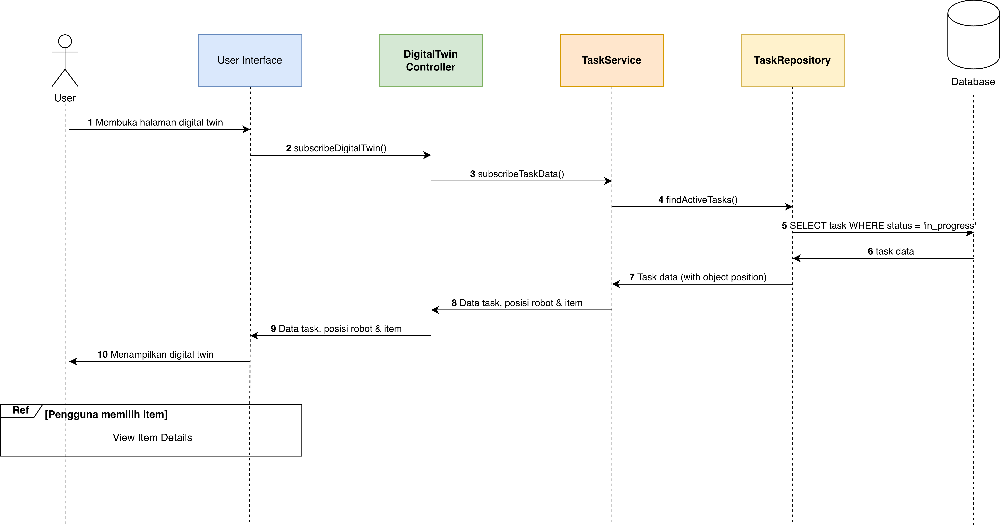

_Gambar 4.19 Sequence Diagram UC-07: Operate Digital Twin_

8. Sequence Diagram UC-08: Create Order Request

Sequence diagram ini merepresentasikan alur pembuatan permintaan order. Antarmuka pengguna mengirimkan formulir order (barang dan kuantitas) ke OrderController, yang memvalidasi ketersediaan barang melalui item service. Setelah tervalidasi, sistem menyimpan order beserta order item ke basis data, mengirim perintah eksekusi ke fleet controller melalui AMQP, kemudian mengembalikan konfirmasi pembuatan order.

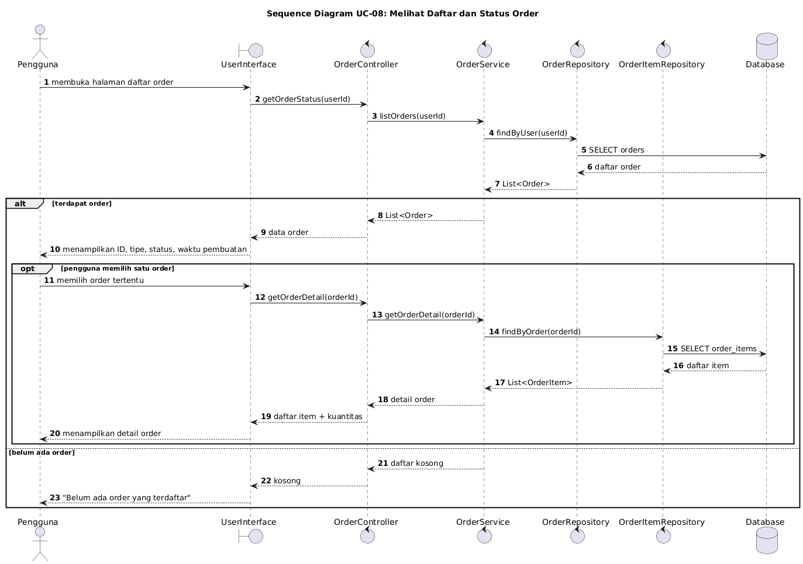

_Gambar 4.20 Sequence Diagram UC-08: Create Order Request_

9. Sequence Diagram UC-09: View Item History

Sequence diagram ini menggambarkan alur penelusuran riwayat aktivitas barang. Antarmuka pengguna memilih barang tertentu dan mengirimkan permintaan ke ItemController, yang meneruskannya ke goods detail service untuk mengambil log aktivitas. Sistem menampilkan kronologi aktivitas inbound/outbound barang tersebut.

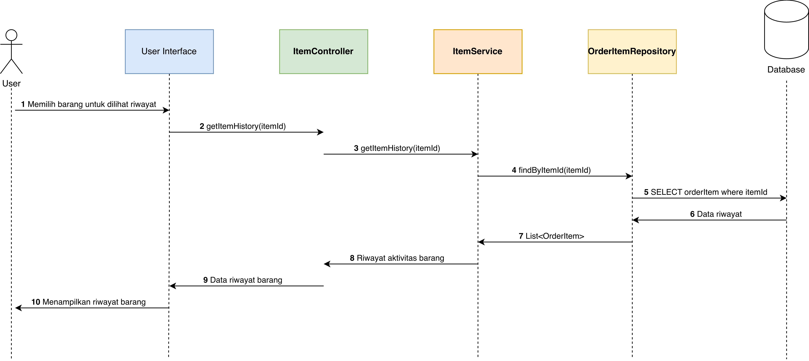

_Gambar 4.21 Sequence Diagram UC-09: View Item History_

