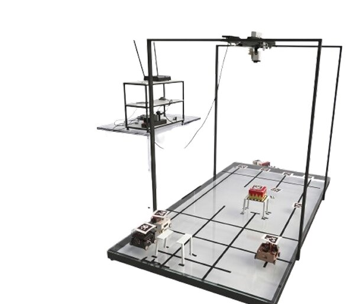
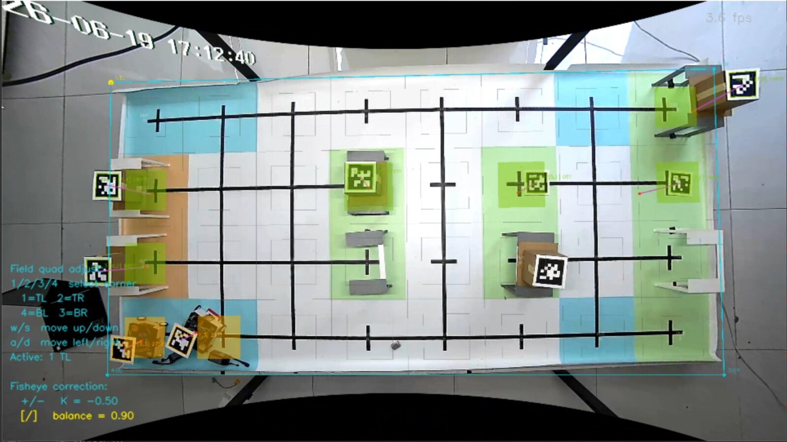
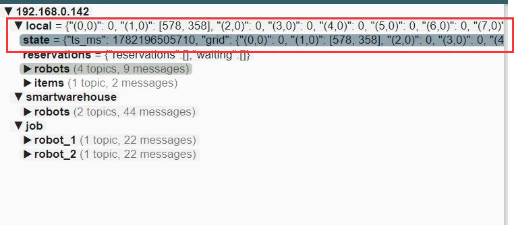

# BAB V IMPLEMENTASI

## V.1 Implementasi Warehouse Management Controller

Sub-bab ini menjabarkan detail implementasi sistem _Warehouse Management Controller_ (WMC), mencakup implementasi modul/_service_ serta lingkungan implementasi yang digunakan selama proses pengembangan.

### V.1.1 Implementasi Modul

Implementasi sistem WMC diorganisasikan ke dalam tiga _service_ utama, yaitu _Authentication Service_, _Goods Service_, dan _Fleet Service_. Pembagian ini merupakan hasil realokasi dari struktur sebelumnya: modul User dan Session dikelompokkan ke _Authentication Service_, sementara modul Robot dan Task dipindahkan dari _Goods Service_ ke _Fleet Service_ agar seluruh logika terkait armada robot (Robot, Task, Robot Log, orkestrasi pergerakan) berada dalam satu _service_ yang sama. Setiap _service_ diuraikan menjadi empat bagian: kelas _Entity_, _Controller_, _Service_, dan _Repository_ sesuai Class Diagram pada Gambar 4.12, diikuti oleh tabel daftar _endpoint_ dan tabel rencana berkas fisik. Kolom _Method_ pada tabel _endpoint_ menunjukkan metode HTTP yang digunakan (GET, POST, PUT, DELETE), kolom _Endpoint_ menunjukkan jalur URL yang tersedia, dan kolom _Auth_ menunjukkan apakah _endpoint_ tersebut memerlukan token JWT sebagai otorisasi akses. Pada tabel rencana berkas fisik, status **ADA** menandakan berkas telah tersedia pada basis kode saat ini, **PINDAH** menandakan berkas yang secara fungsi sudah ada namun berlokasi di basis kode lain dan direncanakan dipindah, dan **USULAN** menandakan berkas baru yang diusulkan agar struktur kode selaras dengan Class Diagram.

#### V.1.1.1 Authentication Service

_Authentication Service_ (`auth-service`, `localhost:3000`) bertanggung jawab atas proses registrasi, _login_, penerbitan dan verifikasi JSON Web Token (JWT), serta pengelolaan data pengguna (_User_) dan sesi (_Session_).

- **Entity:** User, Session
- **Controller:** AuthController
- **Service:** AuthService
- **Repository (usulan):** UserRepository, SessionRepository

### Tabel 5.1 Daftar _endpoint_ _Authentication Service_

| No  | Method | Endpoint         | Deskripsi                             | Auth |
| :-: | :----- | :--------------- | :------------------------------------ | :--: |
|  1  | GET    | `/`              | Health check                          |  --  |
|  2  | GET    | `/docs/spec`     | OpenAPI spec (JSON)                   |  --  |
|  3  | GET    | `/docs`          | Swagger UI                            |  --  |
|  4  | POST   | `/auth/register` | Registrasi user baru                  |  --  |
|  5  | POST   | `/auth/login`    | Login, mendapatkan JWT token          |  --  |
|  6  | GET    | `/protected`     | Contoh _endpoint_ yang dilindungi JWT | JWT  |
|  7  | GET    | `/users`         | Get semua user                        | JWT  |
|  8  | GET    | `/users/:id`     | Get user by ID                        | JWT  |
|  9  | POST   | `/users`         | Buat user baru                        | JWT  |
| 10  | PUT    | `/users/:id`     | Update user                           | JWT  |
| 11  | DELETE | `/users/:id`     | Hapus user                            | JWT  |
| 12  | GET    | `/sessions`      | Get semua session                     | JWT  |
| 13  | POST   | `/sessions`      | Buat session baru                     | JWT  |

### Tabel 5.2 Rencana Berkas Fisik _Authentication Service_

| Nama File             | Path                                     |           Status            | Fungsi                   |
| :-------------------- | :--------------------------------------- | :-------------------------: | :----------------------- |
| auth.controller.ts    | `src/controllers/auth.controller.ts`     |           USULAN            | AuthController (C-01)    |
| auth.service.ts       | `src/services/auth.service.ts`           |           USULAN            | AuthService (C-06)       |
| jwt.middleware.ts     | `src/middlewares/jwt.middleware.ts`      |           USULAN            | Verifikasi token         |
| hash.util.ts          | `src/utils/hash.util.ts`                 |           USULAN            | Hashing password         |
| user.controller.ts    | `src/controllers/user.controller.ts`     | PINDAH dari `goods-service` | Endpoint users           |
| user.service.ts       | `src/services/user.service.ts`           | PINDAH dari `goods-service` | Business logic users     |
| user.repository.ts    | `src/repositories/user.repository.ts`    |           USULAN            | UserRepository (C-14)    |
| session.controller.ts | `src/controllers/session.controller.ts`  | PINDAH dari `goods-service` | Endpoint sessions        |
| session.service.ts    | `src/services/session.service.ts`        | PINDAH dari `goods-service` | Business logic sessions  |
| session.repository.ts | `src/repositories/session.repository.ts` |           USULAN            | SessionRepository (C-15) |

#### V.1.1.2 Goods Service

_Goods Service_ (`goods-service`, `localhost:3001`) menangani data barang, lokasi penyimpanan, pemesanan, serta pemetaan AprilTag ke barang.

- **Entity:** Item, Order, OrderItem, AprilTagMapping
- **Controller:** ItemController, OrderController
- **Service:** ItemService, OrderService (+ OrderItemService, ItemLocationService — tambahan di luar 29 kelas resmi pada Class Diagram)
- **Repository (usulan):** ItemRepository, OrderRepository, OrderItemRepository, AprilTagMappingRepository

### Tabel 5.3 Daftar _endpoint_ _Goods Service_

_Endpoint_ Robot, Task, dan Robot Log telah dikeluarkan dari daftar ini dan direalokasi ke _Fleet Service_ (Tabel 5.5).

| No  | Method | Endpoint                                   | Deskripsi                      | Auth |
| :-: | :----- | :----------------------------------------- | :----------------------------- | :--: |
|  1  | GET    | `/docs`                                    | Swagger UI                     |  --  |
|  2  | GET    | `/orders`                                  | Get semua order                | JWT  |
|  3  | GET    | `/orders/user/:userId`                     | Get order by user              | JWT  |
|  4  | POST   | `/orders`                                  | Buat order baru                | JWT  |
|  5  | GET    | `/items`                                   | Get semua item                 | JWT  |
|  6  | GET    | `/items/history`                           | Get riwayat item               | JWT  |
|  7  | GET    | `/items/sku/:sku`                          | Get item by SKU                | JWT  |
|  8  | POST   | `/items`                                   | Tambah item baru               | JWT  |
|  9  | PUT    | `/items/:id`                               | Update item                    | JWT  |
| 10  | DELETE | `/items/:id`                               | Hapus item                     | JWT  |
| 11  | GET    | `/items/apriltag-mappings/apriltag/:tagId` | Get mapping AprilTag by tag ID | JWT  |
| 12  | POST   | `/items/apriltag-mappings`                 | Buat mapping AprilTag          | JWT  |
| 13  | PUT    | `/items/apriltag-mappings/apriltag/:tagId` | Update mapping AprilTag        | JWT  |
| 14  | DELETE | `/items/apriltag-mappings/apriltag/:tagId` | Hapus mapping AprilTag         | JWT  |
| 15  | GET    | `/item-locations`                          | Get semua lokasi item          | JWT  |
| 16  | GET    | `/item-locations/:id`                      | Get lokasi by ID               | JWT  |
| 17  | GET    | `/item-locations/item/:itemId`             | Get lokasi by item             | JWT  |
| 18  | POST   | `/item-locations`                          | Tambah lokasi item             | JWT  |
| 19  | PUT    | `/item-locations/:id`                      | Update lokasi item             | JWT  |
| 20  | DELETE | `/item-locations/:id`                      | Hapus lokasi item              | JWT  |
| 21  | GET    | `/order-items`                             | Get semua order item           | JWT  |
| 22  | GET    | `/order-items/:id`                         | Get order item by ID           | JWT  |
| 23  | GET    | `/order-items/order/:orderId`              | Get order item by order        | JWT  |
| 24  | POST   | `/order-items`                             | Tambah order item              | JWT  |
| 25  | PUT    | `/order-items/:id`                         | Update order item              | JWT  |
| 26  | DELETE | `/order-items/:id`                         | Hapus order item               | JWT  |

### Tabel 5.4 Rencana Berkas Fisik _Goods Service_

| Nama File                     | Path                                             |     Status     | Fungsi                                        |
| :---------------------------- | :----------------------------------------------- | :------------: | :-------------------------------------------- |
| item.controller.ts            | `src/controllers/item.controller.ts`             |      ADA       | Endpoint items + apriltag-mappings            |
| order.controller.ts           | `src/controllers/order.controller.ts`            |      ADA       | Endpoint orders                               |
| itemLocation.controller.ts    | `src/controllers/itemLocation.controller.ts`     | ADA (tambahan) | Endpoint item-locations                       |
| orderItem.controller.ts       | `src/controllers/orderItem.controller.ts`        | ADA (tambahan) | Endpoint order-items                          |
| item.service.ts               | `src/services/item.service.ts`                   |      ADA       | Business logic items                          |
| order.service.ts              | `src/services/order.service.ts`                  |      ADA       | Business logic orders                         |
| orderItem.service.ts          | `src/services/orderItem.service.ts`              | ADA (tambahan) | Business logic order-items                    |
| item.repository.ts            | `src/repositories/item.repository.ts`            |     USULAN     | ItemRepository (C-16)                         |
| order.repository.ts           | `src/repositories/order.repository.ts`           |     USULAN     | OrderRepository (C-17)                        |
| orderItem.repository.ts       | `src/repositories/orderItem.repository.ts`       |     USULAN     | OrderItemRepository (C-18)                    |
| aprilTagMapping.repository.ts | `src/repositories/aprilTagMapping.repository.ts` |     USULAN     | AprilTagMappingRepository (C-21)              |
| prisma.ts                     | `src/lib/prisma.ts`                              |      ADA       | Prisma client                                 |
| schema.prisma                 | `prisma/schema.prisma`                           |  PERLU DICEK   | Model Item, Order, OrderItem, AprilTagMapping |

#### V.1.1.3 Fleet Service

_Fleet Service_ menggabungkan tiga basis kode — modul Robot dan Task yang direalokasi dari `goods-service`, `blob-service`, serta `fleet-controller` (Go) — dan menangani seluruh logika operasional armada robot: pencatatan robot dan log operasionalnya, penjadwalan _task_, orkestrasi pergerakan, deteksi tabrakan, serta eksekusi _workflow_ _storing_/_picking_.

- **Entity:** Robot, Task
- **Controller:** RobotController, DigitalTwinController
- **Service:** RobotService, TaskService, DigitalTwinService, NotificationService, LocationService (LocationService saat ini berupa _pipeline_ Python terpisah untuk deteksi AprilTag, belum berbentuk _class service_ pada layer _backend_)
- **Repository (usulan):** RobotRepository, TaskRepository

> **Perlu dikonfirmasi:** pada struktur kode saat ini, Task tidak memiliki _controller_ tersendiri — kemungkinan _endpoint_ `/tasks` masih digabung ke dalam RobotController, atau perlu ditambahkan TaskController baru (tambahan di luar 29 kelas resmi pada Class Diagram).

### Tabel 5.5 Daftar _endpoint_ _Fleet Service_

_Endpoint_ Robot, Task, dan Robot Log berasal dari realokasi `goods-service`; _endpoint_ lain berasal dari `blob-service` dan `fleet-controller`.

| No  | Method | Endpoint                     | Asal                   | Deskripsi                             | Auth |
| :-: | :----- | :--------------------------- | :--------------------- | :------------------------------------ | :--: |
|  1  | GET    | `/robots`                    | goods-service (pindah) | Get semua robot                       | JWT  |
|  2  | POST   | `/robots`                    | goods-service (pindah) | Tambah robot baru                     | JWT  |
|  3  | GET    | `/tasks`                     | goods-service (pindah) | Get semua task                        | JWT  |
|  4  | GET    | `/tasks/:id`                 | goods-service (pindah) | Get task by ID                        | JWT  |
|  5  | GET    | `/tasks/robot/:robotId`      | goods-service (pindah) | Get task by robot                     | JWT  |
|  6  | POST   | `/tasks`                     | goods-service (pindah) | Buat task baru                        | JWT  |
|  7  | PUT    | `/tasks/:id`                 | goods-service (pindah) | Update task                           | JWT  |
|  8  | DELETE | `/tasks/:id`                 | goods-service (pindah) | Hapus task                            | JWT  |
|  9  | GET    | `/robot-logs`                | goods-service (pindah) | Get semua log robot                   | JWT  |
| 10  | GET    | `/robot-logs/:id`            | goods-service (pindah) | Get log by ID                         | JWT  |
| 11  | GET    | `/robot-logs/robot/:robotId` | goods-service (pindah) | Get log by robot                      | JWT  |
| 12  | POST   | `/robot-logs`                | goods-service (pindah) | Tambah log robot                      | JWT  |
| 13  | PUT    | `/robot-logs/:id`            | goods-service (pindah) | Update log robot                      | JWT  |
| 14  | DELETE | `/robot-logs/:id`            | goods-service (pindah) | Hapus log robot                       | JWT  |
| 15  | GET    | `/health`                    | blob-service           | Health check                          |  --  |
| 16  | \*     | `/apriltag-mappings/*`       | blob-service           | Route AprilTag mapping                |  --  |
| 17  | \*     | `/robot-mappings/*`          | blob-service           | Route robot–tag mapping               |  --  |
| 18  | \*     | `/orders/*`                  | blob-service           | Route order                           |  --  |
| 19  | GET    | `/docs`                      | blob-service           | Swagger UI                            |  --  |
| 20  | GET    | `/health`                    | fleet-controller       | Health check                          |  --  |
| 21  | GET    | `/map`                       | fleet-controller       | Status occupancy map                  |  --  |
| 22  | GET    | `/queue`                     | fleet-controller       | Status antrean job per robot          |  --  |
| 23  | GET    | `/robots`                    | fleet-controller       | Status gabungan robot                 |  --  |
| 24  | GET    | `/reservations`              | fleet-controller       | Snapshot reservasi sel                |  --  |
| 25  | POST   | `/reset`                     | fleet-controller       | Reset state controller                |  --  |
| 26  | POST   | `/gotoidle`                  | fleet-controller       | Kirim robot ke sel idle               |  --  |
| 27  | POST   | `/demo/forward`              | fleet-controller       | Gerak maju N langkah                  |  --  |
| 28  | POST   | `/demo/turn/right`           | fleet-controller       | Rotasi searah jarum jam N langkah     |  --  |
| 29  | POST   | `/demo/turn/left`            | fleet-controller       | Rotasi berlawanan jarum jam N langkah |  --  |
| 30  | POST   | `/demo/dock`                 | fleet-controller       | Perintah docking                      |  --  |
| 31  | POST   | `/demo/undock`               | fleet-controller       | Perintah undocking                    |  --  |
| 32  | POST   | `/demo/navigate`             | fleet-controller       | Navigasi BFS titik A ke titik B       |  --  |
| 33  | POST   | `/demo/storing`              | fleet-controller       | Workflow storing 3-tahap              |  --  |
| 34  | POST   | `/demo/picking`              | fleet-controller       | Workflow picking 3-tahap              |  --  |

### Tabel 5.6 Rencana Berkas Fisik _Fleet Service_

| Nama File                 | Path                                         |                 Status                 | Fungsi                                                           |
| :------------------------ | :------------------------------------------- | :------------------------------------: | :--------------------------------------------------------------- |
| robot.controller.ts       | `src/controllers/robot.controller.ts`        |      PINDAH dari `goods-service`       | Endpoint robots                                                  |
| robot.service.ts          | `src/services/robot.service.ts`              |      PINDAH dari `goods-service`       | Business logic robots                                            |
| task.service.ts           | `src/services/task.service.ts`               |      PINDAH dari `goods-service`       | Business logic tasks                                             |
| robotLog.controller.ts    | `src/controllers/robotLog.controller.ts`     | PINDAH dari `goods-service` (tambahan) | Endpoint robot-logs                                              |
| robotLog.service.ts       | `src/services/robotLog.service.ts`           | PINDAH dari `goods-service` (tambahan) | Business logic robot-logs                                        |
| robot.repository.ts       | `src/repositories/robot.repository.ts`       |                 USULAN                 | RobotRepository (C-19)                                           |
| task.repository.ts        | `src/repositories/task.repository.ts`        |                 USULAN                 | TaskRepository (C-20)                                            |
| digitalTwin.controller.ts | `src/controllers/digitalTwin.controller.ts`  |                 USULAN                 | DigitalTwinController (C-05) — belum ada                         |
| digitalTwin.service.ts    | `src/services/digitalTwin.service.ts`        |                 USULAN                 | DigitalTwinService (C-11) — belum ada                            |
| notification.service.ts   | `src/services/notification.service.ts`       |                 USULAN                 | NotificationService (C-13) — belum ada                           |
| index.ts                  | `blob-service/src/index.ts`                  |                  ADA                   | Entrypoint blob-service                                          |
| apriltagMapping.ts        | `blob-service/src/routes/apriltagMapping.ts` |        ADA (isi belum dilihat)         | Route AprilTag mapping                                           |
| order.ts                  | `blob-service/src/routes/order.ts`           |        ADA (isi belum dilihat)         | Route order                                                      |
| robotTagMapping.ts        | `blob-service/src/routes/robotTagMapping.ts` |        ADA (isi belum dilihat)         | Route robot-tag mapping                                          |
| main.go                   | `fleet-controller/cmd/main.go`               |              ADA (asumsi)              | Entrypoint fleet-controller                                      |
| api/\*.go                 | `fleet-controller/internal/api/*.go`         |                  ADA                   | Handler health/map/queue/robots/reservations/reset/gotoidle/demo |

#### Modul Infrastruktur Bersama

Selain modul yang spesifik pada masing-masing _service_, terdapat modul infrastruktur bersama pada `goods-service` yang digunakan lintas modul, serta modul pada komponen `database` yang menyediakan skema, migrasi, dan _seeder_ bagi seluruh layanan WMC.

### Tabel 5.7 Modul infrastruktur bersama _goods-service_ dan _database_

| No  | Nama Modul                  | Nama File Fisik                                                                                                                      |
| :-: | :-------------------------- | :----------------------------------------------------------------------------------------------------------------------------------- |
|  1  | Entry Point (goods-service) | `goods-service/src/index.ts`                                                                                                         |
|  2  | Base (Abstraksi)            | `goods-service/src/controllers/BaseController.ts`, `goods-service/src/services/BaseService.ts`                                       |
|  3  | Middleware                  | `goods-service/src/middleware/jwt.ts`                                                                                                |
|  4  | Library / Helper            | `goods-service/src/lib/prisma.ts`, `goods-service/src/lib/response.ts`                                                               |
|  5  | Dokumentasi API             | `goods-service/src/docs/swagger.ts`                                                                                                  |
|  6  | Konfigurasi (goods-service) | `goods-service/package.json`, `goods-service/tsconfig.json`, `goods-service/prisma.config.ts`, `goods-service/Dockerfile`            |
|  7  | Entry Point (database)      | `database/index.ts`                                                                                                                  |
|  8  | Skema Database              | `database/prisma/schema.prisma`                                                                                                      |
|  9  | Seeder                      | `database/prisma/seed.ts`                                                                                                            |
| 10  | Migrasi                     | `database/prisma/migrations/20260312044418_init_db/migration.sql`, `database/prisma/migrations/migration_lock.toml`                  |
| 11  | Konfigurasi (database)      | `database/package.json`, `database/tsconfig.json`, `database/prisma.config.ts`, `database/Dockerfile`, `database/docker-compose.yml` |

### V.1.2 Lingkungan Implementasi

Pengembangan sistem WMC dilakukan di dalam sebuah lingkungan implementasi yang terbagi menjadi dua jenis, yaitu perangkat keras (_hardware_) dan perangkat lunak (_software_). Keduanya menjadi komponen penting yang berjalan bersama dan saling mendukung dalam proses pengembangan sistem.

Pada sisi perangkat keras, pengembangan dan pengujian sistem dilakukan pada lingkungan _cloud_ berbasis Amazon Web Services (AWS). Komponen yang digunakan dapat dilihat pada Tabel 5.8.

### Tabel 5.8 Spesifikasi _hardware_

| Komponen           | Spesifikasi                               |
| :----------------- | :---------------------------------------- |
| Platform           | Amazon EC2 t3.medium                      |
| Prosesor           | 2 vCPU (Intel Xeon Platinum 8259CL)       |
| RAM                | 4 GB DDR4                                 |
| Penyimpanan        | Amazon EBS gp3, 20 GB                     |
| Sistem Operasi     | Ubuntu Server 22.04 LTS (Jammy Jellyfish) |
| Bandwidth Jaringan | Up to 5 Gbps                              |

Adapun perangkat lunak yang digunakan selama proses pengembangan dapat dilihat pada Tabel 5.9.

### Tabel 5.9 Spesifikasi _software_

| Jenis                             | Nama Software                                 |
| :-------------------------------- | :-------------------------------------------- |
| Bahasa Pemrograman                | TypeScript, Go, Python                        |
| Runtime                           | Node.js                                       |
| Framework/Library (auth-service)  | Hono, @hono/node-server, @hono/swagger-ui     |
| Framework/Library (goods-service) | Express.js, swagger-jsdoc, swagger-ui-express |
| Framework/Library (blob-service)  | Express.js, Multer, Axios, Form-data          |
| Framework (fleet-controller)      | Go standard library (`net/http`)              |
| Library Umum (semua service)      | JWT (jsonwebtoken), Bcryptjs, Dotenv, CORS    |
| ORM                               | Prisma (dengan adapter PostgreSQL)            |
| Database                          | PostgreSQL 15                                 |
| Containerization                  | Docker, Docker Compose                        |
| Database Admin Tool               | Adminer                                       |

Dengan menggunakan kombinasi lingkungan _cloud_ Amazon EC2 dan rangkaian perangkat lunak berbasis kontainer tersebut, seluruh proses pengembangan, pengujian, serta orkestrasi layanan WMC dapat dilaksanakan secara konsisten dan terisolasi. Tabel 5.10 merangkum peran masing-masing teknologi secara lebih rinci dalam pengembangan WMC.

### Tabel 5.10 Teknologi yang digunakan dalam pengembangan WMC

| Nama                   | Kategori                        | Deskripsi                                                                                                                                                                                         |
| :--------------------- | :------------------------------ | :------------------------------------------------------------------------------------------------------------------------------------------------------------------------------------------------ |
| **TypeScript**         | Bahasa Pemrograman              | _Superset_ dari JavaScript yang menambahkan sistem tipe statis sehingga meningkatkan keandalan dan keterbacaan kode pada layanan _auth_, _goods_, dan _blob_.                                     |
| **Go**                 | Bahasa Pemrograman              | Bahasa pemrograman terkompilasi yang digunakan untuk membangun `fleet-controller`, mengandalkan kinerja tinggi dan konkurensi native (_goroutine_) untuk orkestrasi pergerakan robot _real-time_. |
| **Node.js**            | Runtime                         | Lingkungan eksekusi JavaScript sisi server berbasis _event-driven_ yang menjadi fondasi _runtime_ untuk layanan _backend_ berbasis TypeScript.                                                    |
| **Hono**               | Framework (auth-service)        | Framework web ringan dan berperforma tinggi yang digunakan sebagai server HTTP utama pada layanan autentikasi.                                                                                    |
| **@hono/node-server**  | Library (auth-service)          | Adapter resmi Hono yang memungkinkan framework Hono dijalankan secara native di lingkungan runtime Node.js.                                                                                       |
| **@hono/swagger-ui**   | Library (auth-service)          | Plugin Hono untuk menyajikan antarmuka dokumentasi API interaktif berbasis Swagger UI langsung dari dalam layanan autentikasi.                                                                    |
| **Express.js**         | Framework (goods, blob service) | Framework web minimalis untuk Node.js yang digunakan sebagai fondasi server HTTP pada layanan _goods_ dan _blob_.                                                                                 |
| **swagger-jsdoc**      | Library (goods-service)         | Library untuk menghasilkan spesifikasi OpenAPI secara otomatis dari anotasi JSDoc yang dituliskan pada kode sumber.                                                                               |
| **swagger-ui-express** | Library (goods-service)         | Middleware Express yang menyajikan halaman dokumentasi API interaktif berbasis Swagger UI pada layanan _goods_.                                                                                   |
| **Multer**             | Library (blob-service)          | Middleware Node.js untuk menangani unggahan _file_ berformat _multipart/form-data_ pada layanan penyimpanan berkas.                                                                               |
| **Axios**              | Library (blob-service)          | HTTP _client_ berbasis _Promise_ yang digunakan untuk melakukan permintaan HTTP antar layanan secara asinkron.                                                                                    |
| **Form-data**          | Library (blob-service)          | Library untuk membuat dan mengelola data formulir _multipart_ yang digunakan saat meneruskan berkas antar layanan.                                                                                |
| **net/http**           | Library (fleet-controller)      | _Package_ standar Go untuk membangun _multiplexer_ HTTP tanpa dependensi _framework_ eksternal, digunakan untuk seluruh _endpoint_ `fleet-controller`.                                            |
| **jsonwebtoken (JWT)** | Library (semua service Node.js) | Library untuk menghasilkan dan memverifikasi JSON Web Token sebagai mekanisme autentikasi _stateless_ pada setiap layanan.                                                                        |
| **Bcryptjs**           | Library (semua service Node.js) | Library untuk melakukan _hashing_ kata sandi secara aman menggunakan algoritma _bcrypt_ saat proses registrasi dan verifikasi pengguna.                                                           |
| **Dotenv**             | Library (semua service Node.js) | Library yang memuat variabel konfigurasi dan rahasia dari _file_ `.env` ke dalam `process.env` pada saat layanan dijalankan.                                                                      |
| **CORS**               | Library (semua service Node.js) | Middleware untuk mengonfigurasi kebijakan _Cross-Origin Resource Sharing_ agar setiap layanan API dapat diakses lintas domain secara aman.                                                        |
| **Prisma**             | ORM                             | _Object-Relational Mapper_ modern untuk TypeScript yang menyederhanakan akses basis data, pembuatan _query_, serta migrasi skema secara _type-safe_.                                              |
| **PostgreSQL 15**      | Database                        | Sistem manajemen basis data relasional _open-source_ yang digunakan sebagai penyimpanan data utama seluruh layanan WMC.                                                                           |
| **Docker**             | Containerization                | Platform kontainerisasi yang digunakan untuk mengemas setiap layanan beserta dependensinya ke dalam _container_ yang terisolasi dan portabel.                                                     |
| **Docker Compose**     | Containerization                | Alat orkestrasi multi-kontainer yang mendefinisikan dan menjalankan seluruh layanan WMC secara bersamaan melalui satu _file_ konfigurasi.                                                         |
| **Adminer**            | Database Admin Tool             | Antarmuka administrasi basis data berbasis web yang ringan, digunakan untuk mengelola dan memantau basis data PostgreSQL selama pengembangan.                                                     |

---

## V.2 Implementasi Sistem Lokalisasi

Sub-bab ini menjabarkan detail implementasi Subsistem Lokalisasi yang berjalan sebagai komponen dalam _Fleet Controller_, mencakup implementasi perangkat keras serta implementasi perangkat lunak (teknologi, _pipeline_ deteksi _frame_, dan mekanisme publikasi data posisi melalui MQTT).

### V.2.1 Implementasi Hardware

Subsistem Lokalisasi berjalan di atas _host_ yang sama dengan WMC, yaitu _instance_ AWS EC2 t3.medium (Ubuntu 22.04 LTS). Perangkat keras utama yang digunakan adalah sebuah kamera IP _fisheye_ berkemampuan 1080p (3 MP) dengan kompresi H.264 yang melakukan _streaming_ video melalui protokol RTSP _over_ TCP. Kamera dipasang pada rangka penyangga yang ditempatkan setinggi 60 cm di atas area lantai gudang berukuran $2,4 \times 1,2$ m. Pencahayaan LED tambahan dipasang untuk memastikan iluminasi yang seragam di seluruh area lantai sehingga kontras _marker_ AprilTag tetap optimal di berbagai kondisi pencahayaan ruangan.

AprilTag yang digunakan adalah keluarga Tag36h11 berukuran fisik $8 \times 8$ cm, ditempelkan pada bagian atas robot dan pada barang-barang di area gudang. Keluarga _tag_ ini dipilih karena memberikan keseimbangan optimal antara keterbacaan pada jarak jauh dan ketahanan terhadap oklusi parsial, sesuai dengan kondisi operasional gudang skala prototipe ini.

_Gambar 5.1 Perangkat Keras Subsistem Lokalisasi_

### V.2.2 Implementasi Software

Tabel 5.11 merangkum seluruh teknologi perangkat lunak yang digunakan dalam implementasi Subsistem Lokalisasi beserta peran masing-masing dalam _pipeline_.

### Tabel 5.11 Teknologi yang digunakan dalam implementasi Subsistem Lokalisasi

| Teknologi                | Kategori           | Deskripsi                                                                                                |
| :----------------------- | :----------------- | :------------------------------------------------------------------------------------------------------- |
| **Python 3**             | Bahasa Pemrograman | Runtime utama _pipeline_ deteksi dan publikasi MQTT.                                                     |
| **OpenCV**               | Computer Vision    | Undistortion lensa _fisheye_, komputasi _homography_, dan transformasi perspektif.                       |
| **pupil-apriltags**      | Deteksi Marker     | Detektor Tag36h11 AprilTag; mengekstrak ID, posisi piksel pusat, dan empat koordinat sudut setiap _tag_. |
| **Model Kannala–Brandt** | Kalibrasi Kamera   | Koefisien kalibrasi untuk koreksi distorsi radial lensa _fisheye_, dihitung saat _setup_.                |
| **RTSP / TCP**           | Protokol Streaming | Konsumsi _video stream_ H.264 dari kamera IP _fisheye_ secara _real-time_.                               |
| **Python threading**     | Konkurensi         | _Background thread_ mengambil _frame_ secara kontinu tanpa memblokir _detection loop_ utama.             |
| **RabbitMQ (MQTT)**      | Message Broker     | Publikasi _grid state_ JSON ke _topic location_ setiap 500 ms; _broker_ yang sama digunakan oleh WMC.    |

Implementasi perangkat lunak Subsistem Lokalisasi disusun dalam folder `localisasi`, terdiri atas skrip entry point, package `tracker` yang memuat seluruh logika _pipeline_ deteksi, serta berkas konfigurasi dan kalibrasi pendukung. Tabel 5.12 merangkum deskripsi singkat setiap berkas.

### Tabel 5.12 Deskripsi Berkas pada Folder `localisasi`

| Kode   | File                               | Deskripsi                                                                                                             |
| :----- | :--------------------------------- | :-------------------------------------------------------------------------------------------------------------------- |
| LOC-01 | `local_rtsp.py`                    | Script standalone untuk uji koneksi RTSP kamera & deteksi AprilTag secara lokal (di luar package `tracker`).          |
| LOC-02 | `main.py`                          | Entry point utama aplikasi — inisialisasi detector lalu menjalankan mode video atau stream.                           |
| LOC-03 | `register_tags.py`                 | Script one-time untuk mendaftarkan AprilTag baru ke goods-service & blob-service via API.                             |
| LOC-04 | `requirements.txt`                 | Daftar dependency Python yang dibutuhkan project.                                                                     |
| LOC-05 | `tracker/__init__.py`              | Inisialisasi package `tracker`, mengekspos fungsi-fungsi dari seluruh modul.                                          |
| LOC-06 | `tracker/capture.py`               | Penanganan capture video — threaded reader, koneksi RTSP, inisialisasi sumber kamera/detector.                        |
| LOC-07 | `tracker/config.py`                | Konstanta konfigurasi sistem (URL RTSP, resolusi, FPS, brightness, grid, dll).                                        |
| LOC-08 | `tracker/field.py`                 | Transformasi perspektif (homography) antara koordinat pixel dan koordinat grid lapangan.                              |
| LOC-09 | `tracker/fisheye.py`               | Utilitas koreksi distorsi lensa fisheye.                                                                              |
| LOC-10 | `tracker/grid.py`                  | Membangun, menggambar, dan mencatat matriks occupancy grid platform (robot/goods/docking).                            |
| LOC-11 | `tracker/modes.py`                 | Mode eksekusi utama — playback video file dan live stream (RTSP/USB).                                                 |
| LOC-12 | `tracker/mqtt.py`                  | Klien MQTT untuk konek ke broker dan publish state grid/entitas dalam format JSON.                                    |
| LOC-13 | `tracker/overlay.py`               | Visualisasi overlay — quad lapangan, label tag, HUD, dan logging terminal.                                            |
| LOC-14 | `tracker/processing.py`            | Pemrosesan frame, manajemen state, dan handler keypress terpusat.                                                     |
| LOC-15 | `tracker/tags.py`                  | Utilitas AprilTag — klasifikasi jenis tag, warna, dan orientasi.                                                      |
| LOC-16 | `tracker/transformer.py`           | Kelas `WarehouseCoordinateTransformer` untuk transformasi koordinat kamera ke koordinat gudang menggunakan kalibrasi. |
| LOC-17 | `tuned_config.json`                | File hasil tuning konfigurasi (parameter kalibrasi yang sudah dioptimasi).                                            |
| LOC-18 | `warehouse_calibration_context.md` | Catatan/context kalibrasi warehouse (parameter kamera, referensi koordinat, dll).                                     |

_Gambar 5.2 Antarmuka Visualisasi Subsistem Lokalisasi_

**Implementasi _Pipeline_ Deteksi**

_Pipeline_ deteksi diimplementasikan dalam dua _thread_ Python yang berjalan secara konkuren. _Thread_ pertama adalah _frame grabber thread_ yang terhubung ke _stream_ RTSP kamera dan secara terus-menerus mengambil _frame_ terbaru ke dalam sebuah _buffer_ bersama, membuang _frame_ lama yang belum sempat diproses. _Thread_ kedua adalah _detection loop_ yang berjalan pada frekuensi 4 Hz, membaca _frame_ dari _buffer_ dan memprosesnya melalui enam tahap _pipeline_ secara berurutan.

Pada tahap pertama, distorsi radial lensa _fisheye_ dihilangkan menggunakan koefisien kalibrasi Kannala--Brandt yang diperoleh dari proses kalibrasi _checkerboard_ saat _setup_ awal. Koefisien ini disimpan sebagai parameter permanen dan dimuat sekali saat program pertama kali dijalankan. Pada tahap kedua, _frame_ yang telah terkoreksi ditingkatkan kontrasnya menggunakan _histogram equalization_ kemudian dikonversi ke _grayscale_ untuk mempercepat proses deteksi.

Pada tahap ketiga, detektor Tag36h11 dari _library_ pupil-apriltags dijalankan pada _frame grayscale_ untuk mengekstrak ID unik, koordinat piksel pusat _tag_, serta koordinat piksel empat sudut _marker_ dari setiap _tag_ yang berhasil terdeteksi. Pada tahap keempat, koordinat piksel pusat setiap _tag_ ditransformasi ke koordinat lantai kontinu menggunakan matriks _homography_ $H$ yang telah dikalibrasi sebelumnya melalui OpenCV `perspectiveTransform`, kemudian di-_snap_ ke sel _grid_ diskrit $(c, r)$ menggunakan formula _nearest-cell-centre_ sebagaimana dijelaskan pada Subbab 2.5.3.

Pada tahap kelima, setiap _tag_ ID diklasifikasikan ke salah satu dari tiga kategori berdasarkan rentang ID yang telah ditetapkan: _docking station_, robot, atau _warehouse item_. Orientasi (_heading_) dalam derajat ($0^\circ$--$359^\circ$) dihitung dari sudut yang dibentuk oleh sisi depan _tag_ relatif terhadap sumbu X positif menggunakan fungsi `atan2` terhadap selisih koordinat dua sudut terdepan _tag_.

**Implementasi Publikasi MQTT**

Pada tahap keenam _pipeline_, seluruh hasil deteksi _frame_ dikodekan sebagai _payload_ JSON yang merepresentasikan _state_ penuh dari _grid_ $8\times4$. _Payload_ diterbitkan setiap 500 ms ke _topic location_ pada RabbitMQ _broker_ yang sama yang digunakan oleh WMC. Setiap entri dalam _payload_ memuat ID _tag_, kategori objek (_docking_/robot/_item_), koordinat sel _grid_ $(c, r)$, dan nilai _heading_ dalam derajat. Dengan interval publikasi 500 ms, latensi maksimum tampilan posisi di _User Interface_ terikat pada 500 ms ditambah latensi jaringan WebSocket, jauh di bawah target KNF-02 sebesar 1 detik.

_Gambar 5.3 Hasil Publikasi Data Posisi ke MQTT Broker_

Kalibrasi _homography_ dilakukan satu kali saat _setup_ dengan menempatkan empat _marker_ referensi di sudut-sudut area lantai gudang yang diketahui posisi _grid_-nya. Korespondensi piksel ke _grid_ dari keempat titik tersebut kemudian digunakan oleh OpenCV `getPerspectiveTransform` untuk menghitung matriks $H$. Setelah kalibrasi selesai, parameter $H$ disimpan dan dimuat secara otomatis setiap kali Subsistem Lokalisasi dijalankan ulang tanpa memerlukan proses kalibrasi ulang.
